# HOL Lab Shutdown Scripts

Version 1.3 - February 2026

## Overview

This folder contains the graceful shutdown orchestration scripts for HOLFY27 lab environments. The scripts ensure an orderly shutdown of all VCF components following the **official Broadcom VCF 9.0 documentation**.

**Reference**: [VCF 9.0 Shutdown Operations](https://techdocs.broadcom.com/us/en/vmware-cis/vcf/vcf-9-0-and-later/9-0/fleet-management/vcf-shutdown-and-startup/vcf-shutdown.html)

## Quick-start to Shutdown pod:

### Shutdown procedure:

1) Shutdown nested environment:

    ```bash
    ssh holuser@manager
    cd hol
    python3 Shutdown/Shutdown.py
    ```

    Wait until complete.

2) Shutdown router as follows:
On the router, login as root and run the /root/shutdown.sh script -This was written to perform a graceful shutdown of the kubernetes stuff.

3) Shutdown manager

4) Shutdown console

### Key Features

- **Status File Updates**: The shutdown progress is written to `/lmchol/hol/startup_status.txt` for console display widgets
- **Real-time Logging**: Detailed progress output for all phases and operations
- **Host Power-Off Monitoring**: Waits up to 30 minutes for all ESXi hosts to fully power off before completing
- **Lab-Safe SSH**: Uses `StrictHostKeyChecking=no` to handle host key changes common in lab environments

## Scripts

### Shutdown.py (Main Orchestrator)

The main entry point for lab shutdown. Coordinates all shutdown phases and provides command-line options.

```bash
# Full shutdown
python3 Shutdown.py

# Preview mode (no changes made)
python3 Shutdown.py --dry-run

# Quick shutdown (skip vSAN wait)
python3 Shutdown.py --quick

# Shutdown VMs only, leave hosts running
python3 Shutdown.py --no-hosts

# Show help
python3 Shutdown.py --help
```

### VCFshutdown.py (VCF Module)

Handles VCF-specific shutdown tasks including:

- Fleet Operations (VCF Operations Suite) via SDDC Manager API
- WCP (Workload Control Plane) shutdown
- Tanzu/Kubernetes workload VMs
- Management VMs (vCenter, SDDC Manager, VCF Operations Suite)
- NSX Edges and Manager
- vSAN elevator operations
- ESXi host shutdown

Can be run standalone:

```bash
python3 VCFshutdown.py --dry-run
```

### fleet.py (Fleet Operations Module)

Provides integration with SDDC Manager Fleet Operations API for graceful shutdown of VCF Operations Suite products:

- vra (VCF Automation)
- vrni (VCF Operations for Networks)
- vrops (VCF Operations)
- vrli (VCF Operations for Logs)

Can be tested standalone:

```bash
python3 fleet.py --fqdn opslcm-a.site-a.vcf.lab --password PASSWORD --action list
python3 fleet.py --fqdn opslcm-a.site-a.vcf.lab --password PASSWORD --action shutdown
```

## Shutdown Order

The shutdown follows the **official Broadcom VCF 9.0 documentation**.

### VCF 9.0 Workload Domain Order

Per [VCF 9.0 Workload Domain Shutdown](https://techdocs.broadcom.com/us/en/vmware-cis/vcf/vcf-9-0-and-later/9-0/fleet-management/vcf-shutdown-and-startup/vcf-shutdown/shut-down-the-virtual-infrastructure-workload-domain.html):

| VCF 9.0 Order | Component |
| ------------- | --------- |
| 1 | Virtualized customer workloads |
| 2 | VMware Live Recovery (if applicable) |
| 4 | NSX Edge nodes |
| 5 | NSX Manager nodes |
| 7 | ESX hosts |
| 8 | vCenter Server (LAST for workload domain) |

### VCF 9.0 Management Domain Order

Per [VCF 9.0 Management Domain Shutdown](https://techdocs.broadcom.com/us/en/vmware-cis/vcf/vcf-9-0-and-later/9-0/fleet-management/vcf-shutdown-and-startup/vcf-shutdown/shut-down-the-management-domain.html):

| VCF 9.0 Order | Component |
| ------------- | --------- |
| 1 | VCF Automation (VCF Automation / vra) |
| 2 | VCF Operations for Networks (vrni) |
| 3 | VCF Operations collector |
| 4 | VCF Operations for logs (vrli) |
| 5 | VCF Identity Broker |
| 6 | VCF Operations fleet management (VCF Operations Manager) |
| 7 | VCF Operations (vrops, orchestrator) |
| 8 | VMware Live Site Recovery (if applicable) |
| 9 | NSX Edge nodes |
| 10 | NSX Manager |
| 11 | SDDC Manager |
| 12 | vSAN and ESX Hosts (includes vCenter shutdown) |

### Implementation Phases

| Main Orchestrator | VCF Shutdown Phase | Description |
| ----------------- | ------------------ | ----------- |
| Phase 0: Pre-Checks | | Check config, detect lab type |
| Phase 1: Docker | | Stop Docker containers |
| Phase 2: VCF Shutdown | 1. Fleet Operations | VCF Automation via API (vra, vrni) |
| | 2. Connect Infrastructure | Connect to management hosts |
| | 3. Stop WCP | Stop Workload Control Plane services |
| | 4. Workload VMs | Tanzu, K8s, Supervisor VMs |
| | 5-6. Workload NSX | Workload domain NSX Edges, then Manager |
| | 7. Workload vCenters | Workload vCenters (LAST per VCF 9.0) |
| | 8. VCF Ops Networks | VCF Operations for Networks (vrni) |
| | 9. VCF Ops Collector | VCF Operations Collector |
| | 10. VCF Ops Logs | VCF Operations for Logs (vrli) |
| | 11. VCF Identity Broker | VCF Identity Broker |
| | 12. VCF Fleet Mgmt | VCF Operations Fleet Management |
| | 13. VCF Operations | VCF Operations (vrops, orchestrator) |
| | 14-15. Mgmt NSX | Management NSX Edges, then Manager |
| | 16. SDDC Manager | SDDC Manager |
| | 17. Mgmt vCenter | Management domain vCenter |
| | 18. Host Settings | Set ESXi advanced settings |
| | 19. vSAN Elevator | Enable elevator, wait 45min, disable |
| | 20. ESXi Hosts | Shutdown ESXi hosts |
| Phase 3: Final Cleanup | | Disconnect vSphere sessions |
| Phase 4: Wait for Hosts | | Ping monitoring (15s interval, 30min max) |

### VCF 9.0 Documentation Compliance

The shutdown order aligns with Broadcom's VCF 9.0 documentation:

1. **Workload domains before management domain** - Per VCF 9.0: workload domain components shut down first
2. **Workload vCenter shuts down LAST in workload domain** - Per VCF 9.0: ESX hosts (#7) before vCenter (#8)
3. **VCF Operations for Logs is position #4** - In VCF 9.0, vrli shuts down early (after collector, before Identity Broker)
4. **VCF Operations (vrops) is position #7** - After Fleet Management, before Live Site Recovery
5. **SDDC Manager after NSX** - SDDC Manager (#11) shuts down after NSX Manager (#10)
6. **vSAN and ESX with vCenter** - Per VCF 9.0 #12: these shut down together last

## Process Diagram

The following Mermaid diagrams illustrate the complete shutdown process flow.

### Main Orchestrator (Shutdown.py)

```mermaid
flowchart TD
    START([🚀 Start Shutdown])
    START --> STATUS_INIT["Set Status: Shutting Down"]
    STATUS_INIT --> INIT[Initialize Logging]
    INIT --> BANNER[Print Banner & Config]
    
    BANNER --> P0[/"Phase 0: Pre-Shutdown Checks"/]
    P0 --> STATUS_P0["Update Status File"]
    STATUS_P0 --> CHECK_CONFIG[Check config.ini exists]
    CHECK_CONFIG --> DETECT_LAB[Detect Lab Type]
    
    DETECT_LAB --> P1[/"Phase 1: Docker Containers"/]
    P1 --> STATUS_P1["Update Status File"]
    STATUS_P1 --> DOCKER_CHECK{Docker Host Reachable?}
    DOCKER_CHECK -->|Yes| DOCKER_STOP[Stop Containers]
    DOCKER_CHECK -->|No| DOCKER_SKIP[Skip Docker]
    DOCKER_STOP --> P2_START
    DOCKER_SKIP --> P2_START
    
    P2_START[/"Phase 2: VCF Shutdown"/] --> STATUS_P2["Update Status File"]
    STATUS_P2 --> VCF_CHECK{Lab Type in VCF_LAB_TYPES?}
    VCF_CHECK -->|Yes| VCF_MODULE["Call VCFshutdown.py<br/>(returns ESXi host list)"]
    VCF_CHECK -->|No| VCF_DEFAULT[Use Default Shutdown]
    VCF_MODULE --> P3_START
    VCF_DEFAULT --> P3_START
    
    P3_START[/"Phase 3: Final Cleanup"/] --> STATUS_P3["Update Status File"]
    STATUS_P3 --> DISCONNECT[Disconnect vSphere Sessions]
    
    DISCONNECT --> P4_START[/"Phase 4: Wait for Host Power Off"/]
    P4_START --> STATUS_P4["Update Status File"]
    STATUS_P4 --> HOST_WAIT{"Ping ESXi Hosts<br/>(15s interval, 30min max)"}
    HOST_WAIT -->|All Offline| HOSTS_DONE[All Hosts Powered Off]
    HOST_WAIT -->|Timeout| HOSTS_TIMEOUT[Report Remaining Hosts]
    
    HOSTS_DONE --> SUMMARY[Print Summary]
    HOSTS_TIMEOUT --> SUMMARY
    SUMMARY --> STATUS_DONE["Set Status: Shutdown Complete"]
    STATUS_DONE --> FINISH(["✅ Lab shut down.<br/>Manually shutdown manager,<br/>router, and console."])

    style START fill:#90EE90
    style FINISH fill:#90EE90
    style P0 fill:#E6F3FF
    style P1 fill:#FFF3E6
    style P2_START fill:#F3E6FF
    style P3_START fill:#E6FFE6
    style P4_START fill:#FFE6E6
    style STATUS_INIT fill:#FFFACD
    style STATUS_DONE fill:#FFFACD
```



### VCF Shutdown Module (VCFshutdown.py)

Each phase updates the status file (`/lmchol/hol/startup_status.txt`) and provides detailed logging. The order follows VCF 5.x documentation.

```mermaid
flowchart TD
    VCF_START([🔧 VCF Shutdown Start])
    
    VCF_START --> P1[/"Phase 1: Fleet Operations"/]
    P1 --> FLEET_CHECK{Fleet Mgmt Reachable?}
    FLEET_CHECK -->|Yes| FLEET_AUTH[Authenticate to SDDC Manager]
    FLEET_AUTH --> FLEET_OFF[Shutdown: vra, vrops, vrni]
    FLEET_CHECK -->|No| FLEET_SKIP[Skip Fleet]
    FLEET_OFF --> P2
    FLEET_SKIP --> P2
    
    P2[/"Phase 2: Connect Infrastructure"/]
    P2 --> CONNECT[Connect to Management Hosts]
    
    CONNECT --> P3[/"Phase 3: Stop WCP"/]
    P3 --> WCP["SSH: vmon-cli -k wcp"]
    
    WCP --> P4[/"Phase 4: Workload VMs"/]
    P4 --> VM_FIND["Find VMs by Pattern<br/>(Tanzu, K8s)"]
    VM_FIND --> VM_OFF[Shutdown Workload VMs]
    
    VM_OFF --> P5[/"Phase 5: Workload vCenters"/]
    P5 --> WLD_VC[Shutdown vc-wld* VMs]
    
    WLD_VC --> P5B[/"Phase 5b: VCF Operations Orchestrator"/]
    P5B --> ORCH[Shutdown o11n-* VMs]
    
    ORCH --> P6[/"Phase 6: VCF Operations Manager"/]
    P6 --> LCM[Shutdown opslcm-* VMs]
    
    LCM --> P7[/"Phase 7: VCF Operations for Logs<br/>(LATE - per VCF docs)"/]
    P7 --> LOGS["Shutdown opslogs-*, opsnet-*<br/>(kept running late for logs)"]
    
    LOGS --> P8[/"Phase 8: NSX Edges"/]
    P8 --> EDGE_OFF[Shutdown Edge VMs]
    
    EDGE_OFF --> P9[/"Phase 9: NSX Manager"/]
    P9 --> NSX_OFF[Shutdown NSX Manager]
    
    NSX_OFF --> P10[/"Phase 10: SDDC Manager"/]
    P10 --> SDDC[Shutdown sddcmanager-a]
    
    SDDC --> P11[/"Phase 11: Management vCenter"/]
    P11 --> MGMT_VC[Shutdown vc-mgmt-a]
    
    MGMT_VC --> P12[/"Phase 12: Host Settings"/]
    P12 --> ADV[Set AllocGuestLargePage=1]
    
    ADV --> P13[/"Phase 13: vSAN Elevator"/]
    P13 --> VSAN_CHECK{vSAN Enabled?}
    VSAN_CHECK -->|Yes| VSAN_ON[Enable plogRunElevator]
    VSAN_ON --> VSAN_WAIT[⏳ Wait 45 minutes]
    VSAN_WAIT --> VSAN_OFF[Disable plogRunElevator]
    VSAN_CHECK -->|No| VSAN_SKIP[Skip vSAN]
    VSAN_OFF --> P14
    VSAN_SKIP --> P14
    
    P14[/"Phase 14: ESXi Hosts"/]
    P14 --> HOST_CHECK{Shutdown Hosts?}
    HOST_CHECK -->|Yes| HOST_OFF[ShutdownHost_Task]
    HOST_CHECK -->|No| HOST_SKIP[Skip Hosts]
    HOST_OFF --> VCF_END
    HOST_SKIP --> VCF_END
    
    VCF_END(["✅ Return success + ESXi host list"])

    style VCF_START fill:#90EE90
    style VCF_END fill:#90EE90
    style P1 fill:#FFE6E6
    style P2 fill:#E6F3FF
    style P3 fill:#FFF3E6
    style P4 fill:#F3E6FF
    style P5 fill:#E6FFE6
    style P5B fill:#E6FFE6
    style P6 fill:#FFFDE6
    style P7 fill:#FFD700
    style P8 fill:#E6FFFF
    style P9 fill:#E6FFFF
    style P10 fill:#FFE6F3
    style P11 fill:#FFE6F3
    style P12 fill:#F0F0F0
    style P13 fill:#F0F0F0
    style P14 fill:#E6E6FF
```



### Fleet Operations Detail


### VM Shutdown Logic


### Sequence Diagram


## Configuration

Shutdown behavior can be customized via the `[SHUTDOWN]` section in `vPodRepo/config.ini`:

```ini
[SHUTDOWN]
# Fleet Operations (SDDC Manager)
fleet_fqdn = opslcm-a.site-a.vcf.lab
fleet_username = admin@local
fleet_products = vra,vrni

# Docker containers
shutdown_docker = true
docker_host = docker.site-a.vcf.lab
docker_user = holuser
docker_containers = gitlab,ldap,poste.io,flask

# NOTE: WCP vCenters are automatically determined from [VCFFINAL] tanzucontrol

# VM patterns to find and shutdown (regex)
vm_patterns = ^kubernetes-cluster-.*$
    ^dev-project-.*$
    ^cci-service-.*$
    ^SupervisorControlPlaneVM.*$

# Specific workload VMs to shutdown
workload_vms = core-a
    core-b
    hol-ubuntu-001

# Workload vCenters (shut down LAST in workload domain per VCF 9.0)
workload_vcenters = vc-wld02-a
    vc-wld01-a

# VCF Operations for Networks (vrni) - VCF 9.0 Mgmt Domain #2
vcf_ops_networks_vms = opsnet-a
    opsnet-01a
    opsnetcollector-01a

# VCF Operations Collector - VCF 9.0 Mgmt Domain #3
vcf_ops_collector_vms = opscollector-01a
    opsproxy-01a

# VCF Operations for Logs (vrli) - VCF 9.0 Mgmt Domain #4
vcf_ops_logs_vms = opslogs-01a
    ops-01a
    ops-a

# VCF Identity Broker - VCF 9.0 Mgmt Domain #5
vcf_identity_broker_vms =

# VCF Operations Fleet Management (VCF Operations Manager) - VCF 9.0 Mgmt Domain #6
vcf_ops_fleet_vms = opslcm-01a
    opslcm-a

# VCF Operations (orchestrator, etc) - VCF 9.0 Mgmt Domain #7
vcf_ops_vms = o11n-02a
    o11n-01a

# NSX components (all edges and managers)
# NOTE: Script automatically filters by name:
#   - "wld" in name = Workload Domain (Phase 5-6)
#   - "mgmt" in name = Management Domain (Phase 14-15)
nsx_edges = edge-wld01-01a
    edge-wld01-02a
    edge-mgmt-01a
    edge-mgmt-02a
nsx_mgr = nsx-wld01-01a
    nsx-mgmt-01a

# SDDC Manager VMs - VCF 9.0 Mgmt Domain #11
sddc_manager_vms = sddcmanager-a

# Management vCenter VMs (shut down LAST per VCF docs)
mgmt_vcenter_vms = vc-mgmt-a

# ESXi hosts
esx_hosts = esx-01a.site-a.vcf.lab
    esx-02a.site-a.vcf.lab
    esx-03a.site-a.vcf.lab
    esx-04a.site-a.vcf.lab
esx_username = root

# vSAN settings
vsan_enabled = true
vsan_timeout = 2700  # 45 minutes

# Host shutdown
shutdown_hosts = true
```

## vSAN Considerations

Before ESXi hosts can be safely shut down, the vSAN cluster must complete all pending I/O operations. This is done via the "vSAN elevator" process:

1. Enable `plogRunElevator` on all hosts (flushes write cache)
2. Wait 45 minutes for vSAN to complete all I/O
3. Disable `plogRunElevator` on all hosts
4. Proceed with host shutdown

The `--quick` flag skips this wait period but may result in data loss if vSAN has pending operations.

## Dependencies

The shutdown scripts rely on:

- `lsfunctions.py` - Core lab functions
- `pyVmomi` - VMware vSphere API
- `requests` - HTTP API calls
- Standard Python 3.x libraries

## Status File

The shutdown script updates `/lmchol/hol/startup_status.txt` throughout the process to provide status for console desktop widgets:

| Phase | Status Text |
| ----- | ----------- |
| Start | `Shutting Down` |
| Main Phase 0 | `Shutdown Phase 0: Pre-Shutdown Checks` |
| Main Phase 1 | `Shutdown Phase 1: Docker Containers` |
| Main Phase 2 | `Shutdown Phase 2: VCF Environment Shutdown` |
| VCF Phase 1 | `Shutdown Phase 1: Fleet Operations (VCF Operations Suite)` |
| VCF Phase 2 | `Shutdown Phase 2: Connect to Infrastructure` |
| VCF Phase 3 | `Shutdown Phase 3: Stop WCP Services` |
| VCF Phase 4 | `Shutdown Phase 4: Shutdown Workload VMs` |
| VCF Phase 5 | `Shutdown Phase 5: Shutdown Workload vCenters` |
| VCF Phase 6 | `Shutdown Phase 6: Shutdown VCF Operations Manager` |
| VCF Phase 7 | `Shutdown Phase 7: Shutdown VCF Operations for Logs` |
| VCF Phase 8 | `Shutdown Phase 8: Shutdown NSX Edges` |
| VCF Phase 9 | `Shutdown Phase 9: Shutdown NSX Manager` |
| VCF Phase 10 | `Shutdown Phase 10: Shutdown SDDC Manager` |
| VCF Phase 11 | `Shutdown Phase 11: Shutdown Management vCenter` |
| VCF Phase 12 | `Shutdown Phase 12: Host Advanced Settings` |
| VCF Phase 13 | `Shutdown Phase 13: vSAN Elevator Operations` |
| VCF Phase 14 | `Shutdown Phase 14: Shutdown ESXi Hosts` |
| Main Phase 3 | `Shutdown Phase 3: Final Cleanup` |
| Main Phase 4 | `Shutdown Phase 4: Wait for Host Power Off` |
| Waiting | `Waiting for ESXi Hosts to Power Off` |
| Complete | `Shutdown Complete` |

## Logging

Shutdown logs are written to:

- `/home/holuser/hol/shutdown.log`
- `/home/holuser/hol/labstartup.log` (Reset)
- Console output (real-time with detailed per-operation progress)

### Detailed Logging

The shutdown scripts provide granular, real-time feedback including:

- Per-VM shutdown status and timing
- Fleet Operations API polling progress (check count, elapsed time)
- Host power-off monitoring (which hosts are still responding)
- Phase transitions with timestamps

## Troubleshooting

### Fleet Operations fails

- Verify SDDC Manager is reachable: `ping opslcm-a.site-a.vcf.lab`
- Check credentials in `/home/holuser/creds.txt`
- Test with: `python3 fleet.py --fqdn ... --action list`

### VMs not shutting down

- Check VMware Tools status in vCenter
- VMs without Tools will be force powered off
- Check VM power state in vCenter

### vSAN timeout too long

- Use `--quick` flag for faster (but less safe) shutdown
- Or set `vsan_timeout = 0` in config

### Hosts not shutting down

- Verify ESXi SSH is enabled
- Check root password in `/home/holuser/creds.txt`
- Use `--no-hosts` to skip host shutdown

### SSH host key errors

The scripts use `StrictHostKeyChecking=no` and `UserKnownHostsFile=/dev/null` to handle host key changes common in lab environments. If you still encounter SSH issues:

- Verify the target host is reachable: `ping <hostname>`
- Test SSH manually: `ssh -o StrictHostKeyChecking=no root@<hostname>`
- Check that `sshpass` is installed

### Hosts still responding after shutdown

Phase 4 monitors ESXi hosts via ping for up to 30 minutes:

- Hosts may take several minutes to fully power off after receiving the shutdown command
- If hosts are still responding after 30 minutes, they will be reported and the script will complete
- Check vCenter or host console for shutdown status if hosts appear stuck

## Support

For issues with the shutdown scripts, contact the HOL Core Team.
