# HOL Lab Shutdown Scripts

Version 1.1 - January 2026

## Overview

This folder contains the graceful shutdown orchestration scripts for HOLFY27 lab environments. The scripts ensure an orderly shutdown of all VCF components in the **reverse order** of startup to properly handle dependencies.

### Key Features

- **Status File Updates**: The shutdown progress is written to `/lmchol/hol/startup_status.txt` for console display widgets 
- **Real-time Logging**: Detailed progress output for all phases and operations
- **Host Power-Off Monitoring**: Waits up to 30 minutes for all ESXi hosts to fully power off before completing
- **Lab-Safe SSH**: Uses `StrictHostKeyChecking=no` to handle host key changes common in lab environments

## Scripts

### Shutdown.py (Main Orchestrator)

The main entry point for lab shutdown. Coordinates all shutdown phases and provides command-line options.

```bash
# Full shutdown
python3 Shutdown.py

# Preview mode (no changes made)
python3 Shutdown.py --dry-run

# Quick shutdown (skip vSAN wait)
python3 Shutdown.py --quick

# Shutdown VMs only, leave hosts running
python3 Shutdown.py --no-hosts

# Show help
python3 Shutdown.py --help
```

### VCFshutdown.py (VCF Module)

Handles VCF-specific shutdown tasks including:

- Fleet Operations (Aria Suite) via SDDC Manager API
- WCP (Workload Control Plane) shutdown
- Tanzu/Kubernetes workload VMs
- Management VMs (vCenter, SDDC Manager, Aria)
- NSX Edges and Manager
- vSAN elevator operations
- ESXi host shutdown

Can be run standalone:

```bash
python3 VCFshutdown.py --dry-run
```

### fleet.py (Fleet Operations Module)

Provides integration with SDDC Manager Fleet Operations API for graceful shutdown of Aria Suite products:

- vra (Aria Automation)
- vrni (Aria Operations for Networks)
- vrops (Aria Operations)
- vrli (Aria Operations for Logs)

Can be tested standalone:

```bash
python3 fleet.py --fqdn opslcm-a.site-a.vcf.lab --password PASSWORD --action list
python3 fleet.py --fqdn opslcm-a.site-a.vcf.lab --password PASSWORD --action shutdown
```

## Shutdown Order

The shutdown follows the **reverse** of the startup order:

| Startup Order | Shutdown Order (Main) | VCF Shutdown Phases |
| -------------- | ---------------------- | ------------------- |
| 1. Preliminary | Phase 0: Pre-Checks | |
| 2. ESXi Hosts | Phase 1: Docker | |
| 3. vSphere | Phase 2: VCF Shutdown | 1. Fleet Operations (Aria) |
| 4. VCF (NSX, vCenter) | | 2. Connect Infrastructure |
| 5. Services | | 3. Stop WCP |
| 6. Kubernetes | | 4. Workload VMs |
| 7. VCF Final (Aria) | | 5. Management VMs |
| 8. Final | | 6. NSX Edges |
| | | 7. NSX Manager |
| | | 8. Host Settings |
| | | 9. vSAN Elevator |
| | | 10. ESXi Hosts |
| | Phase 3: Final Cleanup | |
| | Phase 4: Wait for Hosts | (ping monitoring) |

## Process Diagram

The following Mermaid diagrams illustrate the complete shutdown process flow.

### Main Orchestrator (Shutdown.py)


### VCF Shutdown Module (VCFshutdown.py)

Each phase updates the status file (`/lmchol/hol/startup_status.txt`) and provides detailed logging.

```mermaid
flowchart TD
    VCF_START([🔧 VCF Shutdown Start])
    
    VCF_START --> P1[/"Phase 1: Fleet Operations"/]
    P1 --> FLEET_CHECK{Fleet Mgmt Reachable?}
    FLEET_CHECK -->|Yes| FLEET_AUTH[Authenticate to SDDC Manager]
    FLEET_AUTH --> FLEET_SYNC[Sync Inventory]
    FLEET_SYNC --> FLEET_OFF[Shutdown: vra → vrni → vrops → vrli]
    FLEET_CHECK -->|No| FLEET_SKIP[Skip Fleet]
    FLEET_OFF --> P2
    FLEET_SKIP --> P2
    
    P2[/"Phase 2: Connect Infrastructure"/]
    P2 --> CONNECT[Connect to vCenters & Hosts]
    
    CONNECT --> P3[/"Phase 3: Stop WCP"/]
    P3 --> WCP["SSH: vmon-cli -k wcp<br/>(StrictHostKeyChecking=no)"]
    
    WCP --> P4[/"Phase 4: Workload VMs"/]
    P4 --> VM_FIND[Find VMs by Pattern]
    VM_FIND --> VM_OFF["Shutdown Workload VMs<br/>(detailed per-VM logging)"]
    
    VM_OFF --> P5[/"Phase 5: Management VMs"/]
    P5 --> MGMT_OFF["Shutdown in order:<br/>Aria → SDDC Mgr → vCenters"]
    
    MGMT_OFF --> P6[/"Phase 6: NSX Edges"/]
    P6 --> EDGE_OFF[Shutdown Edge VMs]
    
    EDGE_OFF --> P7[/"Phase 7: NSX Manager"/]
    P7 --> NSX_OFF[Shutdown NSX Manager]
    
    NSX_OFF --> P8[/"Phase 8: Host Settings"/]
    P8 --> ADV[Set AllocGuestLargePage=1]
    
    ADV --> P9[/"Phase 9: vSAN Elevator"/]
    P9 --> VSAN_CHECK{vSAN Enabled?}
    VSAN_CHECK -->|Yes| VSAN_ON[Enable plogRunElevator]
    VSAN_ON --> VSAN_WAIT[⏳ Wait 45 minutes]
    VSAN_WAIT --> VSAN_OFF[Disable plogRunElevator]
    VSAN_CHECK -->|No| VSAN_SKIP[Skip vSAN]
    VSAN_OFF --> P10
    VSAN_SKIP --> P10
    
    P10[/"Phase 10: ESXi Hosts"/]
    P10 --> HOST_CHECK{Shutdown Hosts?}
    HOST_CHECK -->|Yes| HOST_OFF[ShutdownHost_Task]
    HOST_CHECK -->|No| HOST_SKIP[Skip Hosts]
    HOST_OFF --> VCF_END
    HOST_SKIP --> VCF_END
    
    VCF_END(["✅ Return success + ESXi host list"])

    style VCF_START fill:#90EE90
    style VCF_END fill:#90EE90
    style P1 fill:#FFE6E6
    style P2 fill:#E6F3FF
    style P3 fill:#FFF3E6
    style P4 fill:#F3E6FF
    style P5 fill:#E6FFE6
    style P6 fill:#FFFDE6
    style P7 fill:#E6FFFF
    style P8 fill:#FFE6F3
    style P9 fill:#F0F0F0
    style P10 fill:#E6E6FF
```



### Fleet Operations Detail


### VM Shutdown Logic


### Sequence Diagram


## Configuration

Shutdown behavior can be customized via the `[SHUTDOWN]` section in `vPodRepo/config.ini`:

```ini
[SHUTDOWN]
# Fleet Operations (SDDC Manager)
fleet_fqdn = opslcm-a.site-a.vcf.lab
fleet_username = admin@local
fleet_products = vra,vrni,vrops,vrli

# Docker containers
shutdown_docker = true
docker_host = docker.site-a.vcf.lab
docker_user = holuser
docker_containers = gitlab,ldap,poste.io,flask

# WCP vCenters to stop WCP service
wcp_vcenters = vc-mgmt-a.site-a.vcf.lab
    vc-wld01-a.site-a.vcf.lab
    vc-wld02-a.site-a.vcf.lab

# VM patterns to find and shutdown (regex)
vm_patterns = ^kubernetes-cluster-.*$
    ^dev-project-.*$
    ^cci-service-.*$
    ^SupervisorControlPlaneVM.*$

# Specific workload VMs to shutdown
workload_vms = core-a
    core-b
    hol-ubuntu-001

# Management VMs (in shutdown order)
mgmt_vms = o11n-02a
    o11n-01a
    opslogs-01a
    sddcmanager-a
    vc-wld01-a
    vc-mgmt-a

# NSX components
nsx_edges = edge-wld01-01a
    edge-wld01-02a
nsx_mgr = nsx-mgmt-01a

# ESXi hosts
esx_hosts = esx-01a.site-a.vcf.lab
    esx-02a.site-a.vcf.lab
    esx-03a.site-a.vcf.lab
    esx-04a.site-a.vcf.lab
esx_username = root

# vSAN settings
vsan_enabled = true
vsan_timeout = 2700  # 45 minutes

# Host shutdown
shutdown_hosts = true
```

## vSAN Considerations

Before ESXi hosts can be safely shut down, the vSAN cluster must complete all pending I/O operations. This is done via the "vSAN elevator" process:

1. Enable `plogRunElevator` on all hosts (flushes write cache)
2. Wait 45 minutes for vSAN to complete all I/O
3. Disable `plogRunElevator` on all hosts
4. Proceed with host shutdown

The `--quick` flag skips this wait period but may result in data loss if vSAN has pending operations.

## Dependencies

The shutdown scripts rely on:

- `lsfunctions.py` - Core lab functions
- `pyVmomi` - VMware vSphere API
- `requests` - HTTP API calls
- Standard Python 3.x libraries

## Status File

The shutdown script updates `/lmchol/hol/startup_status.txt` throughout the process to provide status for console desktop widgets:

| Phase | Status Text |
|-------|-------------|
| Start | `Shutting Down` |
| Phase 0 | `Shutdown Phase 0: Pre-Shutdown Checks` |
| Phase 1 | `Shutdown Phase 1: Docker Containers` |
| Phase 2 | `Shutdown Phase 2: VCF Environment Shutdown` |
| VCF Phase 1-10 | `Shutdown Phase N: <Phase Name>` |
| Phase 3 | `Shutdown Phase 3: Final Cleanup` |
| Phase 4 | `Shutdown Phase 4: Wait for Host Power Off` |
| Waiting | `Waiting for ESXi Hosts to Power Off` |
| Complete | `Shutdown Complete` |

## Logging

Shutdown logs are written to:

- `/home/holuser/hol/shutdown.log`
- `/home/holuser/hol/labstartup.log` (Reset)
- Console output (real-time with detailed per-operation progress)

### Detailed Logging

The shutdown scripts provide granular, real-time feedback including:

- Per-VM shutdown status and timing
- Fleet Operations API polling progress (check count, elapsed time)
- Host power-off monitoring (which hosts are still responding)
- Phase transitions with timestamps

## Troubleshooting

### Fleet Operations fails

- Verify SDDC Manager is reachable: `ping opslcm-a.site-a.vcf.lab`
- Check credentials in `/home/holuser/creds.txt`
- Test with: `python3 fleet.py --fqdn ... --action list`

### VMs not shutting down

- Check VMware Tools status in vCenter
- VMs without Tools will be force powered off
- Check VM power state in vCenter

### vSAN timeout too long

- Use `--quick` flag for faster (but less safe) shutdown
- Or set `vsan_timeout = 0` in config

### Hosts not shutting down

- Verify ESXi SSH is enabled
- Check root password in `/home/holuser/creds.txt`
- Use `--no-hosts` to skip host shutdown

### SSH host key errors

The scripts use `StrictHostKeyChecking=no` and `UserKnownHostsFile=/dev/null` to handle host key changes common in lab environments. If you still encounter SSH issues:

- Verify the target host is reachable: `ping <hostname>`
- Test SSH manually: `ssh -o StrictHostKeyChecking=no root@<hostname>`
- Check that `sshpass` is installed

### Hosts still responding after shutdown

Phase 4 monitors ESXi hosts via ping for up to 30 minutes:

- Hosts may take several minutes to fully power off after receiving the shutdown command
- If hosts are still responding after 30 minutes, they will be reported and the script will complete
- Check vCenter or host console for shutdown status if hosts appear stuck

## Support

For issues with the shutdown scripts, contact the HOL Core Team.
