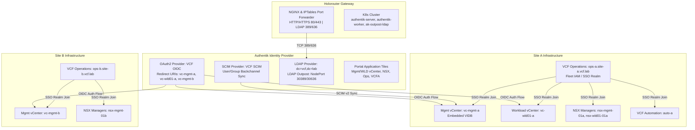
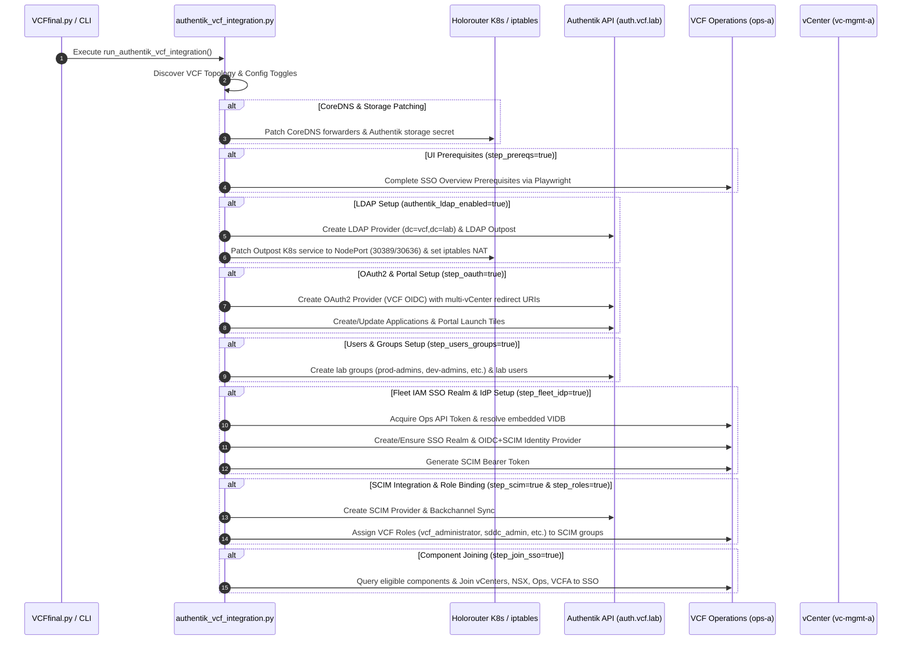

# Authentik Identity Provider & VCF 9.1 SSO Integration

## Overview

This directory contains the automation tooling for integrating **Authentik** as an Identity Provider (IdP) with **VMware Cloud Foundation (VCF) 9.1** across Holodeck lab environments.

The integration provides federated authentication, user/group provisioning, and directory services across multi-site and multi-workload domain topologies:
1. **OIDC Authentication & SSO Federation**: OpenID Connect integration for vCenter (Management and Workload Domains), VCF Operations, VCF Automation, and NSX Managers.
2. **SCIM User & Group Provisioning**: Automated identity synchronization via SCIM v2 between Authentik and the VCF Operations Fleet IAM Identity Directory (VIDB).
3. **Multi-Site & Multi-Domain Support**: Automatic discovery and orchestration across Site A and Site B infrastructure (`vc-mgmt-a`, `vc-wld01-a`, `vc-mgmt-b`, `vc-wld01-b`, `ops-a`, `ops-b`, `nsx-mgmt-01a`, `nsx-wld01-01a`, `nsx-mgmt-01b`, `auto-a`, `auto-b`).
4. **LDAP Directory Services**: Authentik LDAP Provider and LDAP Outpost running on the Holorouter Kubernetes cluster, with automatic port routing (ports 389 and 636) via NodePort and `iptables`.
5. **Attendee Lab Modularity**: Fine-grained `config.ini` toggles enabling full end-to-end automation or selective stage execution for attendee self-paced manual exercises.

---

## Directory Structure

| File | Description |
|---|---|
| `Tools/authentik/authentik_vcf_integration.py` | Main orchestrator script. Handles topology discovery, CoreDNS/storage patching, UI prerequisites, Authentik OAuth2/SCIM/LDAP API calls, application portal launch tiles, and execution control. |
| `Tools/authentik/authentik_fleet_iam.py` | Client library for VCF Operations Fleet IAM APIs (`/suite-api/api/fleet-management/iam/*`). Handles SSO realm creation, OIDC+SCIM IdP configuration, SCIM token generation, role assignment, and component joining. |
| `Tools/authentik/README.md` | Administrator and operational reference guide (this document). |

---

## System Architecture & Data Flow



---

## End-to-End Integration Flow



---

## Configuration Reference (`config.ini`)

All toggles are configured in `[VCFFINAL]` and `[AUTHENTIK]` sections of `/tmp/config.ini` or `holodeck/defaultconfig.ini`.

### Master & Site Enablement Toggles

| Section | Parameter | Default | Description |
|---|---|---|---|
| `[VCFFINAL]` | `authentik_vcf_integration` | `false` | Master toggle to enable Authentik + VCF SSO integration. |
| `[VCFFINAL]` | `authentik_sso_site_a` | `true` | Enable SSO integration for Site A resources (`ops-a`, `vc-mgmt-a`, `vc-wld01-a`). |
| `[VCFFINAL]` | `authentik_sso_site_b` | `true` | Enable SSO integration for Site B resources (`ops-b`, `vc-mgmt-b`, `vc-wld01-b`) if present. |

### Component SSO Join Toggles

Control which infrastructure components are joined to the Fleet IAM SSO Realm:

| Section | Parameter | Default | Description |
|---|---|---|---|
| `[VCFFINAL]` | `authentik_join_mgmt_vc` | `true` | Join Management vCenter(s) to SSO. |
| `[VCFFINAL]` | `authentik_join_wld_vc` | `true` | Join Workload vCenter(s) to SSO. |
| `[VCFFINAL]` | `authentik_join_nsx` | `true` | Master toggle for NSX Manager SSO joining. |
| `[VCFFINAL]` | `authentik_join_nsx_mgmt` | `true` | Join Management NSX Manager(s) to SSO. |
| `[VCFFINAL]` | `authentik_join_nsx_wld` | `true` | Join Workload NSX Manager(s) to SSO. |
| `[VCFFINAL]` | `authentik_join_ops` | `true` | Join VCF Operations instance(s) to SSO. |
| `[VCFFINAL]` | `authentik_join_auto` | `true` | Join VCF Automation instance(s) to SSO. |

### Modular Workflow Step Toggles (Lab Exercises)

Allow lab authors to partially execute automation so lab attendees can complete individual steps manually:

| Section | Parameter | Default | Description |
|---|---|---|---|
| `[VCFFINAL]` | `authentik_step_prereqs` | `true` | Execute VCF Operations UI Prerequisites check (Playwright). |
| `[VCFFINAL]` | `authentik_step_oauth` | `true` | Create Authentik OAuth2 Provider, Application, and Portal Tiles. |
| `[VCFFINAL]` | `authentik_step_users_groups` | `true` | Provision Authentik groups and lab users. |
| `[VCFFINAL]` | `authentik_step_fleet_idp` | `true` | Create Fleet IAM SSO Realm and OIDC+SCIM IdP in VCF Operations. |
| `[VCFFINAL]` | `authentik_step_scim` | `true` | Create Authentik SCIM Provider and initiate backchannel identity sync. |
| `[VCFFINAL]` | `authentik_step_roles` | `true` | Assign VCF Roles (`vcf_administrator`, `sddc_admin`, etc.) to SCIM groups. |
| `[VCFFINAL]` | `authentik_step_join_sso` | `true` | Join discovered components to the SSO Realm. |

### Authentik LDAP Provider Toggles

| Section | Parameter | Default | Description |
|---|---|---|---|
| `[AUTHENTIK]` | `authentik_ldap_enabled` | `false` | Enable Authentik LDAP Provider and LDAP Outpost deployment. |
| `[AUTHENTIK]` | `authentik_ldap_base_dn` | `dc=vcf,dc=lab` | Base DN for the LDAP directory. |
| `[AUTHENTIK]` | `authentik_ldap_provider_name` | `VCF LDAP` | Display name for the Authentik LDAP Provider. |
| `[AUTHENTIK]` | `authentik_ldap_outpost_name` | `authentik LDAP Outpost` | Name for the Authentik LDAP Outpost instance. |
| `[AUTHENTIK]` | `authentik_ldap_router_proxy` | `true` | Automatically configure Holorouter NodePorts (`30389`/`30636`) and `iptables` port forwarding for standard ports `389` and `636`. |

### Authentik Base URL & Provisioning

| Section | Parameter | Default | Description |
|---|---|---|---|
| `[AUTHENTIK]` | `authentik_base_url` | `https://auth.vcf.lab` | Authentik API endpoint. |
| `[AUTHENTIK]` | `authentik_groups` | *(none)* | Additional groups to create in Authentik (one per line). |
| `[AUTHENTIK]` | `authentik_users` | *(none)* | Users to provision in `username:Display Name:email:group1,group2` format. |

---

## Standalone Command Line Execution

The integration script can be run directly from the command line on the Manager VM (`/home/holuser/hol`).

### Example 1: Dry-Run Mode (Validation Only)

Test topology discovery, configuration toggle parsing, and view projected API calls without making any system changes:

```bash
python3 Tools/authentik/authentik_vcf_integration.py --dry-run
```

*Sample Output:*
```text
=== Authentik + VCF integration ===
Discovered topology: 3 vCenter(s), 3 NSX Manager(s), 2 Ops, 1 VCFA
Redirect URIs (3): https://vc-mgmt-a.site-a.vcf.lab/federation/t/CUSTOMER/auth/response/oauth2, https://vc-wld01-a.site-a.vcf.lab/federation/t/CUSTOMER/auth/response/oauth2, https://vc-mgmt-b.site-b.vcf.lab/federation/t/CUSTOMER/auth/response/oauth2
Authentik integration: Step 1 — CoreDNS forwarder (router kubectl)
  DRY-RUN would run: sshpass -f /home/holuser/creds.txt ssh ...
Authentik integration: Step 1b — Authentik Storage Patch (router kubectl)
  DRY-RUN would check/patch Authentik storage secret.
  SSO UI: DRY-RUN would complete prerequisites + Configure SSO on https://ops-a.site-a.vcf.lab
  DRY-RUN would POST providers/oauth2/ ...
Dry-run — skipping downstream steps.
```

### Example 2: Standard Live Execution

Run full end-to-end integration against active lab environment using `/tmp/config.ini`:

```bash
python3 Tools/authentik/authentik_vcf_integration.py
```

### Example 3: Custom Configuration File

Specify a custom `config.ini` file path:

```bash
python3 Tools/authentik/authentik_vcf_integration.py --config /path/to/custom_config.ini
```

### Example 4: Environment Overrides

Override the default Authentik API token or credentials path:

```bash
AUTHENTIK_API_TOKEN="custom_token" HOL_CREDS_PATH="/home/holuser/custom_creds.txt" python3 Tools/authentik/authentik_vcf_integration.py
```

### Example 5: Standalone Fleet IAM Helper

To inspect or query Fleet IAM SSO realms directly using `authentik_fleet_iam.py`:

```bash
python3 Tools/authentik/authentik_fleet_iam.py
```

---

## Troubleshooting & Diagnostics

1. **Verify Authentik Outpost & Pod Status**:
   ```bash
   ssh root@router "kubectl get pods,svc -n default"
   ```
2. **Test LDAP TCP Connection**:
   ```bash
   nc -zvw3 192.168.0.2 389
   nc -zvw3 192.168.0.2 636
   ```
3. **Check OIDC Discovery Endpoint**:
   ```bash
   curl -sk https://auth.vcf.lab/application/o/vcf/.well-known/openid-configuration
   ```
4. **Inspect Fleet IAM SSO Realms via API**:
   ```bash
   python3 -c "from Tools.authentik.authentik_fleet_iam import log_fleet_sso_realm_summary; log_fleet_sso_realm_summary('https://ops-a.site-a.vcf.lab', '<ops_token>', print, False)"
   ```
