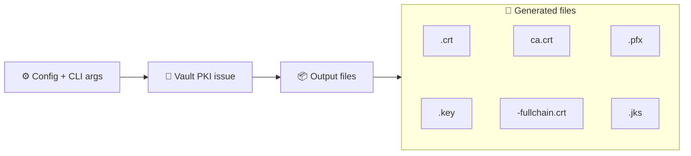
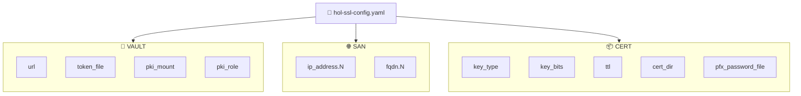
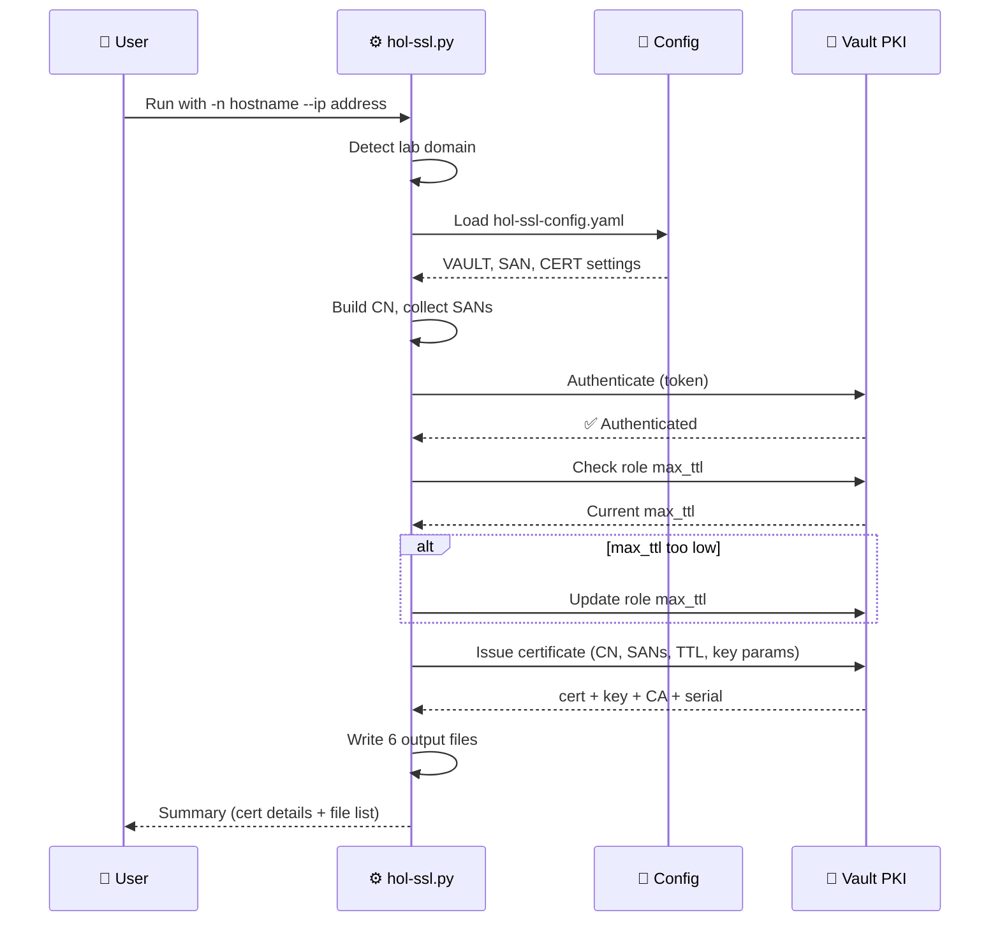

# HOL SSL Certificate Generator

_User guide for `hol-ssl.py` v2.2 — issue trusted TLS certificates in HOL lab environments via HashiCorp Vault PKI._

---

## 📋 Overview

`hol-ssl.py` is a command-line tool that requests TLS certificates from a HashiCorp Vault PKI secrets engine and writes them to disk in every format a lab workload might need: PEM, PKCS12/PFX, and Java KeyStore (JKS).

It is designed for **HOL vPod lab environments** where a Vault instance with a configured PKI engine is already running on the Holorouter. The tool handles:

- Automatic lab domain detection (reverse DNS, `resolv.conf`, or `site-a.vcf.lab` default)
- Common Name construction from bare hostnames
- Subject Alternative Name (SAN) population from config and CLI overrides
- Vault PKI role `max_ttl` auto-adjustment when the requested TTL exceeds the role limit
- Output of six certificate files in a single invocation

<div style="background-color: white; padding: 16px; border-radius: 8px;">



</div>

---

## 🔧 Prerequisites

| Requirement | Details |
|---|---|
| **Python 3.9+** | Tested on 3.11 and 3.12 |
| **Vault server** | A running HashiCorp Vault instance with a PKI secrets engine and an issuing role configured |
| **Vault token** | A valid token with `create` capability on the PKI issue endpoint, stored in a file |
| **Python packages** | `hvac`, `pyyaml`, `cryptography`, `pyjks` |

Install the Python dependencies:

```bash
pip install hvac pyyaml cryptography pyjks
```

---

## 🚀 Quick start

The simplest invocation needs only a hostname. The tool auto-detects the lab domain and appends it:

```bash
./hol-ssl.py -n my-webserver --ip 10.0.100.100
```

This produces a certificate with:

- **CN:** `my-webserver.site-a.vcf.lab` (domain appended automatically)
- **SAN (DNS):** any `fqdn.N` entries from the config file
- **SAN (IP):** `10.0.100.100` (from the `--ip` flag)
- **Output:** six files written to the configured `cert_dir` (default `/hol/ssl`)

---

## ⚙️ Command-line options

| Flag | Value | Required | Description |
|---|---|:---:|---|
| `-n`, `--hostname` | hostname or FQDN | **Yes** | Sets the certificate Common Name. Bare names (no dots) get the detected lab domain appended automatically. |
| `-i`, `--ip` | IPv4 address | No | IP address to include as a SAN. Overrides `ip_address.1` in the config. |
| `-f`, `--fqdn` | FQDN | No | Additional DNS SAN. Overrides `fqdn.1` in the config. |
| `-c`, `--config` | file path | No | Path to YAML config file. Default: `./hol-ssl-config.yaml` |
| `-v`, `--verbose` | — | No | Enable debug-level log output. |
| `-h`, `--help` | — | No | Show the styled help screen. |

> 💡 **Tip:** Running the script with no arguments displays the full help screen with examples, output file descriptions, and configuration notes.

---

## 📋 Configuration file

All Vault connection details, SAN entries, key parameters, and output settings are controlled by a YAML config file. The default location is `./hol-ssl-config.yaml`.

### Structure

The config file has three required sections:

<div style="background-color: white; padding: 16px; border-radius: 8px;">



</div>

### VAULT section

| Key | Default | Description |
|---|---|---|
| `url` | — | Vault server URL (e.g. `http://10.1.1.1:32000`) |
| `token_file` | — | Path to a file containing the Vault authentication token (first line) |
| `pki_mount` | `pki` | Mount path of the PKI secrets engine in Vault |
| `pki_role` | `holodeck` | Name of the PKI role used to issue certificates |

### SAN section

SANs are specified as numbered keys. The tool collects all keys matching `fqdn.N` and `ip_address.N`, deduplicates them, and passes them to Vault. The Common Name is always included as a SAN automatically by Vault.

| Key pattern | Example | Description |
|---|---|---|
| `ip_address.N` | `"10.0.0.1"` | IPv4 address SAN. **Always quote** to prevent YAML type coercion. |
| `fqdn.N` | `"alias.site-a.vcf.lab"` | Additional DNS SAN. Add as many as needed. |

> 📌 **Note:** The `-i`/`--ip` flag overrides `ip_address.1` and the `-f`/`--fqdn` flag overrides `fqdn.1`. Higher-numbered entries are unaffected by CLI flags.

### CERT section

| Key | Default | Description |
|---|---|---|
| `key_type` | `rsa` | Key algorithm: `rsa` or `ec` |
| `key_bits` | `2048` | Key size. RSA: `2048` or `4096`. EC: `256` (P-256) or `384` (P-384). |
| `ttl` | `398d` | Certificate lifetime. Accepts Vault TTL syntax: `398d`, `8760h`, `60m`, `3600s`, or bare seconds. |
| `cert_dir` | `/hol/ssl` | Output directory for all generated files. Created automatically if it doesn't exist. |
| `pfx_password_file` | — | Path to a file containing the password for PFX/JKS keystores (first line). If omitted, falls back to `token_file` with a warning. |

### Example config

```yaml
VAULT:
  url: "http://10.1.1.1:32000"
  token_file: "/home/holuser/creds.txt"
  pki_mount: "pki"
  pki_role: "holodeck"

SAN:
  ip_address.1: "10.0.0.1"
  # fqdn.1: "alias.site-a.vcf.lab"
  # ip_address.2: "10.0.0.2"

CERT:
  key_type: "rsa"
  key_bits: 2048
  ttl: "398d"
  cert_dir: "/hol/ssl"
  pfx_password_file: "/home/holuser/creds.txt"
```

---

## 📦 Output files

Each invocation generates six files in the configured `cert_dir`:

| File | Format | Permissions | Description |
|---|---|:---:|---|
| `<hostname>.crt` | PEM | 0644 | The issued certificate |
| `<hostname>.key` | PEM | **0600** | Private key (restricted) |
| `ca.crt` | PEM | 0644 | Issuing CA certificate |
| `<hostname>-fullchain.crt` | PEM | 0644 | Certificate + CA concatenated |
| `<hostname>.pfx` | PKCS12 | **0600** | Key + cert + CA in PKCS12 format (encrypted with `pfx_password_file`) |
| `<hostname>.jks` | JKS | **0600** | Java KeyStore with `PrivateKeyEntry` and `TrustedCertEntry` |

> ⚠️ **Warning:** `ca.crt` uses a fixed filename. If you issue certificates for multiple hosts to the same `cert_dir`, the CA file is overwritten on each run. This is expected behavior since all certificates share the same issuing CA.

---

## 🎯 Usage examples

### Bare hostname with IP SAN

The lab domain is auto-detected and appended. The CN becomes `my-webserver.site-a.vcf.lab`:

```bash
./hol-ssl.py -n my-webserver --ip 10.0.100.100
```

### Explicit FQDN as the CN

Pass a fully qualified name when the hostname already includes dots:

```bash
./hol-ssl.py -n my-webserver.site-a.vcf.lab --ip 10.0.100.100
```

### Adding an extra DNS SAN

Use `--fqdn` to add a DNS alias in addition to the CN:

```bash
./hol-ssl.py -n my-webserver --ip 10.0.100.100 --fqdn alias.vcf.lab
```

### Using a custom config file

Point to a different config when working with multiple Vault instances or PKI roles:

```bash
./hol-ssl.py -c /path/to/custom-config.yaml -n my-webserver --ip 10.0.100.100
```

### Debug mode

Enable verbose logging to see Vault API details:

```bash
./hol-ssl.py -n my-webserver --ip 10.0.100.100 --verbose
```

---

## 🔍 How it works

<div style="background-color: white; padding: 16px; border-radius: 8px;">



</div>

### Domain detection

The tool determines the lab domain through a three-step fallback:

1. **Reverse DNS** on `10.0.0.2` — extracts the domain portion of the FQDN
2. **`/etc/resolv.conf`** — finds the common suffix among `search` domains
3. **Default** — falls back to `site-a.vcf.lab`

### TTL handling

The default TTL of `398d` (398 days) is the maximum certificate lifetime that Firefox considers valid per the Mozilla Root Store Policy[^1]. If the Vault PKI role's `max_ttl` is lower than the requested TTL, the script automatically raises it before issuing.

TTL values accept Vault-style suffixes: `d` (days), `h` (hours), `m` (minutes), `s` (seconds), or bare integers (seconds).

---

## 🛠️ Troubleshooting

| Symptom | Cause | Fix |
|---|---|---|
| `ERROR: File not found: <path>` | Token file or config file doesn't exist | Verify the path exists and is readable |
| `ERROR: Cannot connect to Vault at <url>` | Vault is unreachable | Check that Vault is running and the URL is correct. Try `curl <url>/v1/sys/health`. |
| `ERROR: Vault authentication failed` | Token is expired or invalid | Regenerate the Vault token and update the file |
| `ERROR: Vault certificate issuance failed` | CN not allowed by role, or role misconfigured | Verify the PKI role's `allowed_domains` includes your lab domain. Check `allow_subdomains` is enabled. |
| `ERROR: Missing required section 'VAULT'` | Config file is malformed or missing a section | Ensure all three sections (`VAULT`, `SAN`, `CERT`) exist in the YAML file |
| `ERROR: Invalid TTL value` | TTL string in config is not a valid number+suffix | Use formats like `398d`, `8760h`, or `34387200` |
| Warning about `pfx_password_file` | No dedicated password file configured | Add `pfx_password_file` to the `CERT` section pointing to a file with the desired PFX/JKS password |

---

## 🔗 Related files

| File | Description |
|---|---|
| `Tools/hol-ssl.py` | The certificate generator script |
| `Tools/hol-ssl-config.yaml` | Default configuration file |
| `/home/holuser/creds.txt` | Default token and password file (standard lab location) |

---

[^1]: Mozilla. "Root Store Policy, Section 6.1 — Maximum Validity Period." https://wiki.mozilla.org/CA/Root_Store_Policy#6.1_Maximum_Validity_Period
