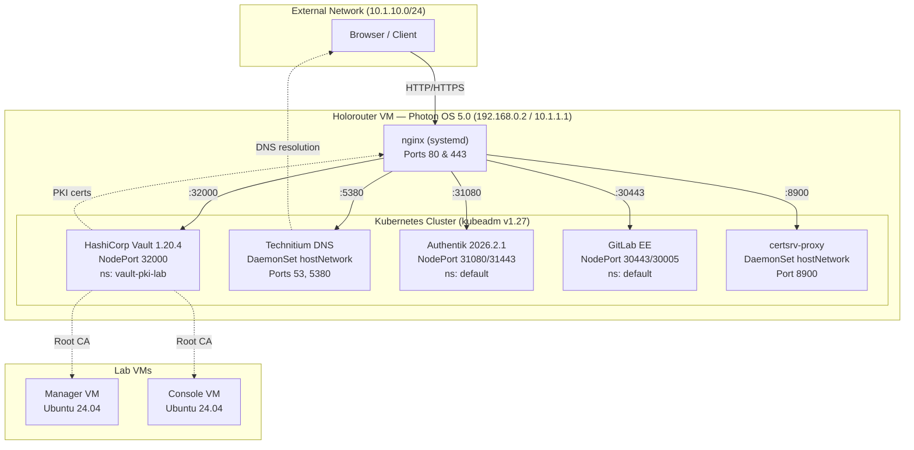
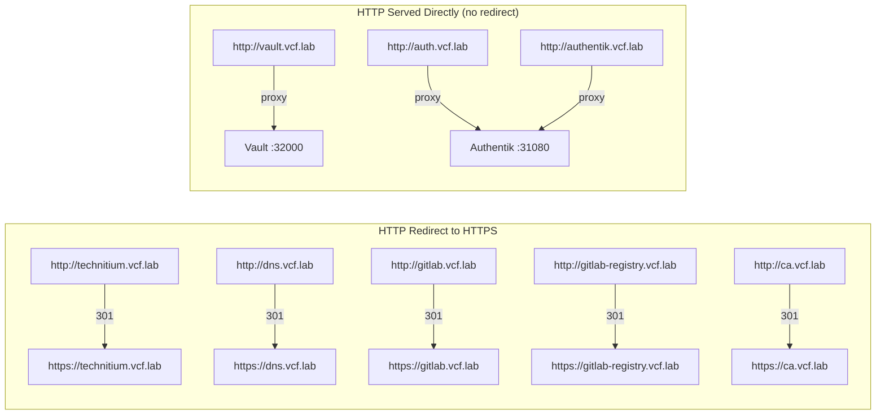
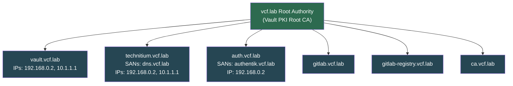
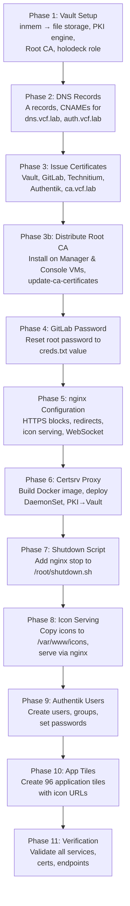
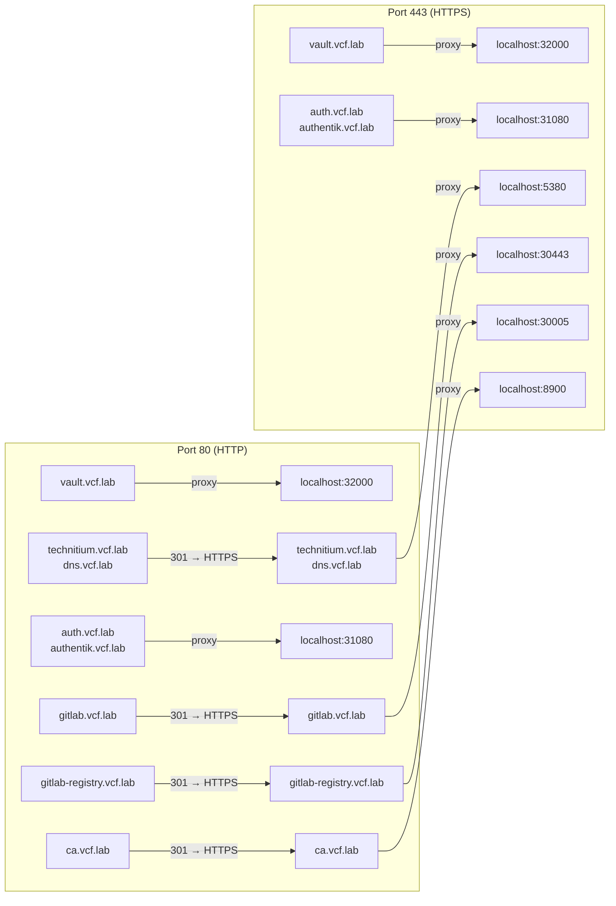
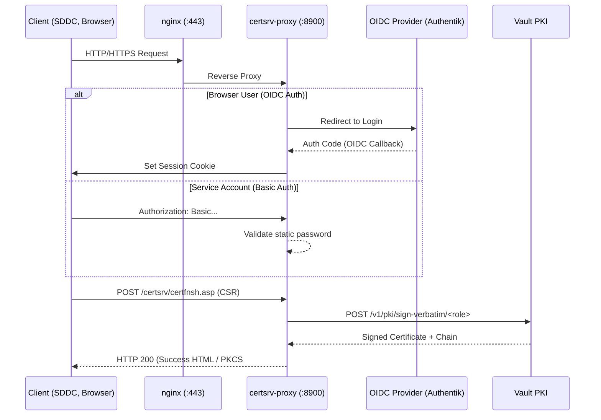

# Holorouter Configuration & Services

Automated normalization and configuration of the holorouter VM — a Photon OS 5.0 gateway running Kubernetes (kubeadm v1.27), nginx reverse proxy, and multiple lab services.

## Quick Start

```bash
# Run from the manager VM as holuser
python3 /home/holuser/hol/Tools/holorouter/configure_holorouter.py
```

The script is **idempotent** — safe to re-run at any time. Each phase detects existing configuration and skips if already applied.

## Architecture Overview



## Service Endpoints

### URL Reference

| URL | Protocol | Service | Notes |
| --- | --- | --- | --- |
| `http://vault.vcf.lab` | HTTP | Vault UI | Direct proxy, no redirect |
| `https://vault.vcf.lab` | HTTPS | Vault UI | Vault-signed cert |
| `https://technitium.vcf.lab` | HTTPS | Technitium DNS | HTTP redirects to HTTPS |
| `https://dns.vcf.lab` | HTTPS | Technitium DNS | CNAME alias, HTTP redirects to HTTPS |
| `http://auth.vcf.lab` | HTTP | Authentik IdP | Direct proxy, no redirect |
| `https://auth.vcf.lab` | HTTPS | Authentik IdP | Preferred URL |
| `http://authentik.vcf.lab` | HTTP | Authentik IdP | Direct proxy, no redirect |
| `https://authentik.vcf.lab` | HTTPS | Authentik IdP | Also works via HTTPS |
| `https://gitlab.vcf.lab` | HTTPS | GitLab EE | HTTP redirects to HTTPS |
| `https://gitlab-registry.vcf.lab` | HTTPS | GitLab Container Registry | HTTP redirects to HTTPS |
| `https://ca.vcf.lab/certsrv/` | HTTPS | PKI Proxy (Vault PKI) | HTTP redirects to HTTPS |
| `https://auth.vcf.lab/icons/{file}` | HTTPS | Static icon files | 96 app icons served by nginx |

### HTTP vs HTTPS Behavior



### DNS Records

All hostnames resolve to `192.168.0.2` via Technitium DNS in the `vcf.lab` zone:

| Record | Type | Value |
| --- | --- | --- |
| `vault.vcf.lab` | A | 192.168.0.2 |
| `technitium.vcf.lab` | A | 192.168.0.2 |
| `authentik.vcf.lab` | A | 192.168.0.2 |
| `gitlab.vcf.lab` | A | 192.168.0.2 |
| `gitlab-registry.vcf.lab` | A | 192.168.0.2 |
| `ca.vcf.lab` | A | 192.168.0.2 |
| `dns.vcf.lab` | CNAME | technitium.vcf.lab |
| `auth.vcf.lab` | CNAME | authentik.vcf.lab |

## TLS Certificates

All certificates are issued by the on-box Vault PKI engine (`vcf.lab Root Authority`). The Root CA is distributed to the Manager and Console VMs so that `curl`, browsers, and other tools trust the certificates without `-k` or manual overrides.

### Certificate Inventory



| Certificate CN | SANs | IP SANs | Cert Path (on holorouter) | Key Path |
| --- | --- | --- | --- | --- |
| `vault.vcf.lab` | — | 192.168.0.2, 10.1.1.1 | `/root/nginx-certs/vault.crt` | `/root/nginx-certs/vault.key` |
| `technitium.vcf.lab` | `dns.vcf.lab` | 192.168.0.2, 10.1.1.1 | `/root/nginx-certs/technitium.crt` | `/root/nginx-certs/technitium.key` |
| `auth.vcf.lab` | `authentik.vcf.lab` | 192.168.0.2 | `/root/nginx-certs/authentik.crt` | `/root/nginx-certs/authentik.key` |
| `gitlab.vcf.lab` | — | — | `/holodeck-runtime/gitlab/ssl/gitlab.crt` | `/holodeck-runtime/gitlab/ssl/gitlab.key` |
| `gitlab-registry.vcf.lab` | — | — | `/holodeck-runtime/gitlab/ssl/gitlab-registry.crt` | `/holodeck-runtime/gitlab/ssl/gitlab-registry.key` |
| `ca.vcf.lab` | — | — | `/root/certsrv-proxy/ca.crt` | `/root/certsrv-proxy/ca.key` |

### Root CA Distribution

| Target | Path | Method |
| --- | --- | --- |
| Manager VM | `/usr/local/share/ca-certificates/vcf-lab-root-ca.crt` | SSH as root, `update-ca-certificates` |
| Console VM | `/usr/local/share/ca-certificates/vcf-lab-root-ca.crt` | SSH as root, `update-ca-certificates` |

## Authentication & Credentials

All passwords default to the contents of `/home/holuser/creds.txt` on the manager VM (or `/root/creds.txt` on the holorouter).

| Service | Username | Password | Notes |
| --- | --- | --- | --- |
| Vault UI | — | Token auth | Use creds.txt contents as the root token |
| Technitium DNS | `admin` | creds.txt | Web UI and API |
| Authentik | `akadmin` | creds.txt | Admin user |
| Authentik API | — | creds.txt | Bootstrap API token (Bearer) |
| GitLab | `root` | creds.txt | Set by Phase 4 |

### Pre-Created Authentik Users

All user passwords are set to the creds.txt value. Password expiry policies are removed.

| Username | Email | Purpose |
| --- | --- | --- |
| `akadmin` | akadmin@vcf.lab | Built-in admin (superuser) |
| `dev-user` | dev-user@vcf.lab | Development user |
| `dev-admin` | dev-admin@vcf.lab | Development administrator |
| `dev-readonly` | dev-readonly@vcf.lab | Development read-only |
| `approver` | approver@vcf.lab | Approval workflows |
| `requestor` | requestor@vcf.lab | Request workflows |
| `prod-user` | prod-user@vcf.lab | Production user |
| `prod-admin` | prod-admin@vcf.lab | Production administrator |
| `prod-readonly` | prod-readonly@vcf.lab | Production read-only |
| `vcadmin` | vcadmin@vcf.lab | VCF administrator |
| `demouser` | demouser@vcf.lab | Demo/lab user |
| `backup` | backup@vcf.lab | Backup operations |
| `audit` | audit@vcf.lab | Audit/compliance |
| `configadmin` | configadmin@vcf.lab | Configuration management |

### Authentik Groups

| Group | Members |
| --- | --- |
| `dev-users` | dev-user |
| `dev-admins` | dev-admin |
| `dev-readonly` | dev-readonly |
| `approvers` | approver |
| `prod-users` | prod-user |
| `prod-admins` | prod-admin |
| `prod-readonly` | prod-readonly |

## Script Phases

The `configure_holorouter.py` script executes the following phases in order:



### Phase Details

#### Phase 1: Vault Setup

Converts Vault from development mode (in-memory storage) to standalone mode with persistent file storage. Configures the PKI secrets engine with a Root CA (`vcf.lab Root Authority`) and creates the `holodeck` issuing role. Sets the root token to the lab password. Vault data persists at `/holodeck-runtime/vault/data/` on the holorouter.

#### Phase 2: DNS Records

Creates A and CNAME records in Technitium DNS via its API (port 5380). Adds records for `ca.vcf.lab` (A), `dns.vcf.lab` (CNAME → technitium.vcf.lab), and `auth.vcf.lab` (CNAME → authentik.vcf.lab).

#### Phase 3: Issue Certificates

Issues six TLS certificates from the Vault PKI engine with a 720-hour TTL:
- `vault.vcf.lab` — IP SANs: 192.168.0.2, 10.1.1.1
- `gitlab.vcf.lab` — copied to both nginx and GitLab config SSL dirs
- `gitlab-registry.vcf.lab` — same dual-path copy
- `ca.vcf.lab` — used by the certsrv proxy nginx block
- `technitium.vcf.lab` — SANs: dns.vcf.lab; IP SANs: 192.168.0.2, 10.1.1.1
- `auth.vcf.lab` — SANs: authentik.vcf.lab; IP SAN: 192.168.0.2

Restarts the GitLab pod to pick up the new certificates.

#### Phase 3b: Distribute Root CA

Exports the Vault Root CA PEM and installs it into the OS certificate trust store on both the Manager and Console VMs (`/usr/local/share/ca-certificates/vcf-lab-root-ca.crt`). Runs `update-ca-certificates` so that `curl`, Python `requests`, and browsers trust Vault-issued certificates without manual overrides.

#### Phase 4: Fix GitLab Root Password

Resets the GitLab `root` user password to the creds.txt value. Attempts API-based reset first (using the auto-generated initial password from `/etc/gitlab/initial_root_password` inside the GitLab pod), with `gitlab-rails runner` as a fallback.

#### Phase 5: nginx Configuration

Configures the systemd nginx reverse proxy with the correct server blocks:
- **Vault**: HTTP proxy (port 80) + HTTPS proxy (port 443), no redirect
- **Technitium**: HTTP 301 redirect to HTTPS, HTTPS proxy with Vault-signed cert
- **Authentik**: HTTP proxy (port 80, no redirect) + HTTPS proxy (port 443), serves `/icons/` static files, WebSocket upgrade support
- **GitLab / GitLab Registry**: HTTP 301 redirect to HTTPS
- **ca.vcf.lab**: HTTP 301 redirect to HTTPS, HTTPS proxy to certsrv on port 8900

#### Phase 6: Deploy Certsrv Proxy

Builds the PKI proxy Docker image from `Dockerfile.certsrv-proxy` and `certsrv_proxy.py`. The Docker daemon is started only for the build and stopped after. The image is exported via `docker save`, imported into containerd with `ctr`, and deployed as a Kubernetes DaemonSet with `hostNetwork: true` on port 8900. This proxy translates Microsoft ADCS Web Enrollment requests (`/certsrv/`) into HashiCorp Vault PKI API calls.

#### Phase 7: Update Shutdown Script

Adds an `nginx stop` function to `/root/shutdown.sh` on the holorouter, ensuring nginx is gracefully stopped during lab shutdown.

#### Phase 8: Setup Icon Serving

Copies application icons from `images/` to `/var/www/icons/` on the holorouter. Icons are served as static files by nginx at the `/icons/` location under both the HTTP and HTTPS Authentik server blocks.

#### Phase 9: Authentik Users and Groups

Creates 13 user accounts and 7 groups via the Authentik API. Sets all passwords to the creds.txt value and removes password expiry policies. Configures group memberships.

#### Phase 10: Create App Tiles

Creates 96 application tiles in Authentik with icon URLs pointing to `https://auth.vcf.lab/icons/{filename}`. Each tile maps to a dashboard icon from the `images/` directory.

#### Phase 11: Verification

Runs automated checks against all services:
- Vault seal status, storage type, token, PKI CA, HTTPS
- CA trust on Manager and Console VMs (curl without `-k`)
- GitLab HTTPS, HTTP redirect, root login, cert issuer
- Technitium HTTPS on both `technitium.vcf.lab` and `dns.vcf.lab`, cert SANs
- Certsrv proxy HTTP status
- DNS CNAME records
- Authentik HTTPS, HTTP proxy (no redirect), users, application tiles

Prints a PASS/FAIL summary for each check.

## nginx Reverse Proxy

nginx runs as a systemd service (not inside Kubernetes) and handles all inbound HTTP/HTTPS routing.



### Key Configuration Details

- Config file: `/etc/nginx/nginx.conf`
- Reload: `nginx -t && nginx -s reload`
- Static icons: `/var/www/icons/` served at `/icons/` path on Authentik blocks
- WebSocket upgrade headers on Authentik HTTPS block

## Vault PKI

HashiCorp Vault serves as the internal Certificate Authority for the lab.

| Setting | Value |
| --- | --- |
| Version | 1.20.4 |
| Namespace | `vault-pki-lab` |
| NodePort | 32000 |
| Storage | `file` (`/holodeck-runtime/vault/data/`) |
| PKI Path | `pki/` |
| Root CA CN | `vcf.lab Root Authority` |
| Issuing Role | `holodeck` |
| Allowed Domains | `vcf.lab` (subdomains allowed) |
| IP SANs | Allowed |
| Max TTL | 17520h (2 years) |
| Unseal | Automatic on boot via `/root/unseal_vault.sh` |

## VCF CA Proxy (certsrv)

> **Disclaimer**: This software is not developed, endorsed, or affiliated with Microsoft Corporation. It provides a certsrv-compatible interface for interoperability with products that expect a Microsoft ADCS Web Enrollment endpoint.

The certsrv proxy provides an interface compatible with Microsoft Active Directory Certificate Services web enrollment. SDDC Manager, VCF Operations, and other lab appliances use this to request and retrieve certificates.



### Features & Capabilities
- **Template to Vault Role Mapping**: AD CS template names are mapped dynamically to HashiCorp Vault PKI roles via a JSON configuration file.
- **Advanced Auth Support**: Supports static Basic Auth (for SDDC Manager / scripts) and OpenID Connect (OIDC) with Authentik for browser-based human users.
- **CRL Distribution**: Exposes the Vault PKI Base CRL via the `/certsrv/certnew.crl` endpoint in both PEM and DER formats.
- **Instant Issuance**: Automatically signs all CSRs instantly against Vault—no polling or "pending" state required.

### Proxy Configuration
The proxy accepts several CLI arguments and environment variables to customize behavior:

| CLI Argument | Environment Variable | Default | Description |
| --- | --- | --- | --- |
| `--port` | `PROXY_PORT` | `8900` | HTTP listen port |
| `--bind` | `PROXY_BIND` | `0.0.0.0` | Bind address |
| `--vault-url` | `VAULT_ADDR` | `http://127.0.0.1:32000` | Vault API URL |
| `--vault-token` | `VAULT_TOKEN` | (read from creds file) | Vault authentication token |
| `--vault-mount` | `VAULT_PKI_MOUNT` | `pki` | Vault PKI mount path |
| `--vault-role` | `VAULT_PKI_ROLE` | `holodeck` | Default Vault PKI role name |
| `--vault-skip-verify` | `VAULT_SKIP_VERIFY` | `true` | Skip TLS verification for Vault |
| `--cert-ttl` | `CERT_TTL` | `17520h` | Default Certificate TTL (2 years) |
| `--password` | `PROXY_PASSWORD` | (read from creds file) | Basic Auth password |
| `--role-mapping` | `ROLE_MAPPING` | None | Path to JSON file mapping AD CS templates to Vault roles |
| `--oidc-issuer` | `OIDC_ISSUER` | None | OIDC issuer URL (e.g., `https://auth.vcf.lab/application/o/certsrv/`) |
| `--oidc-client-id` | `OIDC_CLIENT_ID` | None | OIDC Client ID |
| `--oidc-client-secret` | `OIDC_CLIENT_SECRET`| None | OIDC Client Secret |
| `--oidc-redirect-uri` | `OIDC_REDIRECT_URI` | `https://ca.vcf.lab/certsrv/oidc/callback` | OIDC Redirect URI |

Example running with CLI arguments:
```bash
python3 certsrv_proxy.py \
    --port 8900 \
    --vault-url http://127.0.0.1:32000 \
    --vault-token '<token>' \
    --role-mapping /path/to/mapping.json \
    --oidc-issuer https://auth.vcf.lab/application/o/certsrv/ \
    --oidc-client-id '<client_id>' \
    --oidc-client-secret '<secret>' \
    --oidc-redirect-uri https://ca.vcf.lab/certsrv/oidc/callback
```

Example using Environment Variables (ideal for Docker / Kubernetes DaemonSet configuration):
```bash
export VAULT_ADDR="http://127.0.0.1:32000"
export OIDC_ISSUER="https://auth.vcf.lab/application/o/certsrv/"
export OIDC_CLIENT_ID="<client_id>"
export OIDC_CLIENT_SECRET="<secret>"
export ROLE_MAPPING="/path/to/mapping.json"
python3 certsrv_proxy.py
```

### Role Mapping Configuration (`mapping.json`)
The mapping configuration allows translating specific AD CS Template requests to their corresponding HashiCorp Vault PKI roles.

```json
{
  "WebServer": "web_server",
  "VCFWebServer": "holodeck",
  "VMwareWebServer": "holodeck",
  "SubCA": "subca",
  "Machine": "machine_cert"
}
```

If a template is not mapped or missing, the proxy will gracefully fall back to the default role specified by `--vault-role` (usually `holodeck`).

### Standalone Docker Compose Deployment

If you want to run `certsrv_proxy.py` as a standalone service outside of this specific lab environment (e.g., on a generic Docker host to proxy an existing HashiCorp Vault), you can use the provided `docker-compose.yml` file.

1. **Review and configure `docker-compose.yml`**:
   Adjust the environment variables to point to your Vault instance, configure your Basic Auth password, and optionally set up OIDC and Role Mapping.

2. **Create the optional `mapping.json`** (if you enabled `ROLE_MAPPING`):
   ```json
   {
     "WebServer": "web_server",
     "SubCA": "subca"
   }
   ```

3. **Start the service**:
   ```bash
   docker-compose up -d
   ```

4. **Verify it's running**:
   ```bash
   docker-compose logs -f
   ```

The container will expose port `8900` by default. It is highly recommended to place it behind a reverse proxy (like Traefik, Nginx, or HAProxy) that handles TLS termination, as the proxy itself serves plain HTTP.

## Files in This Directory

| File | Purpose |
| --- | --- |
| `configure_holorouter.py` | Main normalization script (run from manager VM) |
| `update-holorouter.sh` | Legacy reference script (do not execute) |
| `certsrv_proxy.py` | PKI proxy Python source |
| `Dockerfile.certsrv-proxy` | Dockerfile for building the certsrv proxy container |
| `images/` | 114 application icon files (SVG/PNG) for Authentik tiles |
| `README.md` | This documentation |

## Troubleshooting

### Certificate Warnings in Browser

If a browser shows certificate warnings after trusting the Root CA, verify that the correct certificate is being served:

```bash
echo | openssl s_client -connect <hostname>:443 -servername <hostname> 2>/dev/null \
  | openssl x509 -noout -subject -issuer -ext subjectAltName
```

The issuer should be `CN = vcf.lab Root Authority`. If a different cert is served (e.g., hostname mismatch), check that the nginx `server_name` directive matches and that an HTTPS server block exists for that hostname.

### Vault Sealed After Reboot

Vault auto-unseals via `/root/unseal_vault.sh` on boot. If manually checking:

```bash
curl -s http://router:32000/v1/sys/seal-status | python3 -m json.tool
```

### Re-issuing Certificates

Re-run the script — Phase 3 re-issues all certificates and Phase 3b re-distributes the Root CA:

```bash
python3 /home/holuser/hol/Tools/holorouter/configure_holorouter.py
```

### GitLab Not Responding

GitLab can take 3-5 minutes to start after a pod restart. Phase 4 waits up to 5 minutes. Check pod status:

```bash
ssh root@router "kubectl get pods -l app=gitlab"
```

### Authentik API Token

The bootstrap API token is `holodeck`. Use it for API calls:

```bash
curl -s -H "Authorization: Bearer holodeck" \
  "http://192.168.0.2:31080/api/v3/core/users/" | python3 -m json.tool
```

### tdns-mgr DNS Management

The `tdns-mgr` CLI tool on the manager VM connects to Technitium DNS at `dns.vcf.lab:443`:

```bash
tdns-mgr login        # Authenticate (password from creds.txt)
tdns-mgr list-zones   # List DNS zones
tdns-mgr config       # Show current configuration
```

Configuration is stored at `~/.config/tdns-mgr/.tdns-mgr.conf`.
