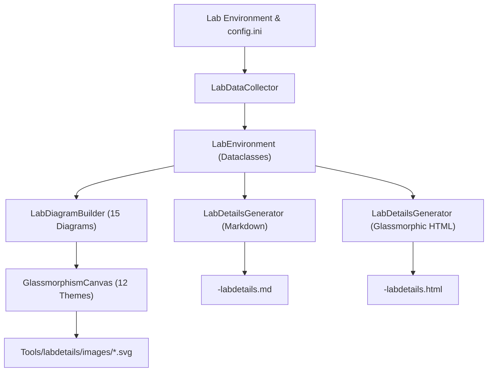

# `AGENT.md` - AI Agent Guidelines for `Tools/labdetails`

**Version:** 2.3.3  
**Last Updated:** 2026-08-27  
**Author:** Broadcom HOL Core Team  
**Audience:** AI Coding Assistants & Agents (Cursor, Claude Code, Cline, Roo, Zoo, Codex, etc.)

---

## 1. Purpose & Scope

This document provides definitive rules, architectural context, and coding standards for AI agents modifying, maintaining, or extending the automated documentation and topology generator tools in `Tools/labdetails/`.

The primary tool in this directory is `generate_labdetails.py`, which dynamically inspects live VMware Cloud Foundation (VCF 9.x) and VMware Validated Foundation (VVF 9.x) Holodeck lab environments (or falls back intelligently when offline) to produce:

1. **Markdown Documentation**: `<SKU>-labdetails.md`
2. **Glassmorphic Interactive HTML Report**: `<SKU>-labdetails.html`
3. **15 Standalone Multi-Style SVG Architecture Diagrams**: `Tools/labdetails/images/*.svg`

---

## 2. Upstream Reference & License Compliance (`fireworks-tech-graph`)

`generate_labdetails.py` incorporates and adapts architecture diagramming principles, color token palettes, layout structures, and pure-Python SVG generation logic from the open-source project **[fireworks-tech-graph](https://github.com/yizhiyanhua-ai/fireworks-tech-graph)**.

### Attribution & License Information

- **Upstream Repository**: [https://github.com/yizhiyanhua-ai/fireworks-tech-graph](https://github.com/yizhiyanhua-ai/fireworks-tech-graph)
- **License**: MIT License © 2025 fireworks-tech-graph contributors
- **License Requirement**: In compliance with the MIT License, attribution notices must be preserved across all derivative scripts, documentation, and header comments.

### Derived Concepts & Design Principles

All AI agents maintaining `generate_labdetails.py` and its documentation must adhere to the design patterns established by `fireworks-tech-graph`:

1. **Pure-Python Vector Generation**: Direct SVG XML string construction without external headless browser binaries (no Chromium, Puppeteer, or Graphviz required).
2. **The 12 Visual Theme Tokens**: Precise color tokens, border radiuses, container background gradients, and typography tailored for 12 distinct aesthetic styles (see Section 8).
3. **Live CSS Keyframe Animations**:
   - `icon-float`: Smooth \(\pm 2\text{px}\) vertical floating oscillation for container and component icons.
   - `dash-flow`: Moving stroke-dasharray animations for flow connector lines between tiers.
   - `radar-ping`: Concentric pulsing rings simulating active network reachability and status dots.
   - `title-glow`: Ambient pulsing opacity and drop-shadow on primary diagram title headers.
   - Flow particles: Dynamic animated SVG circles traversing connector pathways.
4. **Accessible Contrast & Visual Hierarchy**: Strict adherence to minimum WCAG contrast ratios across dark mode, light mode, cream editorial, and CAD blueprint backgrounds.
5. **Preservation of License Notice**: Every Python script or documentation file utilizing `fireworks-tech-graph` concepts must include the following attribution block in its header:

```python
# License:
#   Portions of diagram styling, color tokens, and layout principles derived from
#   fireworks-tech-graph (https://github.com/yizhiyanhua-ai/fireworks-tech-graph)
#   MIT License © 2025 fireworks-tech-graph contributors.
```

---

## 3. Strict Directory & File Placement Rules

AI agents must strictly follow these file placement boundaries:

| Asset Type | Mandatory Location | Forbidden Locations |
| --- | --- | --- |
| **Python Generator Script** | `Tools/labdetails/generate_labdetails.py` | `Tools/generate_labdetails.py` |
| **User & Technical Documentation** | `Tools/labdetails/generate_labdetails.md` | `Tools/generate_labdetails.md`, `README.md` |
| **Agent Guidelines & Rules** | `Tools/labdetails/AGENT.md` | Root directory or other subfolders |
| **Generated SVG Architecture Diagrams** | `Tools/labdetails/images/*.svg` | **`Tools/images/` is strictly forbidden!** |
| **Generated Markdown / HTML Deliverables** | Configured `--output` directory (e.g. `Tools/labdetails/` or `/home/holuser/`) | `Tools/` root |

> **CRITICAL RULE:** Never create, write, or restore image files in `Tools/images/`. All diagrams and images belong exclusively under `Tools/labdetails/images/`.

---

## 4. Core Contribution & Coding Standards

### Rule 1: Zero Hardcoded IP Addresses, Specs, or Counts

- **NEVER hardcode literal IP addresses** (e.g., `"10.1.1.140"`, `"10.1.10.129"`, `"192.168.0.1"`), subnet masks, CPU core totals, memory sizes, or datastore capacities as static values in diagram cards, subtitles, or markdown tables.
- **Always resolve dynamically:**
  - Use `self.env` dataclass properties populated during discovery.
  - Use `resolve_host(hostname, domain)` which queries the global cache `_HOST_CACHE`, `/etc/hosts`, and DNS.
  - Use `get_subnet_for_ip(ip, prefix_len)` for subnet calculations.
  - Dynamically compute host counts, cluster sizes, and VM inventories from discovered objects.
  - If a fallback is necessary, use `resolve_host()` with expected DNS names (e.g., `resolve_host('supervisor') or "10.1.1.140"`).

### Rule 2: Mandatory Header Comment Updates

- **Whenever ANY file is modified**, always update the **version** and **date** (format: `YYYY-MM-DD`, e.g., `2026-08-27`) in the file's header comments before concluding the turn.
- Ensure the version number in `generate_labdetails.py`, `generate_labdetails.md`, and `AGENT.md` stay synchronized.

### Rule 3: Read-Only Safety Protocol

- When connecting to live lab environments (via SSH, REST API, or pyVmomi), **ONLY execute READ-ONLY queries**.
- **NEVER** execute state-changing HTTP requests (`POST` outside auth token creation, `PUT`, `DELETE`, `PATCH`).
- **NEVER** modify or delete files on remote hosts outside `/tmp`.

### Rule 4: Multi-Site & Lab Flavor Awareness

- **Lab Flavor:** Auto-detect VCF vs. VVF from `config.ini` or host discovery. Display **"VVF Version"** when running VVF and **"VCF Version"** when running VCF.
- **Topology:** Check for `site-b` definitions. When multi-site is detected, diagrams (High-Level, Dataflow, Domains, Hosts, Storage) must render dual-site containers for Site A and Site B.

### Rule 5: Deliverable Naming Convention

- The generated Markdown file MUST be named `<SKU>-labdetails.md` (e.g., `VCF-91-labdetails.md`).
- The generated HTML report MUST be named `<SKU>-labdetails.html` (e.g., `VCF-91-labdetails.html`).
- Both files must be generated whenever the script runs (HTML generation is not optional).

---

## 5. Architectural Structure of `generate_labdetails.py`

The script is cleanly divided into four modular subsystems:



### 1. Data Model (`dataclasses`)

- `LabEnvironment`: Central state container holding discovered metadata, hosts, VMs, clusters, datastores, networks, K8s clusters, and holorouter details.
- `HostInfo`, `VMInfo`, `ClusterInfo`, `DatastoreInfo`, `DomainInfo`, `NetworkInfo`, `NSXEdgeInfo`.
- `K8sClusterInfo`, `K8sNodeInfo`: Structured K8s discovery (VIPs, control planes, workers, taints, namespaces, pods, storage classes, PVCs).
- `HolorouterInfo`: Routing interfaces, firewall/NAT state, Squid proxy filter mode, container states.
- `GlassCard`, `FlowEdge`: Primitives for pure-Python SVG rendering.

### 2. Data Collection Engine (`LabDataCollector`)

- `_load_config()`: Reads `/tmp/config.ini`, detects SKU, lab type, flavor (VCF vs. VVF), and multi-site topology.
- `_collect_core_info()`: Checks reachability of Holorouter, Manager, and Console; inspects `/etc/squid/allowlist` to determine proxy filtering status.
- `_collect_sddc_info()`: Authenticates via Bearer token (`admin@local`) to SDDC Manager REST API to discover domains, clusters, and commissioning state.
- `_collect_vcenter_info()`: Connects via pyVmomi SOAP or REST sessions to discover hypervisors, vCPUs, RAM, vSAN ESA/OSA datastores, and VM inventory.
- `_collect_nsx_info()`: Queries NSX Manager REST API for transport nodes, TEP interfaces, and Edge clusters.
- `_collect_k8s_info()`: Discovers Supervisor Tanzu, VSP (Fleet LCM), VCFA (VCF Automation), and SSP (Security Services Platform) clusters via vCenter namespace API and SSH/kubectl JSON queries.
- `_populate_fallback_data()`: Provides robust synthetic defaults derived from DNS/hostname resolution when offline or partial discovery occurs.

### 3. Diagram Engine (`GlassmorphismCanvas` & `LabDiagramBuilder`)

- Pure-Python SVG generator without external binary dependencies (no Graphviz or Chromium required).
- Implements 12 distinct visual themes inspired by `fireworks-tech-graph`.
- Renders live CSS keyframe animations: floating icons (`icon-float`), pulsing titles (`title-glow`), flowing dashed lines (`dash-flow`), radar ping status dots (`radar-ping`), and animated particle flows.
- Builds 15 standalone architecture SVGs.

### 4. Documentation Generator (`LabDetailsGenerator`)

- Generates comprehensive Markdown tables and references.
- Generates self-contained, responsive Style 5 Glassmorphism HTML documents with sticky navigation, metric stat cards, inline SVG diagrams, interactive terminal command snippets, and collapsible tables.

---

## 6. Kubernetes & Platform 5-Tier Diagram Standard

All Kubernetes and container platforms visualized in `LabDiagramBuilder` (**Supervisor Tanzu**, **VSP Fleet LCM**, **VCF Automation**, **Security Services Platform**, and **Holorouter**) must follow the **5-Tier Architecture Standard**:

| Tier List |
| ----------------------------------------------------------------------------------- |
| Tier 1: Ingress & Virtual Routing Endpoints (kube-vip, DLB, MetalLB, NGINX SNI)     |
| Tier 2: Control Plane / Master Quorum & Compute Nodes (Sizing, vCPUs, RAM, Taints)  |
| Tier 3: Lifecycle Operators, Runtimes & Mesh Control Planes (Istio, CAPI, PKI)      |
| Tier 4: Microservices Fabric & Active Namespaces Breakdown (Pod topology)           |
| Tier 5: Storage Subsystems, Bound PVCs & Physical/Virtual Volume Layers             |
| ----------------------------------------------------------------------------------- |

### Platform-Specific Details

1. **Supervisor Tanzu (`supervisor_k8s_architecture.svg`)**
   - *Tier 1*: Supervisor Floating VIP (`10.1.1.140:6443`), CoreDNS Virtual Service VIP (`172.16.200.x`), SSO/WCP Webhook Auth.
   - *Tier 2*: 3-Node HA Control Plane Quorum (`SupervisorControlPlaneVM (1..3)` / `10.1.1.137..139`).
   - *Tier 3*: Hypervisor Worker Compute Fabric (ESXi hosts as native workers via Spherelet and Antrea CNI).
   - *Tier 4*: Namespaces (`kube-system`/`wcp`, `svc-harbor`, `svc-cci`/`ns-argocd`, `ns-hol-apps`).
   - *Tier 5*: Cloud Native Storage (CNS), `vsphere-csi-driver`, bound PVCs, backed by Clustered vSAN.

2. **VSP Management Cluster (`vsp_k8s_architecture.svg`)**
   - *Tier 1*: kube-vip Ingress VIP (`10.1.1.142:5480`), Internal Container Registry (`198.18.128.16:5000`), SDDC Suite Proxy VIP.
   - *Tier 2*: Single-Node Master/Worker VM (`vsp-01a.site-a.vcf.lab` / `10.1.1.141` / 8 vCPUs / 32 GB RAM).
   - *Tier 3*: Operators Pool (`vcf-fleet-lcm`, `vcf-sddc-lcm`, `telemetry`).
   - *Tier 4*: Microservice Namespaces (`vcf-fleet-lcm`, `vcf-sddc-lcm`, `telemetry`, `vmsp-platform`).
   - *Tier 5*: Local Path CSI, Offline Upgrade Depot (`/opt/vmware/vcf/depot`), SQLite/PostgreSQL metadata stores.

3. **VCF Automation Cluster (`vcfa_k8s_architecture.svg`)**
   - *Tier 1*: Istio Ingress Gateway VIP (`10.1.1.70:443`), Direct Platform Management IP (`10.1.1.69:443`), Identity Broker & OIDC Gateway.
   - *Tier 2*: Single-Node Platform Host VM (`auto-a` / `auto-platform-a` / 24 vCPUs / 96 GB RAM), Istio Service Mesh Control Plane (`istiod`).
   - *Tier 3*: Core Runtimes (Cloud Templates/IaC Engine, Resource Placement/Lease, vRO Workflow Engine).
   - *Tier 4*: Namespaces (`prelude`, `vmsp-platform`, Service Broker, Argo Workflows, Redis, PostgreSQL HA).
   - *Tier 5*: Local Storage CSI Operator, Bound PVCs, High-IOPS SSD storage tier.

4. **Security Services Platform (`ssp_k8s_architecture.svg`)**
   - *Tier 1*: MetalLB Layer 2 Ingress VIP (`ssp.site-a.vcf.lab` / `10.1.0.11`), Kafka Telemetry VIPs (`kafka-0..3` / `10.1.0.12..15`).
   - *Tier 2*: CAPI Management Node (`ssp-i` / `10.1.0.10`), 3 Control Plane Nodes, 6 Worker Compute Nodes.
   - *Tier 3*: Security Services Controllers (NSX Intelligence, vDefend NDR, Malware Analysis, Distributed IDS/IPS).
   - *Tier 4*: Microservices (`nsxi-platform`, Druid Analytics, MinIO Object Lake, Redis Cache, Envoy Proxy).
   - *Tier 5*: Cloud Native Storage (CNS), Bound PVCs for Kafka/Druid, Clustered vSAN backing.

5. **Holorouter Services & Reverse Proxy (`holorouter_architecture.svg`)**
   - *Tier 1*: Dual-Homed Interfaces (`eth0` external gateway `192.168.0.1`, `eth1` internal core `10.1.10.129`), Ingress Ports Matrix (`:80`, `:443`, `:53`, `:3128`, `:32000`, `:5380`, `:9000`).
   - *Tier 2*: NGINX Reverse Proxy Engine, Vault PKI Root CA TLS Certificates (`holodeck-ca.pem`), SNI Virtual Host Routing.
   - *Tier 3*: Security & PKI Containers (Authentik OIDC `:9000`, HashiCorp Vault `:32000`, MS ADCS CA Proxy `:8000`).
   - *Tier 4*: Core Services (Technitium DNS/DHCP `:53/:5380`, GitLab CE `:8080/:2222`, Squid Forward Proxy `:3128`, Core Host services).
   - *Tier 5*: Persistent Docker Volumes (`/opt/holodeck`), Linux Kernel IP Forwarding, nftables NAT.

---

## 7. Complete List of Architecture Diagrams (15 SVGs)

| # | Diagram Filename | Section / Topic |
| --- | --- | --- |
| 1 | `high_level_architecture.svg` | High-Level Lab Topology & Boundary Planes |
| 2 | `network_dataflow.svg` | Multi-Plane Network & Data Flow Topology |
| 3 | `vcf_domain_architecture.svg` | VCF Domain Hierarchy & Management / Workload Planes |
| 4 | `esxi_host_layout.svg` | Physical ESXi Hypervisors, Compute & Interface Fabric |
| 5 | `core_infrastructure.svg` | Core Management VMs (Router, Console, Manager) |
| 6 | `holorouter_architecture.svg` | Holorouter Services, Container Breakdown & TLS Proxy |
| 7 | `dvs_topology.svg` | Distributed Virtual Switches (VDS) & Port Groups |
| 8 | `nsx_architecture.svg` | NSX-T Virtualization, Transport Nodes & Tier-0/1 Gateways |
| 9 | `lab_boot_sequence.svg` | Lab Startup Boot Sequence & Service Flow |
| 10 | `storage_summary.svg` | Clustered vSAN Storage & Capacity Allocation |
| 11 | `complete_infrastructure.svg` | End-to-End Holistic VCF Infrastructure Topology |
| 12 | `supervisor_k8s_architecture.svg` | Supervisor Tanzu K8s Architecture & Workload Fabric |
| 13 | `vsp_k8s_architecture.svg` | VSP Management Cluster (Fleet LCM) K8s Architecture |
| 14 | `vcfa_k8s_architecture.svg` | VCF Automation Microservices K8s Architecture |
| 15 | `ssp_k8s_architecture.svg` | Security Services Platform (SSP 5.2 / vDefend) Architecture |

---

## 8. The 12 Supported Visual Themes

| Theme ID | Style Name | Aliases | Description / Visual Aesthetic |
| --- | --- | --- | --- |
| 1 | `glassmorphism` | `glass` | **DEFAULT**: Translucent glass cards, radial ambient glow, vivid accent borders |
| 2 | `flat-icon` | `flat` | Crisp light layout, clean pastel status badges, modern tech icons |
| 3 | `dark-terminal` | `terminal` | Monospace typography, neon cyan and green command-line aesthetic |
| 4 | `blueprint` | `blueprint` | Engineering CAD blueprint, cyan vectors, grid background pattern |
| 5 | `claude-official` | `claude` | Editorial Anthropic aesthetic, terracotta accents `#da7756`, warm cream base |
| 6 | `openai-official` | `openai` | Clean slate and emerald green `#10a37f` styling, crisp fine borders |
| 7 | `dark-luxury` | `luxury` | Deep onyx background, champagne gold `#d4af37` card headers and borders |
| 8 | `notion-clean` | `notion` | Ultra-minimalist border styling, soft grey cards, clean typography |
| 9 | `c4-review` | `c4` | Architectural review paper canvas, bold containers, high contrast |
| 10 | `cloud-fabric` | `cloud` | Sky blue palette, azure highlights, cloud container styling |
| 11 | `event-transit` | `transit` | Metro transit map layout, connected rail lines, station nodes |
| 12 | `ops-pulse` | `ops` | SRE observability theme, dark navy cards, ECG pulse line indicators |

---

## 9. Agent Testing & Verification Protocol

When working on `generate_labdetails.py` or associated documentation, follow this step-by-step verification protocol:

### Step 1: Run Linter / Diagnostics

Check for type errors and linter issues:

```python
# Verify with ReadLints tool
ReadLints(paths=["Tools/labdetails/generate_labdetails.py"])
```

### Step 2: Test Local Execution & Output Generation

Run the script targeting the `Tools/labdetails` folder:

```bash
python3 Tools/labdetails/generate_labdetails.py --output Tools/labdetails
```

### Step 3: Validate Generated Deliverables

Ensure that:

1. `Tools/labdetails/<SKU>-labdetails.md` exists and contains non-empty tables and image links.
2. `Tools/labdetails/<SKU>-labdetails.html` exists, has embedded SVGs, and valid HTML tags.
3. All 15 SVGs are present in `Tools/labdetails/images/` and render without syntax errors.
4. **NO** files were created in `Tools/images/`.

### Step 4: Batch Regenerate Theme Variants (if updating diagram structures)

When diagram methods in `LabDiagramBuilder` are added or updated, regenerate the theme sample variants in `Tools/labdetails/images/`:

```bash
python3 -c "
import sys, os
sys.path.insert(0, 'Tools/labdetails')
from generate_labdetails import LabDataCollector, LabDiagramBuilder

collector = LabDataCollector()
env = collector.collect_all()

styles = ['blueprint', 'flat-icon', 'claude-official', 'dark-luxury', 'dark-terminal']
img_dir = 'Tools/labdetails/images'

for st in styles:
    builder = LabDiagramBuilder(env, diagram_style=st)
    all_svgs = builder.build_all()
    for fname, svg in all_svgs.items():
        base, ext = os.path.splitext(fname)
        out_name = f'{base}_{st}{ext}'
        with open(os.path.join(img_dir, out_name), 'w') as f:
            f.write(svg)
    print(f'Generated all {len(all_svgs)} diagrams for theme: {st}')
"
```

### Step 5: Check Git Status

Verify clean git status and ensure untracked files are correctly located in `Tools/labdetails/`:

```bash
git status
```
