# VCF-91 - Lab Environment Documentation

## Lab Overview

| Property | Value |
| -------- | ----- |
| **Lab SKU** | VCF-91 |
| **Lab Type** | DISCOVERY (Discovery Environment) |
| **VVF Version** | 9.1.0 |
| **ESXi Version** | ESXi 9.1.0 |
| **Configuration** | Dual Site |
| **DNS Domain** | site-a.vcf.lab |
| **Squid Proxy** | Filtering Enabled (Default) |
| **Credentials** | See `/home/holuser/creds.txt` |

---

## High-Level Architecture


---

## Network Architecture

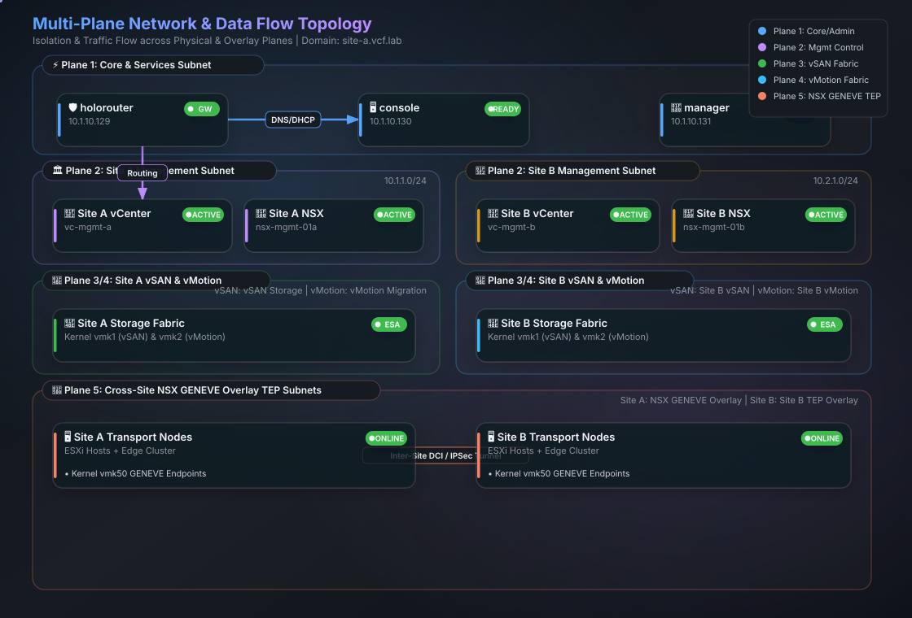

---

## VCF Domain Architecture

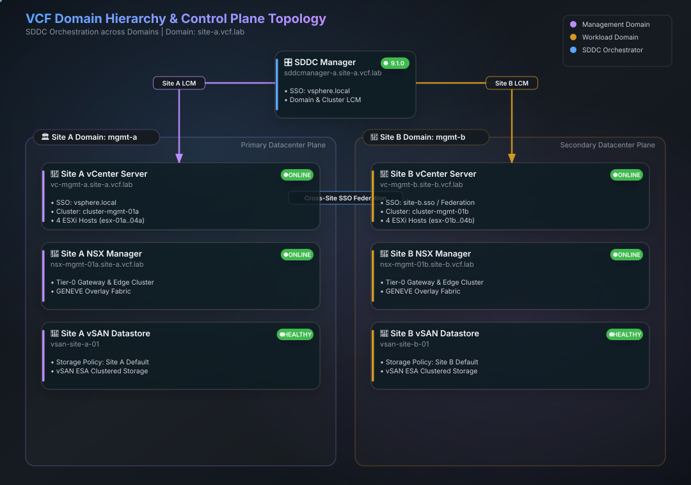

---

## ESXi Host Layout

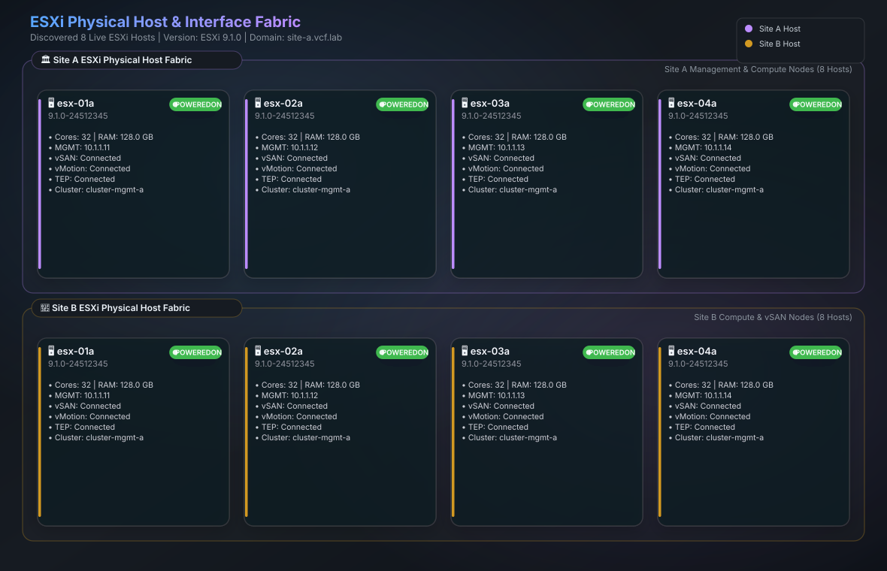

---

## Virtual Machine Inventory

### Management Domain VMs (vc-mgmt-a.site-a.vcf.lab)

| VM Name | Power State | vCPUs | Memory | IP Address |
| ------- | ----------- | ----- | ------ | ---------- |

### Management Domain VMs (vc-mgmt-b.site-b.vcf.lab)

| VM Name | Power State | vCPUs | Memory | IP Address |
| ------- | ----------- | ----- | ------ | ---------- |

---

## Kubernetes & Platform Cluster Architectures

Discovered Kubernetes and platform microservice clusters powering Tanzu, Lifecycle Management, Automation, and Network Security.

### 1. Supervisor Tanzu Cluster

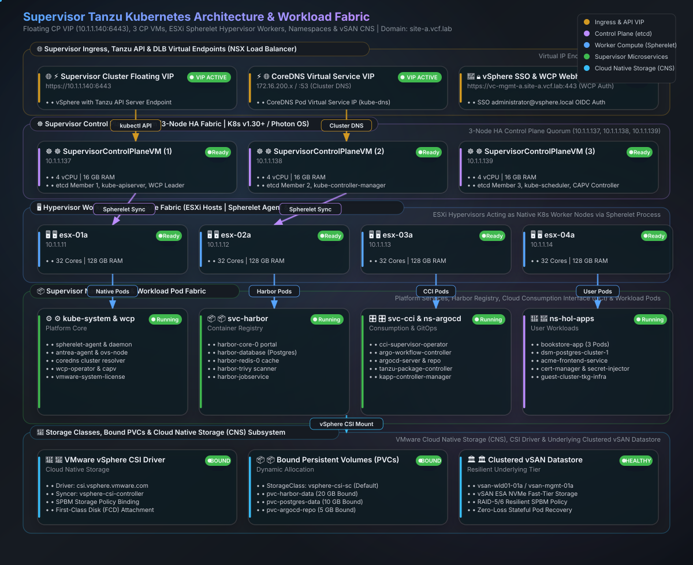

| Component | Details |
| --------- | ------- |
| **Cluster VIP** | `10.1.1.140` (Port 6443) |
| **Control Plane VMs** | `SupervisorControlPlaneVM (1)` (`10.1.1.137`), `SupervisorControlPlaneVM (2)` (`10.1.1.138`), `SupervisorControlPlaneVM (3)` (`10.1.1.139`) |
| **Worker Nodes** | ESXi Hypervisor Hosts (`esx-01a..04a`) via Spherelet Agent |
| **Namespaces** | `kube-system`, `svc-harbor`, `ns-argocd`, `svc-cci`, `ns-hol-*` |
| **Persistent Storage** | vSAN CSI Driver (`vsphere-csi-sc`) |

### 2. VSP Management Cluster (Fleet LCM)

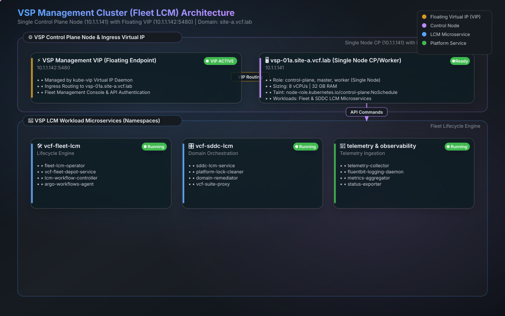

| Component | Details |
| --------- | ------- |
| **Topology** | Single Node Control Plane & Worker |
| **Node Name & IP** | `vsp-01a.site-a.vcf.lab` (`10.1.1.141`) |
| **VIP & Port** | `10.1.1.142:5480` (Fleet LCM Ingress) |
| **Node Sizing** | 8 vCPUs / 32 GB RAM (Single Node) |
| **Taints** | `node-role.kubernetes.io/control-plane:NoSchedule` |
| **Microservices** | `vcf-fleet-lcm`, `vcf-sddc-lcm`, `telemetry`, `vcf-fleet-depot-service` |

### 3. VCF Automation Microservices Cluster

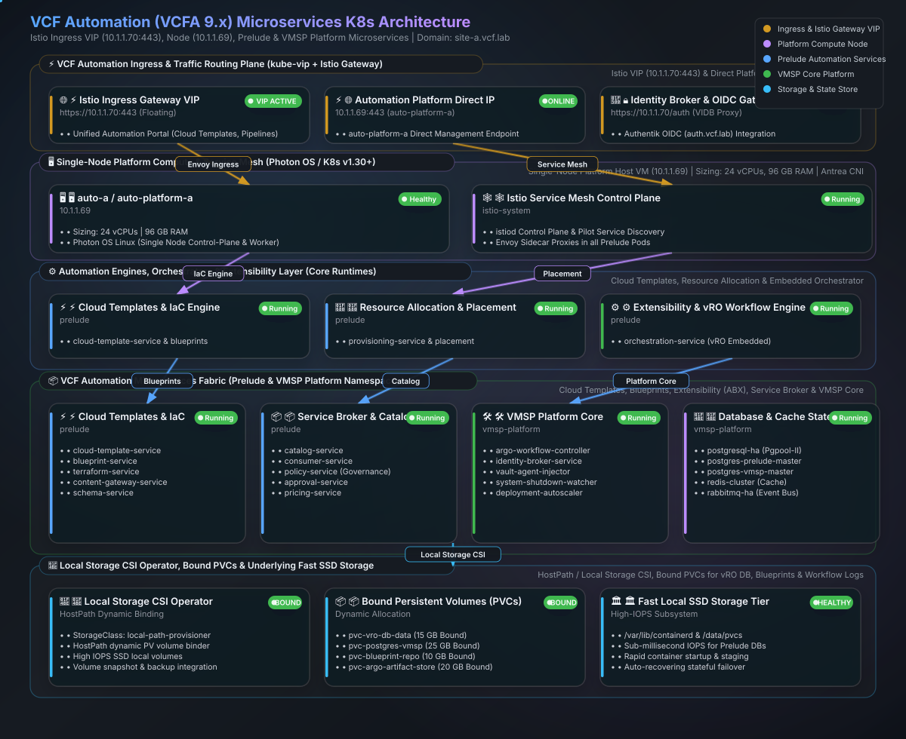

| Component | Details |
| --------- | ------- |
| **Node VIP / IP** | `10.1.1.70` (`auto-a.site-a.vcf.lab`) / `10.1.1.69` (`auto-platform-a`) |
| **Node Sizing** | 24 vCPUs / 96 GB RAM |
| **Ingress Mesh** | Istio Ingress Gateway & Kube-VIP |
| **Microservices** | `prelude`, `istio-system`, `vmsp-platform` |

---

## Core Infrastructure & Holorouter Services

Core management appliances, Linux routing, TLS reverse proxy, and identity services powering the HOL pod fabric.

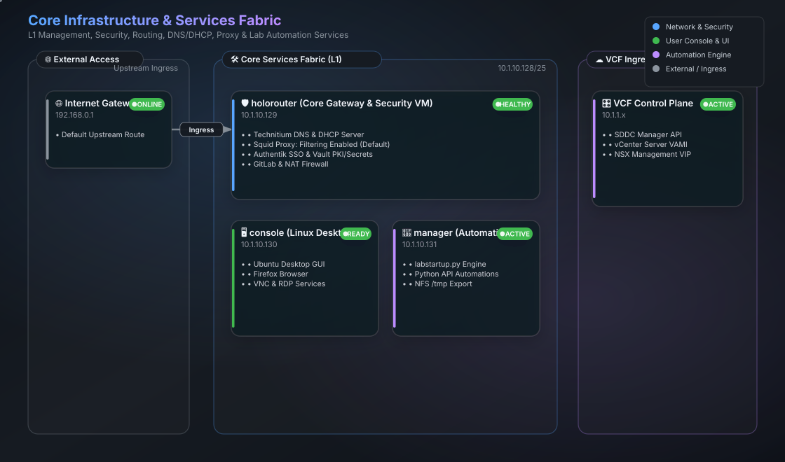

### Holorouter Services & Container Reverse Proxy Topology

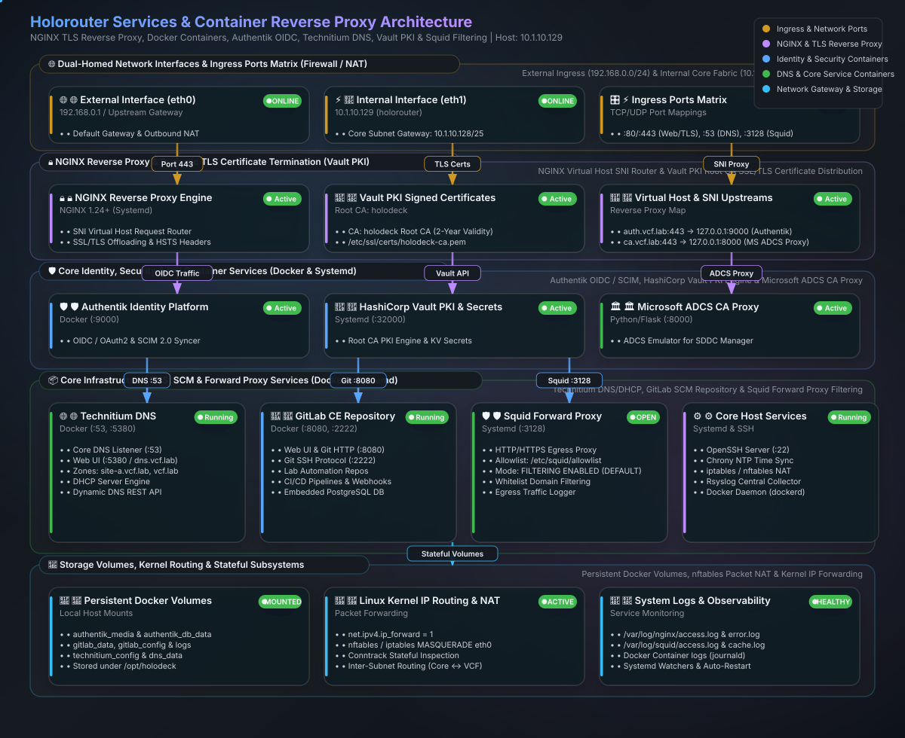

---

## Network Subnets Reference

| Network | Subnet | Gateway | Purpose |
| ------- | ------ | ------- | ------- |
| Core/External | 10.1.10.128/25 | 10.1.10.129 | Console, Manager, Router |
| Management | 10.1.1.0/24 | 10.1.1.1 | VCF Management Components |
| vSAN | 10.1.2.0/24 | - | vSAN Traffic |
| vMotion | 10.1.3.0/24 | - | vMotion Traffic |
| TEP (Overlay) | 10.1.5.128/25 | 10.1.5.129 | NSX Transport Endpoint (GENEVE) |
| External (Holodeck) | 192.168.0.0/24 | 192.168.0.1 | External/Internet Access |

---

## Distributed Virtual Switches

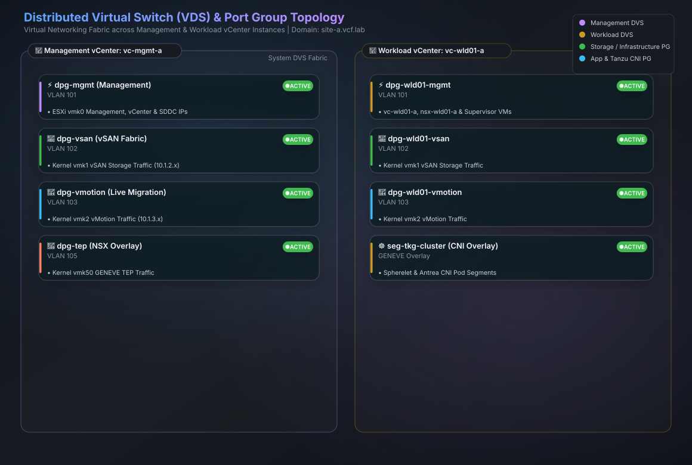

---

## NSX Architecture

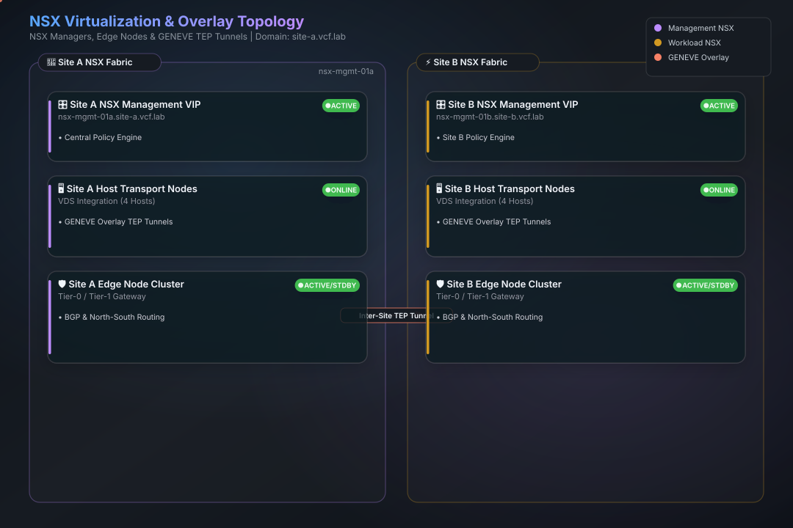

---

## Lab Startup Boot Sequence

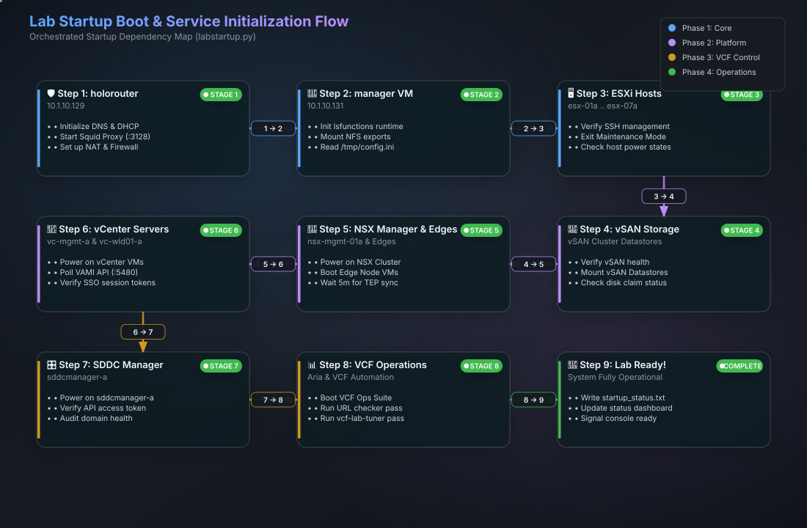

---

## Web Interfaces / URLs

| Service | URL | Expected Content |
| ------- | --- | ---------------- |

---

## Credentials

> **Note:** The lab password is stored in `/home/holuser/creds.txt`

| System | Username | Password |
| ------ | -------- | -------- |
| vCenter (Management) | administrator@vsphere.local | See `/home/holuser/creds.txt` |
| SDDC Manager | administrator@vsphere.local | See `/home/holuser/creds.txt` |
| NSX Manager | admin | See `/home/holuser/creds.txt` |
| ESXi Hosts | root | See `/home/holuser/creds.txt` |
| VCF Operations Suite | admin@local | See `/home/holuser/creds.txt` |
| Linux VMs (holuser) | holuser | See `/home/holuser/creds.txt` |
| Linux VMs (root) | root | See `/home/holuser/creds.txt` |

---

## Storage Summary

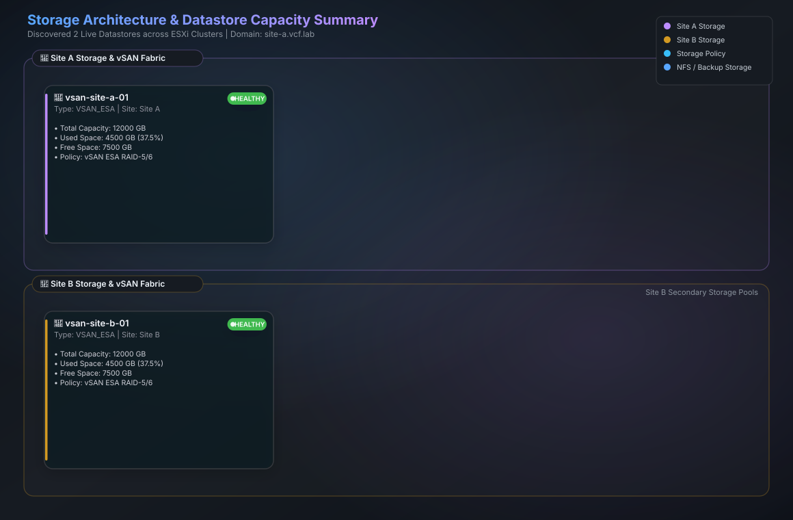

| Datastore | Type | Capacity | Free | Used |
| --------- | ---- | -------- | ---- | ---- |
| vsan-site-a-01 | VSAN_ESA | 12000.0 GB | 7500.0 GB | 38% |
| vsan-site-b-01 | VSAN_ESA | 12000.0 GB | 7500.0 GB | 38% |

---

## Complete Infrastructure Diagram

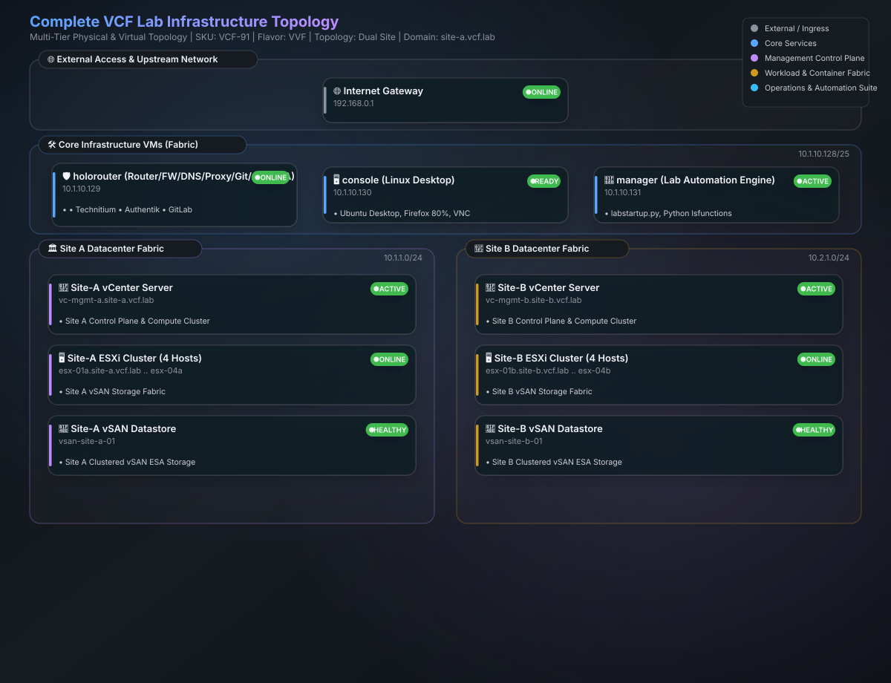

---

## Quick Reference Commands

### Lab Startup

```bash
# Full lab startup
cd /home/holuser/hol && python3 labstartup.py

# Check lab status
cat /lmchol/startup_status.txt

# View startup dashboard
firefox /lmchol/home/holuser/startup-status.htm
```

### vCenter Connection (Python)

```python
from pyVim import connect

# Read password from creds.txt
with open('/home/holuser/creds.txt', 'r') as f:
    password = f.read().strip()

si = connect.SmartConnect(
    host="vc-mgmt-a.site-a.vcf.lab",
    user="administrator@vsphere.local",
    pwd=password,
    disableSslCertValidation=True
)
```

### SDDC Manager API

```bash
# Read password from creds.txt
PASSWORD=$(cat /home/holuser/creds.txt)

# Get access token
TOKEN=$(curl -k -s -X POST "https://sddcmanager-a.site-a.vcf.lab/v1/tokens" \
  -H "Content-Type: application/json" \
  -d "{\"username\": \"administrator@vsphere.local\", \"password\": \"$PASSWORD\"}" \
  | python3 -c "import sys,json; print(json.load(sys.stdin)['accessToken'])")

# List domains
curl -k -s "https://sddcmanager-a.site-a.vcf.lab/v1/domains" \
  -H "Authorization: Bearer $TOKEN" | python3 -m json.tool
```

### NSX Manager API

```bash
# Read password from creds.txt
PASSWORD=$(cat /home/holuser/creds.txt)

# Get cluster status
curl -k -s -u admin:$PASSWORD \
  https://nsx-mgmt-01a.site-a.vcf.lab/api/v1/cluster/status | python3 -m json.tool
```

---

## Document Information

| Property | Value |
| -------- | ----- |
| **Generated** | August 27, 2026 at 13:02:14 |
| **Generator Version** | `v2.3.2` (Style 5 Glassmorphism Engine) |
| **Generated By** | `python3 Tools/labdetails/generate_labdetails.py` |
| **Diagram Engine License** | MIT License © 2025 fireworks-tech-graph contributors |
| **Lab Configuration** | `/tmp/config.ini` |
| **Source INI** | `/home/holuser/hol/holodeck/VCF-91.ini` |
| **Lab Startup Script** | `/home/holuser/hol/labstartup.py` |