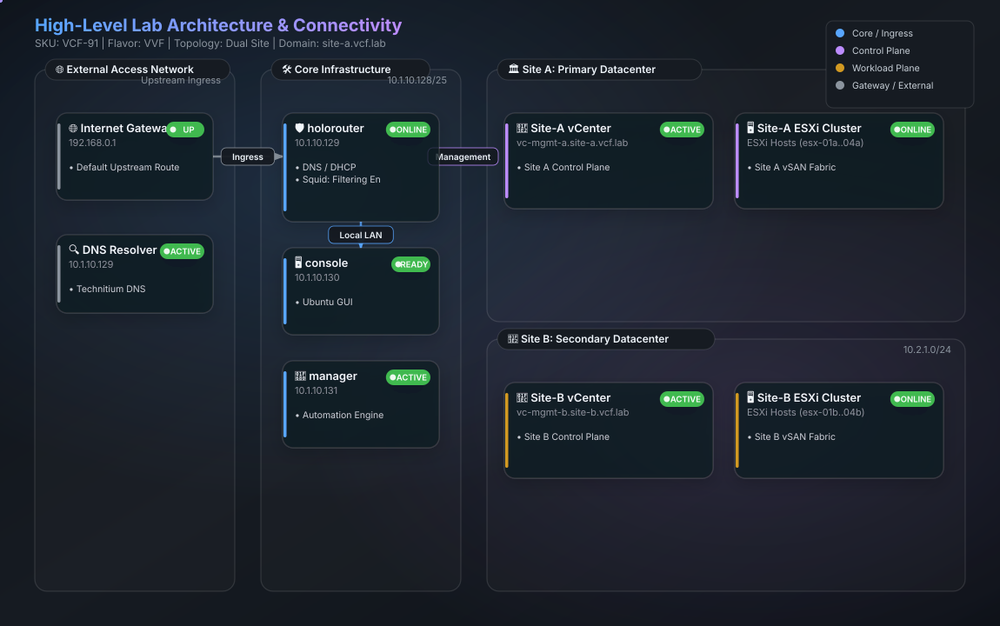
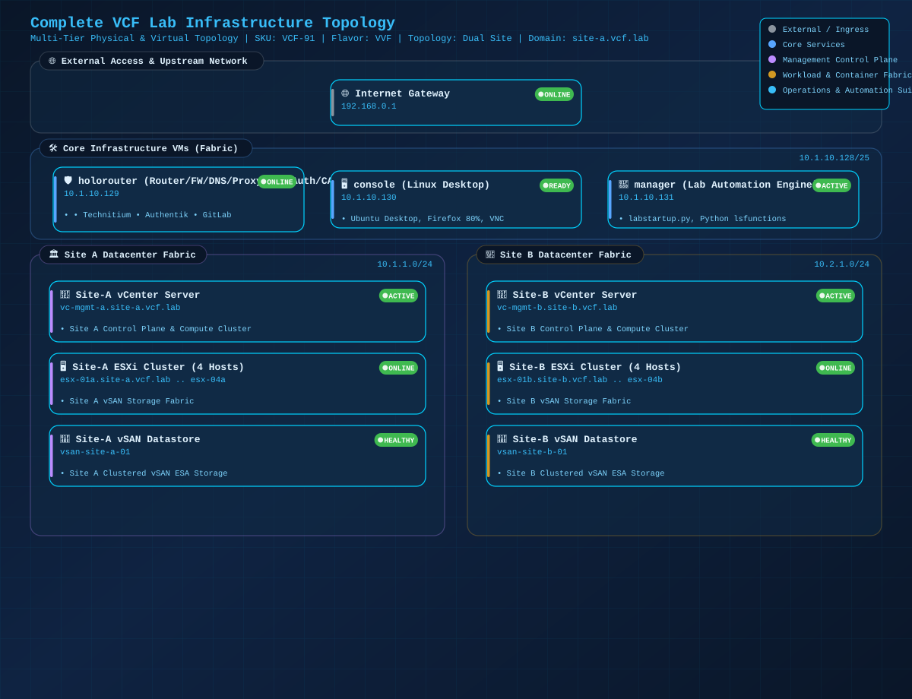
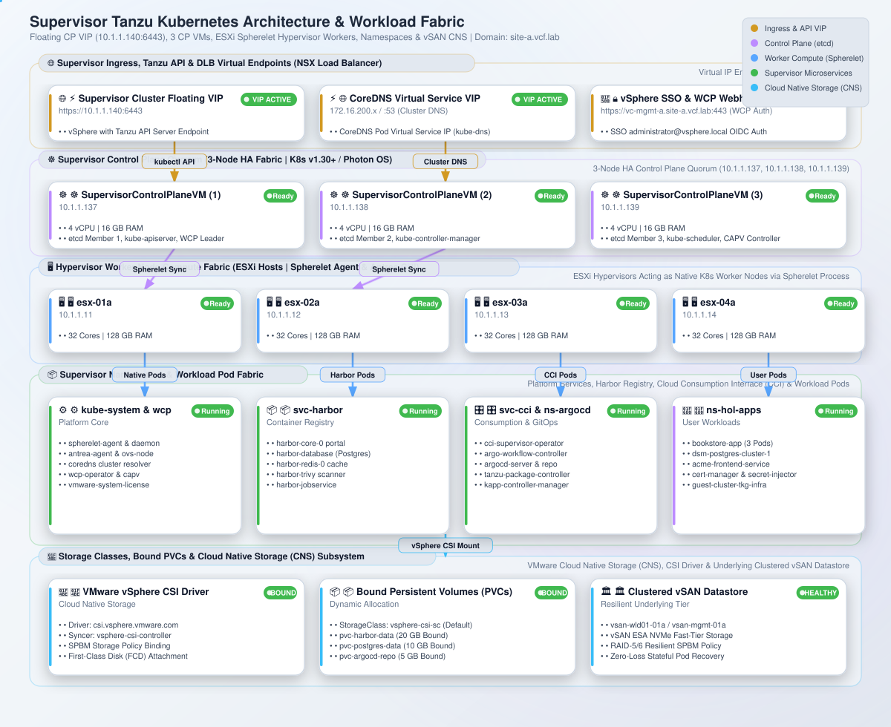
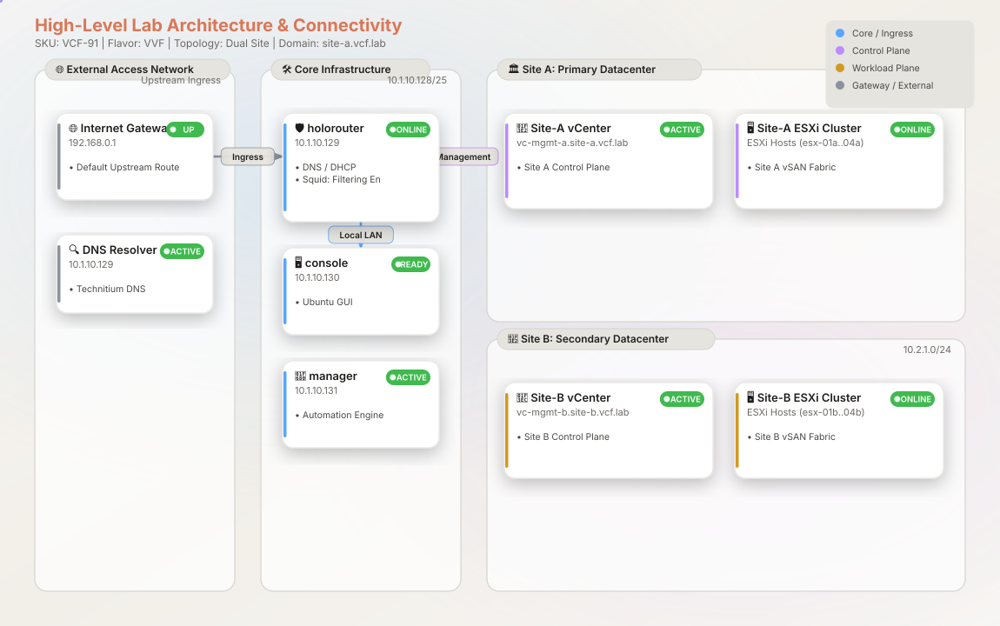
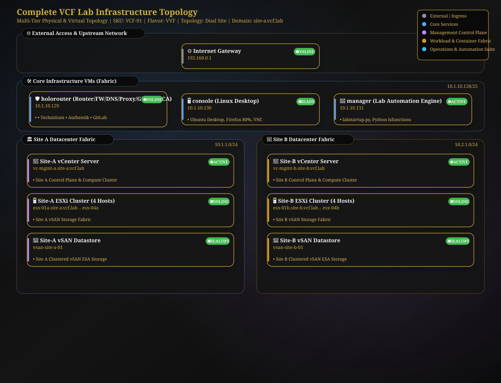

# `generate_labdetails.py` - Dynamic Lab Architecture & Multi-Style Topology Generator

**Version:** 2.3.1  
**Last Updated:** 2026-08-27  
**Author:** Broadcom HOL Core Team  

---

## 1. Overview & Purpose

`generate_labdetails.py` is an automated, real-time infrastructure discovery and dynamic documentation engine for VMware Cloud Foundation (VCF 9.x) and VMware Validated Foundation (VVF 9.x) nested virtualization lab environments running on Holodeck.

Unlike legacy documentation tools that rely on static template assumptions, `generate_labdetails.py` performs live discovery across all management control planes, compute hypervisors, network virtualization controllers, platform services, and Kubernetes clusters in the lab. It produces accurate, real-time Markdown documentation (`<SKU>-labdetails.md`), a responsive standalone HTML report (`<SKU>-labdetails.html`), and a complete suite of standalone SVG architecture diagrams supporting **12 visual themes** with live CSS keyframe animations, radar pings, and moving flow particles powered by [fireworks-tech-graph](https://github.com/yizhiyanhua-ai/fireworks-tech-graph).

### Key Capabilities

- **Zero-Hardcoding Live Discovery**: Queries live vCenter instances, SDDC Manager, NSX Manager, and Kubernetes clusters to discover true CPU core totals, memory allocations, storage capacities, build numbers, and VM kernel interface mappings.
- **Auto-Detection of Lab Flavor (VCF vs. VVF)**: Automatically detects whether the lab is running VMware Cloud Foundation (VCF) or VMware Validated Foundation (VVF) and dynamically adjusts table headers (e.g., **"VVF Version"** vs. **"VCF Version"**).
- **Single Site & Dual Site Support**: Automatically detects multi-site topologies (`Site A` and `Site B`) and dynamically reorganizes layout containers, host layouts, storage summaries, and network diagrams to reflect multi-datacenter connectivity.
- **Accurate Kubernetes VIP & Node Architecture**: Refactored architecture diagrams for Kubernetes clusters clearly distinguish floating Virtual IPs (VIPs) from physical/VM control plane nodes:
  - **Supervisor Tanzu Cluster**: Shows the Supervisor Cluster Floating VIP (`10.1.1.140:6443`) routing to 3 CP VMs (`SupervisorControlPlaneVM (1..3)` / `10.1.1.137..139`), Spherelet agents on ESXi worker nodes, namespaces, and persistent vSAN CSI storage.
  - **VSP Management Cluster (Fleet LCM)**: Accurately reflects the single control plane & worker VM (`vsp-01a.site-a.vcf.lab` / `10.1.1.141`) fronted by its kube-vip floating endpoint (`10.1.1.142:5480`).
  - **VCF Automation Cluster (VCFA)**: Shows the single-node platform VM (`auto-a` / `10.1.1.70`) fronted by the Istio Ingress Gateway VIP (`10.1.1.70:443`).
  - **Security Services Platform (SSP / vDefend)**: Dynamic detection and visualization if present (`10.1.0.10`).
- **Holorouter Gateway & Proxy Filtering Probe**: Inspects Holorouter core services (Technitium DNS, Authentik OIDC, GitLab, HashiCorp Vault, Squid Proxy) and parses `/etc/squid/allowlist` to report whether proxy filtering is **Filtering Enabled (N domains)** or **Open (Filtering Disabled)**.
- **12 Visual Themes & Live SVG Animations**: Pure-Python SVG engine supporting all 12 styles from `fireworks-tech-graph` (`Glassmorphism`, `Blueprint`, `Dark Terminal`, `Claude Official`, `OpenAI Official`, `Dark Luxury`, `Flat Icon`, `C4 Review`, `Cloud Fabric`, `Notion Clean`, `Event Transit`, `Ops Pulse`) featuring floating icon oscillations, flowing dashed lines, pulsating title glows, animated particle flows, and radar ping status indicators.
- **Consistent Output File Naming**: All generated deliverables (`<SKU>-labdetails.md`, `<SKU>-labdetails.html`, and `images/*.svg`) are placed directly into the specified `--output` destination folder named with the discovered or configured Lab SKU.

---

## 2. Architecture & Data Flow

The following sequence diagram details how `generate_labdetails.py` authenticates, discovers infrastructure components, processes environment metadata, and outputs visual & textual documentation artifacts.

```mermaid
sequenceDiagram
    autonumber
    participant CLI as CLI / User
    participant Gen as generate_labdetails.py
    participant Router as Holorouter (10.1.10.129)
    participant SDDC as SDDC Manager (9.x)
    participant VC as vCenter (pyVmomi/REST)
    participant NSX as NSX Manager
    participant K8s as K8s Clusters (VSP/VCFA/SSP)
    participant Render as Theme Engine & SVG Canvas

    CLI->>Gen: Execute with options (--style, --html, --svg-dir)
    Gen->>Gen: Load config.ini & /home/holuser/creds.txt
    
    rect rgb(20, 30, 50)
        note right of Gen: 1. Core & Holorouter Probe
        Gen->>Router: TCP Check (5380, 9000, 32000, 3128)
        Gen->>Router: SSH read /etc/squid/allowlist
    end

    rect rgb(20, 50, 30)
        note right of Gen: 2. Control Plane & vSphere Discovery
        Gen->>SDDC: POST /v1/tokens (admin@local)
        SDDC-->>Gen: Bearer Token
        Gen->>SDDC: GET /v1/domains, /v1/clusters, /v1/hosts
        Gen->>VC: SmartConnect / REST session (vc-mgmt-a, vc-wld01-a)
        VC-->>Gen: Hosts, CPUs, RAM, vmk NICs, vSAN ESA/OSA, VMs
    end

    rect rgb(50, 30, 20)
        note right of Gen: 3. Network & Kubernetes Discovery
        Gen->>NSX: GET /api/v1/transport-nodes (Edges, TEPs)
        Gen->>VC: REST /api/vcenter/namespaces/instances (Supervisor)
        Gen->>K8s: SSH kubectl get nodes/pods (VSP 10.1.1.142, VCFA 10.1.1.70, SSP 10.1.0.10)
    end

    rect rgb(40, 20, 50)
        note right of Gen: 4. Artifact Generation
        Gen->>Render: Build 14 SVG Diagrams with selected theme
        Gen->>Gen: Render LABDETAILS.md & LABDETAILS.html
    end
    Gen-->>CLI: Return success & write output files
```



---

## 3. Installation & Prerequisites

### Prerequisites

1. **Python Version**: Python 3.9 or higher.
2. **System Dependencies**:
   - `sshpass` (for non-interactive SSH authentication to Kubernetes nodes).
   - Standard networking tools (`ping`, `nc` / `telnet`).
3. **Python Packages**:
   - `pyVmomi` (optional, for direct vSphere SOAP API queries).
   - `requests` (optional, for SDDC Manager, NSX, and vCenter REST queries).
   - `urllib3` (for SSL warning suppression).

### Installation Command

```bash
pip install pyvmomi requests urllib3
sudo apt-get update && sudo apt-get install -y sshpass
```

> **Note**: If `pyVmomi` or `requests` are not installed, `generate_labdetails.py` automatically falls back to offline discovery mode using safe environment defaults without failing.

---

## 4. Run Location & Execution Model

The script is designed to be executed directly from the **Main Manager VM** (`10.1.10.131` / `manager.site-a.vcf.lab`) or the local workspace orchestrator host:

```bash
# Workspace Location
cd /home/holuser/hol/Tools/labdetails
python3 generate_labdetails.py [OPTIONS]
```

### Credentials & Safety Rules

- Read-Only Execution: The script strictly performs **READ-ONLY** queries. It never executes `WRITE`, `PUT`, `DELETE`, or state-changing operations on any lab component.
- Credential Source: Passwords default to `/home/holuser/creds.txt`.

---

## 5. Usage & Command-Line Options

### Command Syntax

```bash
python3 Tools/labdetails/generate_labdetails.py [OPTIONS]
```

### Full Options Matrix

| Flag | Short | Default | Description |
| --- | --- | --- | --- |
| `--output` | `-o` | `/home/holuser` | Destination directory where `<SKU>-labdetails.md`, `<SKU>-labdetails.html`, and `images/*.svg` are placed. |
| `--style`, `--theme` | | `glassmorphism` | Visual theme for SVG architecture diagrams (supports 12 themes). |
| `--diagram-style` | | `glassmorphism` | Markdown diagram embedding strategy (`glassmorphism`, `mermaid`, `both`). |
| `--svg-dir` | | `<output_dir>/images` | Target directory for saving standalone SVG vector files. |
| `--html` | | *(Always True)* | Generate interactive standalone `<SKU>-labdetails.html` viewer. |
| `--dry-run` | | `False` | Perform discovery and print Markdown to stdout without writing files. |
| `--config` | | `/tmp/config.ini` | Path to lab `config.ini` specification file. |
| `--help` | `-h` | | Display formatted CLI help banner and theme manual. |

---

## 6. The 12 Visual Themes Reference (`fireworks-tech-graph`)

`generate_labdetails.py` includes a theme engine adapted from `fireworks-tech-graph`. You can specify any of the 12 themes using `--style <name>` or `--theme <alias>`:

| # | Theme Name | Aliases | Background | Palette & Aesthetics | Recommended Use Case |
|---|---|---|---|---|---|
| 1 | **Flat Icon** | `flat-icon`, `flat` | `#ffffff` (White) | Clean light layout, dark grey borders, pastel status badges | Standard technical documentation & whitepapers |
| 2 | **Dark Terminal** | `dark-terminal`, `terminal` | `#0f0f1a` (Dark Cyan) | Monospace SF Mono font, neon cyan & electric green glows | SRE, DevOps, and command-line guides |
| 3 | **Blueprint** | `blueprint` | `#0a1628` (CAD Blue) | Grid background pattern, bright cyan vectors & technical CAD lines | Network topology & infrastructure engineering |
| 4 | **Notion Clean** | `notion-clean`, `notion` | `#ffffff` (Pure White) | Ultra-minimalist border styling, soft grey cards, clean typography | Minimalist executive summaries & Notion pages |
| 5 | **Glassmorphism** | `glassmorphism`, `glass` | `#0d1117` (Dark Slate) | **DEFAULT**: Translucent glass cards, radial ambient glow, vivid accent borders | Modern dark-mode web dashboards & presentations |
| 6 | **Claude Official** | `claude-official`, `claude` | `#f8f6f3` (Warm Cream) | Anthropic editorial palette, terracotta accents `#da7756`, dark charcoal text | Elegant publications & technical blog posts |
| 7 | **OpenAI Official** | `openai-official`, `openai` | `#ffffff` (Clean White) | Sleek slate, emerald green `#10a37f` highlights, fine line borders | AI / ML architecture & developer documentation |
| 8 | **Dark Luxury** | `dark-luxury`, `luxury` | `#0a0a0a` (Onyx) | Deep black surface, champagne gold `#d4af37` card borders & titles | Executive briefings & high-impact visual decks |
| 9 | **C4 Review Canvas**| `c4-review`, `c4` | `#f7f2e8` (Paper) | Architectural review paper layout, bold boundaries, high contrast | Architectural review boards & design docs |
| 10| **Cloud Fabric** | `cloud-fabric`, `cloud` | `#edf5fb` (Soft Azure) | Sky blue palette, azure `#0284c7` highlights, cloud container styling | Multi-cloud & hybrid cloud topology maps |
| 11| **Event Transit** | `event-transit`, `transit` | `#fbf7ee` (Metro Warm) | Metro transit map layout, connected rail lines, station nodes | Event-driven microservices & messaging streams |
| 12| **Ops Pulse** | `ops-pulse`, `ops` | `#07111f` (Deep Navy) | SRE observability theme, dark navy cards, ECG pulse line indicators | Observability, monitoring, & incident response |

---

## 7. Command-Line Examples

### 1. Default Generation (Glassmorphism Theme)

Generates `<SKU>-labdetails.md` and `<SKU>-labdetails.html` in the user's home directory with diagrams in `images/`:

```bash
python3 Tools/labdetails/generate_labdetails.py
```

### 2. Generate Documentation into a Specific Directory with Blueprint Theme

```bash
python3 Tools/labdetails/generate_labdetails.py \
  --theme blueprint \
  --output /path/to/destination_folder
```

### 3. Generate Dual-Site Documentation with Dark Luxury Theme

```bash
python3 Tools/labdetails/generate_labdetails.py \
  --style dark-luxury \
  --config /home/holuser/config.ini \
  --output Tools
```

### 4. Dry-Run Output to Terminal with Claude Theme

```bash
python3 Tools/labdetails/generate_labdetails.py --dry-run --theme claude-official
```

### 5. Export Custom Documentation Suite into `Tools/` Folder with Flat Icon Theme

```bash
python3 Tools/labdetails/generate_labdetails.py \
  --output Tools \
  --theme flat-icon
```

---

## 8. Sample Diagram Gallery

Below are previews of key architecture diagrams generated by `generate_labdetails.py` across different visual themes stored in `Tools/images/`.

### 1. High-Level Lab Architecture & Connectivity (`Glassmorphism` Theme)



### 2. Complete Infrastructure Topology (`Blueprint` Theme)

Features a centered **Internet Gateway** and detailed **Holorouter** card displaying active services and Squid proxy filtering status.



### 3. Supervisor Tanzu Kubernetes Cluster Architecture (`Flat Icon` Theme)

Displays the Supervisor Cluster Floating VIP (`10.1.1.140:6443`), Spherelet integration, active namespaces, persistent storage PVCs, and animated traffic flow particles.



### 4. High-Level Architecture (`Claude Official` Theme)

Warm Anthropic editorial aesthetic featuring terracotta highlights and clean container borders.



### 5. Complete Infrastructure Topology (`Dark Luxury` Theme)

Deep black onyx backdrop with champagne gold accents.



---

## 9. Output Artifacts & Deliverables

When executed without `--dry-run`, the script generates the following files in the target `--output` destination directory:

1. **`<SKU>-labdetails.md`**: Primary Markdown document containing:
   - Lab Overview table (**VCF Version** or **VVF Version**, Dual Site or Single Site status, DNS Domain, Squid Proxy mode).
   - Core Control Plane & Holorouter service status.
   - ESXi Host Specifications (true CPU cores, memory, ESXi build, VMkernel IPs for management, vSAN, vMotion, and TEPs).
   - Storage Summary (vSAN ESA/OSA capacities, FTT resiliency policies, NFS backups).
   - Kubernetes Platform Summaries (Supervisor, VSP, VCFA, SSP).
   - Embedded standalone SVG diagrams from the `images/` directory.
2. **`<SKU>-labdetails.html`**: A self-contained, interactive HTML web document with tabbed navigation, embedded inline SVGs, theme toggle support, and searchable tables.
3. **`images/*.svg`**: 14 standalone SVG architecture vector files with animated icons, dashed flows, and radar ping indicators:
   - `high_level_architecture.svg`
   - `network_dataflow.svg`
   - `vcf_domain_architecture.svg`
   - `esxi_host_layout.svg`
   - `core_infrastructure.svg`
   - `dvs_topology.svg`
   - `nsx_architecture.svg`
   - `lab_boot_sequence.svg`
   - `storage_summary.svg`
   - `complete_infrastructure.svg`
   - `supervisor_k8s_architecture.svg`
   - `vsp_k8s_architecture.svg`
   - `vcfa_k8s_architecture.svg`
   - `ssp_k8s_architecture.svg`
