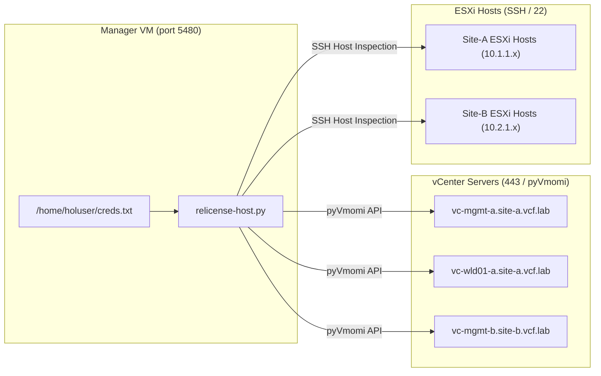
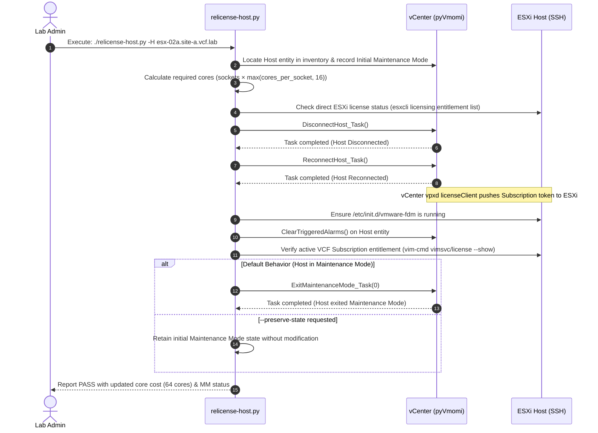

# VCF Host Re-Licensing Tool (`relicense-host.py`)

- **Version**: 1.1.0
- **Author**: Hands-on Labs Core Team
- **Date**: 2026-09-11

---

## Overview

`relicense-host.py` automates the resynchronization of VMware Cloud Foundation (VCF) 9.x subscription licenses to ESXi hosts following hardware or CPU topology reconfigurations (such as reconfiguring a VM-nested ESXi host from 2 sockets &times; 16 cores to 4 sockets &times; 8 cores).

### The Root Cause

In VMware Cloud Foundation 9.x per-core subscription licensing, Broadcom enforces a **minimum license requirement of 16 core licenses per physical CPU socket** (`cpuCore:16core` unit rule).

| CPU Topology | Sockets | Total Cores | Cores / Socket | Broadcom Minimum Calculation | Required License Cores |
| :--- | :---: | :---: | :---: | :---: | :---: |
| **Original** | 2 | 32 | 16 | $2 \times 16\text{ cores}$ | **32 cores** |
| **Reconfigured** | 4 | 32 | 8 | $4 \times \max(8, 16)\text{ cores}$ | **64 cores** |

When an ESXi host boots with an updated 4-socket topology:
1. ESXi boots into an unassigned evaluation mode (`00000-00000-00000-00000-00000`), whose evaluation period has expired.
2. Direct license assignment on the host via `vim-cmd vimsvc/license` is rejected because host licensing is managed centrally by vCenter (`vpxa`).
3. vCenter's internal license client requires a connection cycle (**Disconnect &rarr; Reconnect**) to recalculate the host's socket-weighted core requirements ($4 \times 16 = 64$ cores) and push the active `Subscription` entitlement token (`SUBSC-...`) down to the ESXi host.
4. After reconnecting, the vSphere HA agent (`vmware-fdm`) must be verified running and any stale license trigger alarms in vCenter must be cleared.
5. **Maintenance Mode Management**: By default, the script verifies whether the host is in Maintenance Mode at completion; if so, it automatically triggers `ExitMaintenanceMode_Task(0)` so the host is immediately ready for workloads. If `--preserve-state` is specified, the script leaves the host in whatever maintenance mode state it was found in at the start.

`relicense-host.py` performs this entire remediation workflow in seconds without human error or manual vSphere UI interaction.

---

## Installation & Requirements

### Dependencies
- **Python Runtime**: Python 3.9+
- **Python Libraries**: `pyVmomi`, `paramiko` (pre-installed in the manager VM environment)
- **Host Credentials**: Lab SSO / root password located in `/home/holuser/creds.txt`

---

## Run Location

- **Execution Location**: **Manager VM** (`/home/holuser/hol` or `/home/holuser/hol/Tools`)
- **Network Scope**: The manager VM has direct routable access to all vCenters (`vc-mgmt-a`, `vc-wld01-a`, `vc-mgmt-b`) and all nested ESXi hosts (`10.1.1.x`, `10.2.1.x`).



---

## Usage & Examples

### Help Screen

```
╔════════════════════════════════════════════════════════════════════════════╗
║                         VCF Host Re-Licensing Tool                         ║
║                               Version 1.1.0                                ║
║          VMware Cloud Foundation 9.x Host License Synchronization          ║
╚════════════════════════════════════════════════════════════════════════════╝

USAGE:
    relicense-host.py [-H <hostname>] [--all] [--check-only] [--preserve-state] [--password <pwd>]

OPTIONS:
    -H, --host <hostname>          Target specific ESXi host (e.g. esx-01a.site-a.vcf.lab)
    -a, --all                     Process all ESXi hosts across all active vCenters
    -c, --check-only              Inspect and display CPU topology, license status, and MM state
    --preserve-state              Preserve initial Maintenance Mode state (default is to exit MM)
    -p, --password <pwd>          Lab SSO / root password (defaults to /home/holuser/creds.txt)
    -v, --vcenter <vc_fqdn>       Target a specific vCenter Server directly
    -h, --help                    Show this help message
```

### Example Commands

#### 1. Re-license a single host and exit Maintenance Mode (Default)
```bash
/home/holuser/hol/Tools/relicense-host.py -H esx-02a.site-a.vcf.lab
```

#### 2. Re-license a host but preserve its initial Maintenance Mode state
```bash
/home/holuser/hol/Tools/relicense-host.py -H esx-02a.site-a.vcf.lab --preserve-state
```

#### 3. Check topology, licensing, and MM state across all hosts (Read-Only)
```bash
/home/holuser/hol/Tools/relicense-host.py --check-only
```

#### 4. Automatically remediate all hosts with evaluation or unassigned licenses
```bash
/home/holuser/hol/Tools/relicense-host.py --all
```

---

## Workflow Logic



---

## Output & State Changes

When `relicense-host.py` runs against a target host, it modifies the following system states:

1. **ESXi Host Licensing**:
   - Updates from `00000-00000-00000-00000-00000` (Expired Eval) to `SUBSC-00000-00000-00000-RIBED`.
   - Binds the host to the active `(TLG) VMware Cloud Foundation (cores)` subscription asset.
   - Sets host entity cost to $4 \times 16 = 64$ cores.
2. **Maintenance Mode State**:
   - **Default**: Checks `host.runtime.inMaintenanceMode` and issues `ExitMaintenanceMode_Task(0)` if active, returning the host to normal operation.
   - **With `--preserve-state`**: Restores or preserves the host in its initial maintenance mode state captured at startup.
3. **vCenter Alarm State**:
   - Acknowledges and clears triggered alarms (`License assignment failed for this host`, `Host license expired`).
   - Restores host status to `green` state.
4. **vSphere HA (`vmware-fdm`)**:
   - Verifies the Fault Domain Manager agent is active and running.

---

## Related Tools & Verification

- **Lab Health Validator**: `/home/holuser/hol/Tools/vpodchecker.py --report-only`
- **Session Credentials**: `/home/holuser/creds.txt`

---

## Changelog

### [1.1.0] - 2026-09-11
- Added automated Maintenance Mode evaluation at completion of host operations.
- Set default behavior to exit Maintenance Mode if the host is in MM.
- Added `--preserve-state` (aliases: `--preserve-maintenance-mode`, `--keep-mm`) to preserve initial MM state.
- Added Maintenance Mode column to `--check-only` summary table.
- Added generic asynchronous task tracking helper (`wait_for_task`).

### [1.0.0] - 2026-09-11
- Initial release.
- Added automatic CPU socket topology inspection and 16-core minimum cost calculation.
- Implemented vCenter host connection cycle with pyVmomi task tracking.
- Added SSH validation for ESXi `esxcli licensing` and `vimsvc/license`.
- Added vCenter alarm clearing and HA daemon auto-remediation.
- Added ANSI color terminal interface adhering to `script-help-style`.
