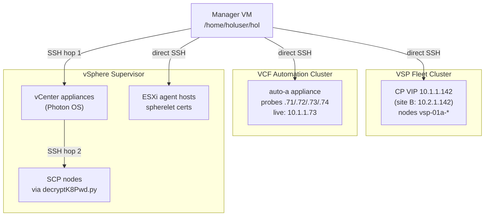
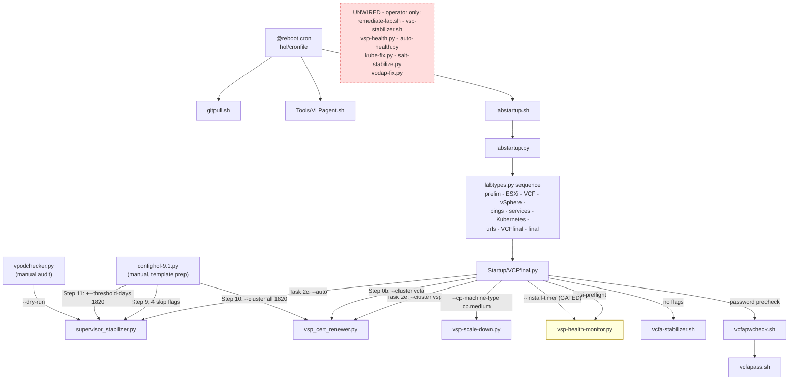
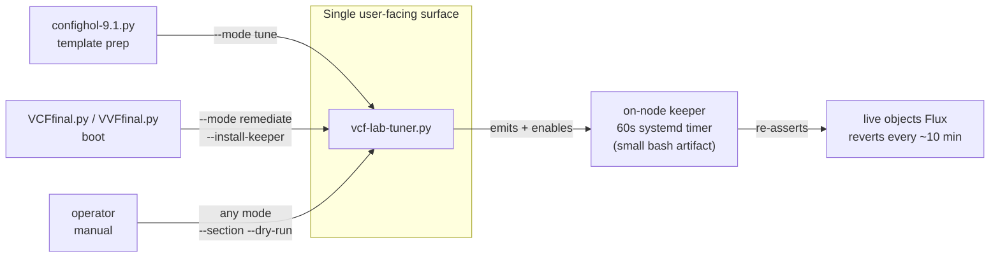

# VCF Lab Tooling — Comparative Analysis & Consolidation Report

**Version 1.0 — 2026-08-14**
**Author:** HOL Core Team
**Scope:** 15 scripts, ~1.4 MB, across three Kubernetes clusters
**Method:** full source read of every file (6 parallel analysis passes) + live verification against DevPod

> This report supersedes `Tools/vsp-analysis-report.md` (113 lines, 2026-08-14 11:16). That report is
> directionally correct but shallow in places and wrong in four specific claims — see
> [§10 Correction Log](#10-correction-log). Every claim below carries a `file:line` citation or a live
> command, and [§11](#11-evidence-classification) classifies each finding as source-verified,
> live-verified, or unverified.

---

## Table of Contents

1. [Executive Summary](#1-executive-summary)
2. [Scope: Three Clusters, Not One](#2-scope-three-clusters-not-one)
3. [Inventory](#3-inventory)
4. [Wiring: What Actually Calls What](#4-wiring-what-actually-calls-what)
5. [Capability Matrix](#5-capability-matrix)
6. [One-Shot vs Recurring](#6-one-shot-vs-recurring)
7. [Conflicts and Divergences](#7-conflicts-and-divergences)
8. [Gaps](#8-gaps)
9. [Consolidation Design](#9-consolidation-design)
10. [Correction Log](#10-correction-log)
11. [Evidence Classification](#11-evidence-classification)

---

## 1. Executive Summary

Fifteen scripts in `Tools/` perform overlapping pre-flight checks, tuning, remediation, and reporting
against three distinct Kubernetes clusters. The tooling works — labs come up — but it has reached the
point where **the same fix exists in up to four places with three different behaviours**, and the
divergences are now causing real defects rather than mere duplication.

### The five findings that matter most

| # | Finding | Severity | Status |
| --- | --- | --- | --- |
| **F1** | Three tools believe they own VSP control-plane sizing. Only one actually does; a second patches a **field that does not exist in the live CRD schema**. | High | Live-verified |
| **F2** | Two scripts install the **same systemd unit at the same paths with different payloads**. Last writer wins; no ordering yields both. Evidence shows the "do not run" draft **has been run here**. | High | Live-verified |
| **F3** | `confighol-9.1.py`'s Supervisor proxy configuration **silently fails on every run** — an unassigned variable inside a swallowing `try/except`. | High | Source-verified |
| **F4** | `supervisor_stabilizer.py --dry-run` **is not read-only** — one phase restarts services and can block 30 minutes. | High | Source-verified |
| **F8** | Two pod-sweepers implement **irreconcilable policies** (unthresholded force-delete vs deliberately damped). They don't collide today only because they target different clusters. | Medium | Source-verified |

### The organizing insight

The single most useful lens on this codebase is **not** "what does each script do" but **what reverts it**.
Every durability decision in the repo — and every recurring-vs-one-shot classification — follows from
which controller owns the object being patched, and how fast that controller reverts. Measured revert
speeds range from **under one second** (vmsp-operator on HelmRelease `spec.values`) to **never**
(unowned Kyverno ClusterPolicy). See [§6](#6-one-shot-vs-recurring). Organizing the consolidated tool
around durability tiers rather than around subsystem names is the main structural recommendation.

### Recommendation

One parameterized script, `vcf-lab-tuner.py`, as the entire user-facing surface — `--cluster` ×
`--mode` — which **emits** a small on-node drift-keeper rather than *being* it. Deprecate the existing
scripts in place (no deletions). Detail in [§9](#9-consolidation-design).

---

## 2. Scope: Three Clusters, Not One

This is the most commonly conflated point in existing documentation, and it drives the consolidation
design. The 15 scripts target **three different Kubernetes clusters** plus the vCenter and ESXi
appliances.



| Cluster | Namespaces | Tooling today |
| --- | --- | --- |
| **VSP fleet** | `vmsp-platform`, `vcf-fleet-lcm`, `vcf-sddc-lcm`, `vidb-external`, `vodap`, `ops-logs`, `salt`, `salt-raas`, `telemetry`, `vcf-fleet-depot`, `vmsp-metrics-store` | `vsp-health/*` (6 files), `vsp_cert_renewer.py`, `vsp-stabilizer.sh`, `confighol` Steps 8b/8c/9/10 |
| **VCF Automation** | `vmsp-platform`, `vmsp-policies`, `prelude` | `vcfa-stabilizer.sh`, `auto-health/auto-health.py`, `vcfapass.sh`, `vcfapwcheck.sh` |
| **vSphere Supervisor** | `kube-system`, `vmware-system-cert-manager`, `svc-cci-ns-*`, `argocd`, `svc-harbor-*` | `supervisor_stabilizer.py` |
| *spans VSP + VCFA* | — | `remediate-lab.sh` |

**Note the namespace collision:** `vmsp-platform` exists in **both** the VSP fleet cluster and the VCFA
cluster, with different contents. Any tool that logs "patching `vmsp-platform`" without naming the
cluster is ambiguous — a real hazard when reading logs after the fact.

**The registry pattern already spans clusters.** `vsp_cert_renewer.py:71-92` defines a `CLUSTERS` dict
with both a `vsp` and a **`vcfa`** entry:

```python
"vsp":  {"label": "VSP",  "worker_fqdn": "vsp-01a.site-a.vcf.lab",
         "phases": ["kubeadm","kubelet","extendca","certmanager","antrea","casync"],
         "fix_kcm_duration": True},
"vcfa": {"label": "VCFA", "fqdn": "auto-a.site-a.vcf.lab",
         "candidate_ips": ["10.1.1.71","10.1.1.72","10.1.1.73","10.1.1.74"],
         "phases": ["kubeadm","kubelet"]},
```

That `candidate_ips` list is **identical** to `auto-health.py:980`'s probe list. There is no
`supervisor` entry. This registry is the right model for the consolidated tool's `--cluster` parameter.

---

## 3. Inventory

Versions as of 2026-08-14. **Bold** in the Version column flags a self-inconsistent or missing version
constant.

| Script | Lines | Version | Cluster | Runs from | Invoked by | Mutates? |
| --- | --- | --- | --- | --- | --- | --- |
| `remediate-lab.sh` | 3449 | `3.0.1-draft` 2026-08-03 | VSP + VCFA | **local machine** (SSHes to manager) | *nothing* | Yes |
| `vsp-stabilizer.sh` | 770 | `1.3.1` 2026-08-13 (**`--help` prints 1.0.0**) | VSP | manager *or* CP node | *nothing* | Yes |
| `vcfa-stabilizer.sh` | 3500 | `2.21` 2026-08-03 (**no `VERSION` var; 4 literals**) | VCFA | manager | `VCFfinal.py:4318` (no flags) | Yes |
| `supervisor_stabilizer.py` | 3413 | `2.15` 2026-08-05 (**no version constant at all**) | Supervisor | manager | `VCFfinal.py:1164`, `confighol:5569`, `confighol:5713`, `vpodchecker:3130` | Yes |
| `confighol-9.1.py` | 6090 | `2.29` 2026-08-13 | VSP (+ all) | manager, interactive | *nothing* (imported by `VCFfinal.py:4837`) | Yes |
| `vsp_cert_renewer.py` | 2652 | `2.12` 2026-07-25 | VSP + VCFA | manager | `VCFfinal:2386`, `VCFfinal:3997`, `VVFfinal:698`, `confighol:5651`, `monitor:2219` | Yes |
| `vsp-health/vsp-health-monitor.py` | 2994 | **hdr `2.12` vs `SCRIPT_VERSION='2.10'`** | VSP | manager | `VCFfinal:3121` (`--csi-preflight`), `VCFfinal:5300` (`--install-timer`) | Yes (19/20 checks) |
| `vsp-health/vsp-health.py` | 1633 | `2.9.1` 2026-08-14 | VSP | manager | *nothing* | **No — read-only** |
| `vsp-health/vsp-scale-down.py` | 897 | `1.3.1` 2026-08-12 | VSP | manager | `VCFfinal:2446` | Yes |
| `vsp-health/vodap-fix.py` | 635 | **docstring `1.1.1` vs `VERSION="1.1.0"`** | VSP | manager | *nothing* | Yes |
| `vsp-health/kube-fix.py` | 533 | `1.1.0` 2026-07-16 | VSP | manager | *nothing* | Yes |
| `vsp-health/salt-stabilize.py` | 488 | `1.1.0` 2026-07-16 | VSP | manager | *nothing* | Yes |
| `auto-health/auto-health.py` | 1180 | `1.4.0` 2026-08-11 | VCFA | manager | *nothing* | **No — read-only** |
| `vcfapwcheck.sh` | 86 | `1.2` Nov 2025 | VCFA | manager | `VCFfinal.py:3945` | Yes (password) |
| `vcfapass.sh` | 27 | **none (expect script)** | VCFA | manager | `vcfapwcheck.sh:57` | Yes (password) |

### Observations

- **Six of fifteen scripts are invoked by nothing** — `remediate-lab.sh`, `vsp-stabilizer.sh`,
  `vsp-health.py`, `vodap-fix.py`, `kube-fix.py`, `salt-stabilize.py`. Four of those six *mutate state*.
  They are operator-run only, and `VCFfinal.py` merely *recommends* two of them in comments
  (`VCFfinal.py:2123-2126`).
- **Only two scripts are read-only** — `vsp-health.py` and `auto-health.py`. Both are unwired. They are
  also the two best-styled files in the set, and `auto-health.py:139,1036` states explicitly that it
  mirrors `vsp-health.py`'s conventions.
- **Five scripts have version-identity problems** (missing constant, self-contradiction, or stale
  `--help`). `supervisor_stabilizer.py` has no machine-readable version at all and no `--version` flag,
  so log parsers cannot assert which revision produced a line.

---

## 4. Wiring: What Actually Calls What

Only one `@reboot` cron entry exists on the manager (`hol/cronfile`); everything else descends from it.



### The `--install-timer` gate is closed on this pod

`VCFfinal.py:5294-5299` gates the entire monitor block on `[VSPMONITOR] enabled`:

```python
_vspmon_enabled = False
if lsf.config.has_section('VSPMONITOR') and lsf.config.has_option('VSPMONITOR', 'enabled'):
    _raw = lsf.config.get('VSPMONITOR', 'enabled').strip().lower()
    _vspmon_enabled = _raw not in ('0', 'false', 'no', 'off')
if not _vspmon_enabled:
    lsf.write_output('VSP health monitor not enabled in [VSPMONITOR] — skipping')
```

That section exists **only** in `hol/holodeck/defaultconfig.ini:636` and is **absent from the live
`/tmp/config.ini`**. Live verification on the manager:

```console
$ systemctl list-timers --all | grep -i vsp     # (empty)
$ ls /etc/systemd/system/*vsp*                  # (no such file)
$ crontab -l | grep -i vsp                      # (empty)
```

So the VSP self-heal timer **never installs**. Note also that `VCFfinal.py:5285` calls it "the
manager-side cron job" while the flag is `--install-timer` and the implementation
(`vsp-health-monitor.py:2787-2815`) installs a **crontab entry**, not a systemd timer — the comment and
the flag name disagree with each other, and the flag name is the misleading one.

### The VCFA side, by contrast, *is* wired — unconditionally

`VCFfinal.py:4318-4336` runs `vcfa-stabilizer.sh` with **no flags** (→ full 6-phase run), and its
SKU gate is commented out:

```python
# If the lab_sku = HOL-2701, then run vcfa-stabilizer.sh
#if lsf.lab_sku == 'HOL-2701':
lsf.write_output('Running vcfa-stabilizer.sh...')
proc = subprocess.Popen(['/bin/bash','/home/holuser/hol/Tools/vcfa-stabilizer.sh'], ...)
```

Confirmed executed: `labstartup.log:1174` `Running vcfa-stabilizer.sh...` and `:1187`
`[INFO] Acquired run lock (/tmp/vcfa-stabilizer.lock).`

### `supervisor_stabilizer.py` gets four different flag sets

| Caller | Flags | Phases actually active |
| --- | --- | --- |
| `VCFfinal.py:1184` | `--auto` (+ `--skip-vcenter-proxy --skip-proxy` for non-HOL labtypes) | all, or 0b/1/3/4/5 |
| `confighol-9.1.py:5569` | `--auto --skip-vcenter-services --skip-content-lib --skip-spherelet --skip-supervisor-poll` | 0, 2, 5 |
| `confighol-9.1.py:5720` | `--auto --skip-vcenter-proxy --skip-vcenter-services --skip-content-lib --skip-proxy --skip-supervisor-poll --threshold-days 1820` | 3, 5 |
| `vpodchecker.py:3132` | `--auto --dry-run --skip-vcenter-proxy --skip-vcenter-services --skip-content-lib --skip-supervisor-poll` | 2, 5 (dry) |

Two consequences fall directly out of this table — see [F11](#f11--storage-quota-certs-are-never-pre-provisioned)
and [F4](#f4--supervisor_stabilizerpy---dry-run-is-not-read-only).

---

## 5. Capability Matrix

Legend: **RO** = read-only detect · **FIX** = mutates · **–** = absent

### 5a. VSP fleet cluster

| Capability | `vsp-health.py` | `vsp-health-monitor.py` | `kube-fix.py` | `salt-stabilize.py` | `vodap-fix.py` | `vsp-stabilizer.sh` | `remediate-lab.sh` | `confighol` | `cert_renewer` | Verdict |
| --- | --- | --- | --- | --- | --- | --- | --- | --- | --- | --- |
| VIP restore (`ip addr add` + `arping -U`) | RO `:407` | FIX `:696` | FIX `:271` | – | – | – | – | – | – | Identical commands, different entry conditions. No conflict |
| `vip_preserve_on_leadership_loss=true` | RO `:415` | FIX `:917` | FIX `:306` | – | – | FIX `:453` | FIX `:1795` | – | – | Byte-identical `sed`; all re-verify |
| KCM/scheduler `crictl rm -f` | RO `:436` | FIX `:1014` | FIX `:355` | – | – | – | – | – | – | **Divergent detection** — monitor parses `crictl ps -a` state at `split()[5]` and documents `[3]` was wrong; `kube-fix.py` has its own parse, not verified to carry the fix |
| KCM/scheduler lease `60s/40s/6s` | RO | FIX `:1298` | – | – | – | FIX `:188` | FIX `:1480` | – | – | Same values, three implementations |
| etcd CPU request | – | – | – | – | – | FIX `2500m` `:360` | FIX `2500m` `:1603` | – | – | Agree. *(VCFA sibling uses `1000m` — different cluster)* |
| etcd compaction + defrag | – | – | – | – | – | FIX `:374` | FIX `:1651` | – | – | Agree; both run defrag ungated |
| kube-apiserver CPU share | – | – | – | – | – | – | FIX `:1375` | – | – | **Unique** — discovery-sized, raise-only, deliberately inert until `--kubelet-reload` |
| Static-pod shadow sweep | – | – | – | – | – | partial `:170` | FIX `:1305` | – | – | **`remediate-lab.sh` only** has real detection + attribution. This is the fix for a 2.5-month silent failure |
| pgdata `chmod 700` | RO `:863` | FIX `:1449a` | – | FIX `:267` | – | – | – | – | – | Same command; divergent verification (18×5s poll vs defer) |
| Salt stack restart | RO `:996` | FIX `:1625` gated | – | FIX `:331` **ungated** | – | – | – | – | – | **Divergent by design** — see [F7](#f7--divergence-from-copy-paste) |
| Redis endpoint population | RO `:954` | – | – | – | – | – | – | – | – | **Gap** — detected, never remediated |
| ClickHouse served-cert vs secret | RO `:1179` | FIX `:1693a` | – | – | FIX `:306` | – | – | – | – | Same logic; **monitor carries a live bug** the other two fixed |
| fluentd `/buffers` purge | RO `:1271` | FIX `:1693b` | – | – | FIX `:453` | – | – | – | – | Same `rm -rf`; `vodap-fix.py` docstring misdescribes its own fix |
| Postgres unsuspend / instances | RO `:815` | FIX `:1449b` | – | – | – | – | – | – | – | Also duplicated inline in `VCFfinal.py` |
| Patroni stale `leader` annotation | RO `:877` | FIX `:1449c` | – | – | – | – | – | – | – | Clean detect/fix split |
| wal-g stub | RO `:902` | FIX `:2434` | – | – | – | – | – | – | – | **Most aggressive action in the repo** — replaces a real binary with `exit 0`, on by default |
| Kyverno UpdateRequest backlog | RO `:1142` | FIX `:2295` (>50) | – | – | – | – | – | – | – | Thresholds not verified equal |
| Argo stale shutdown workflows | RO `:1097` | FIX `:1960` | – | – | – | – | – | – | – | Also duplicated in `VCFfinal.py` |
| Node proxy drift | RO `:1307` | FIX `:2076` | – | – | – | – | – | FIX `:5162` | strips env `:150` | **Divergent source of truth** — `vsp-health.py:95` hardcodes the URL; monitor imports it |
| Password expiry (`chage`) | RO `:1346` | FIX `-M 730` `:2490` | – | – | – | – | – | FIX `-M 999` `:5369` | – | **Values disagree**; `VCFfinal.py:3986` adds a third writer at `730` |
| Component `operational-status` | RO `:734` | FIX `:1871a` | – | – | – | – | – | – | – | **Triplicated** — also `VCFfinal.py:3105` |
| Scale-up from `original-replicas` | RO `:734` | FIX `:1871b` | – | – | – | – | – | – | – | Triplicated; monitor shares the config key to limit drift |
| CP sizing | table only | FIX `cpu=4` `:841` | – | – | – | – | – | FIX `controlPlane=6` `:5472` | – | ⚠️ **See [F1](#f1--three-tools-believe-they-own-vsp-cp-sizing)** |
| Machine type | – | – | – | – | – | – | – | – | – | `vsp-scale-down.py:440` → `cp.medium` — **the only real lever** |
| kubeadm / kubelet / CA / cert-manager / Antrea certs | RO `:1040`,`:1396` | delegates `:2237` | – | – | – | – | – | delegates `:5651` | **FIX** (6 phases) | Clean — one owner, others delegate |
| vsphere-cpi + kyverno leader-election | – | FIX `:2326` | – | – | – | FIX `:696` | – | – | – | **Also in `VCFfinal.py:2110`** — three implementations, three cadences |
| Host-contention gate | – | gate `:804` | – | – | – | – | – | – | – | Unique; one-way latch disables remediation for the cycle |
| CSI vCenter credential | – | FIX `:1164` | – | – | – | – | – | – | – | Unique; no read-only counterpart |

### 5b. VCF Automation cluster

| Capability | `auto-health.py` | `vcfa-stabilizer.sh` | `remediate-lab.sh` | Verdict |
| --- | --- | --- | --- | --- |
| VIP pinning ×3 (`.72`/`.69`/`.70`) | RO `:357` | FIX `:1480` + watchdog `:1500` | ? | Stabilizer's `ip monitor`-driven watchdog is the durable answer |
| `plndr-cp-lock` lease death-spiral | RO `<10` `:391` | FIX `:1675` | ? | Agree that only `<10` is pathological |
| kube-vip static pod env | – | FIX `renew=40 retry=6` `:1639` | ? | Deliberately does **not** manage `vip_leaseduration` (v1.0.2 ignores it) |
| CP probes + leader-election | – | FIX `:1690` | ? | `periodSeconds=10 timeoutSeconds=30 failureThreshold=8` |
| etcd CPU + defrag | RO slack `:908` | FIX `1000m`, defrag ≥30% `:1560` | ? | Threshold-gated defrag is the better pattern |
| envoy-gateway memory | – | FIX `4Gi` + keeper `:1281` | FIX `8Gi` | ⚠️ **See [F2](#f2--two-scripts-write-the-same-on-node-artifacts)** |
| BackendTLSPolicy SDS NACK | – | FIX Kyverno ClusterPolicy `:1174` | – | **Best durability pattern in the repo** — unowned cluster-scoped object, nothing prunes it |
| RabbitMQ `copy-config` | RO `:826` | FIX `:2206` | – | Detect/fix split; the JSON-merge bug that caused it is documented both sides |
| resource-manager self-dial deadlock | RO `:826` | FIX `nsenter` `:2368` | – | Unique; injects a Python HTTP/2 responder into the pod netns |
| `service-tls` stale certs | RO `:716` | FIX 24 deployments `:2962` | – | Hardcoded 24-name inventory will miss renames |
| Argo stale shutdown workflows | RO `:792` | FIX `:2776` | – | Same failure class as VSP, separate code |
| support-bundle runaway | RO `:826` | FIX + `driftDetection=disabled` `:2832` | keeper | Durable via the Flux-disable label |
| prelude `replicas 0→1` | – | FIX `:2355` | – | Blind `=1` (see [F9](#f9--blind-scale-up-down-scales-legitimate-replicas)) |
| Node capacity table | RO `:448` | – | – | Copied idea from `vsp-health.py:467` |

### 5c. vSphere Supervisor

| Capability | `supervisor_stabilizer.py` | Overlap elsewhere? |
| --- | --- | --- |
| vCenter OS + VAMI proxy | FIX `:687-811` | Parallel to VSP node proxy; **disjoint targets** |
| WCP service autostart (`vmon-cli`) | FIX `:859` | Unique |
| Content-library trust + thumbprint | FIX `:1140` | Unique |
| `hypercrypt` / `kubelet` recovery | FIX `:2094` | Unique — **and unguarded under `--dry-run`** |
| SCP node proxy + containerd | FIX `:2144` | Parallel to VSP; disjoint |
| storage-quota cert trio | FIX `:2288` | **No overlap** — `grep 'storage-quota'` over VSP tooling returns zero hits |
| VWC `caBundle` sync | FIX quota/cns `:2330` | Parallel to monitor's kyverno-cleanup sync; **disjoint objects** |
| management-proxy mTLS regen | FIX `:2458` | Unique |
| ESXi spherelet certs | FIX `:2860` | **No overlap** — see [§10](#10-correction-log) |
| Component scale-up | FIX blind `=1` `:1937` | ⚠️ **Conflicts with monitor's record-then-restore** |
| Stuck/terminal pod sweep | FIX unthresholded `:1959` | ⚠️ **See [F8](#f8--pod-sweep-policy-conflict)** |
| Supervisor RUNNING/READY poll | RO `:3115` | Unique |

---

## 6. One-Shot vs Recurring

**The classification is dictated by what reverts the change, not by what the script intends.** This
table is the single most important reference for the consolidated design.

| Layer patched | Reverting force | Measured revert | Correct cadence | Evidence |
| --- | --- | --- | --- | --- |
| HelmRelease `spec.values` | vmsp-operator PackageDeployment controller | **< 1 second** | **None viable** — do not attempt | `vsp-stabilizer.sh:48-53` "empirically timed — gone by the very next status check"; `confighol:52-56` "REVERTED … within ~90s" |
| HelmRelease `postRenderers` | vmsp-operator | **< 60 seconds** | None viable | `vcfa-stabilizer.sh:96-98` — approach tried and rejected |
| Kyverno-rendered deployment flags | Kyverno re-asserts own webhooks | **~90 s / ~2 min** | Conditional only | `confighol:61-66` — step removed for this reason |
| Live Deployment / DaemonSet / ValidatingWebhookConfiguration | Flux `helm-controller` driftDetection | **~10 minutes** | **60 s keeper** (a 5-min cron is a coin flip) | `VCFfinal.py:2121-2127`; `vsp-stabilizer.sh:56-61` |
| ReleaseTemplate `spec.helm.values` | — (operator renders *from* it) | durable | One-shot | `remediate-lab.sh:2000` "re-renders within ~30-60s" |
| ComponentVersion `spec.sizes` | — | durable | One-shot | `confighol:57-59` "the input the operator actually honors" |
| Kyverno ClusterPolicy (unowned) | — nothing prunes it | durable | One-shot | `vcfa-stabilizer.sh:1194-1200` |
| `driftDetection=disabled` label | — disables Flux revert | durable | One-shot | `vcfa-stabilizer.sh:2858` |
| cert `spec.duration` | **VCF operator enforces `27740h`** | reverts post-issuance | One-shot; **never loop** | `vsp_cert_renewer.py:964-968`; `md:718` |
| On-disk static manifests | — (lost on CAPI machine replace) | node lifetime | One-shot + re-apply after CP roll | `remediate-lab.sh:1707-1723` |
| systemd unit / timer | — | survives reboot | One-shot install → recurring actor | `vsp-stabilizer.sh:718-728` |
| Container filesystem (wal-g stub) | pod recreation | per-pod lifetime | Recurring | `vsp-health-monitor.py:2434` |
| Pod/container lifecycle actions | — | transient | Recurring | crashloop sweeps, rollout restarts |

### The cert-rotation trap (worth its own note)

`vsp_cert_renewer.py:941-947` documents the most instructive failure in the repo:

> Using 5 years (43830h) caused Phase 3.0 to fire on EVERY boot because the VCF operator enforces
> `spec.duration=27740h` (~3.17y) and continuously reverts our patch. **Each rotation generates a new
> key pair, breaking all existing leaf certs signed by the previous CA.**

The fix was to lower `CA_MIN_REMAINING_H` from `43830` to `8760` (1 year) so the guard stops firing.
Three separate regressions in this area (`md:335,348,350`) all had the same shape: a false-positive
`force_all` that silently re-rotated the CA every boot. **Any consolidated tool must treat CA rotation
as destructive and gate it on remaining life, not on desired duration.**

---

## 7. Conflicts and Divergences

### F1 — Three tools believe they own VSP CP sizing

Live state:

```console
$ kubectl get components.api.vmsp.vmware.com vsp \
    -o jsonpath="activeSize={.spec.size} versionRef={.spec.versionRef.name}"
activeSize=small versionRef=vsp-9.1.0.0.25257932

$ kubectl get packagedeployment vmsp-platform -n vmsp-platform \
    -o jsonpath="machineType={.spec.values.cluster.machineType}"
machineType=cp.medium

$ kubectl get nodes -l node-role.kubernetes.io/control-plane \
    -o jsonpath="{range .items[*]}node={.metadata.name} cpu={.status.capacity.cpu}{end}"
node=vsp-01a-4c87s cpu=6            # 12241548Ki memory
```

And the `small` profile's actual schema:

```yaml
sizes:
- name: small
  resources:
    cpu:    {max: "4", min: "1.5"}
    memory: {max: 24Gi, min: 12Gi}
    storage:{max: 450Gi, min: 100Gi}
  worker: {size: large}
```

| Writer | Object / field | Value | Assessment |
| --- | --- | --- | --- |
| `vsp-scale-down.py:440` via `VCFfinal.py:2446` | `PackageDeployment.spec.values.cluster.machineType` | `cp.medium` = 6/12 | ✅ **The real lever** — matches the live node exactly |
| `vsp-health-monitor.py:838,841` | `ComponentVersion.spec.sizes[small].resources.cpu` | `"4"` | Already `"4"` live → **no-op**. Its comment ("do NOT raise back toward 12") is sound advice about a *different* axis |
| `confighol-9.1.py:5283,5472` | `...sizes[].controlPlane.cpu` | `6` | ⚠️ **`controlPlane` is not a field in this schema.** The patch cannot be what produced current state |

Additional defects in the same function:

- `VSP_TOPOLOGY_TARGET_MEMORY_MIB = 12288` (`:5284`) is defined and **never read** — only
  `controlPlane['cpu']` is written (`:5472`). Memory is never enforced.
- The guard is `==` not `>=` (`:5457`), so a CP legitimately at 8 or 12 vCPU would be patched *down*.
- Three documentation statements disagree with the constant: changelog says "BenS-validated 4 vCPU"
  (`:31`), the docstring says 4 (`:5388`), `main()`'s docstring says "≥12 vCPU / 24GB" (`:5822`), and the
  constant is `6`. `vsp-health/README.md:130` says 6. Nothing says the same thing twice.

**So `resources.cpu` is a resource envelope and `machineType` is the VM size — two independent axes.**
The headline is not "two tools fight" but "**one tool patches a field that does not exist, and its
memory target is dead code.**"

*Unverified:* whether the CRD's schema validation rejects the unknown `controlPlane` field or silently
preserves it (`x-kubernetes-preserve-unknown-fields`). Either way it does not produce the observed state.

### F2 — Two scripts write the same on-node artifacts

Both `remediate-lab.sh:2377-2391` and `vsp-stabilizer.sh:745-761` install the identical set:

```
/usr/local/bin/vsp-fleet-depot-keeper.sh
/usr/local/etc/vsp-*.yaml                       (9 patch files)
/etc/systemd/system/vsp-fleet-depot-keeper.service
/etc/systemd/system/vsp-fleet-depot-keeper.timer   (OnBootSec=2min, OnUnitActiveSec=60s)
```

Different payloads:

| Keeper element | `remediate-lab.sh` | `vsp-stabilizer.sh` |
| --- | --- | --- |
| envoy-gateway memory | **8Gi / 1536Mi** (`:2330`) | **4Gi / 512Mi** (`:677`) |
| vsphere-cpi leader-election args | absent | present (`:696`) |
| kyverno webhook fail-open | absent | present (`:703`) |
| depot `proxy-forwarder` probes | `{10,6,15}`, no startupProbe | `{15,8,15}` + startup |

`remediate-lab.sh:2324-2328` warns about this in its own words:

> envoy-gateway memory: MUST equal Family C `EG_MEM_LIMIT`/`EG_MEM_REQUEST` … If it disagrees (e.g.
> **stale 4Gi**) it fights vmsp-operator every 60s → envoy-gateway rollout churn → vmsp-gateway
> restarts → VCF Ops 'Software Depot'/'Lifecycle' UI flaps.

Live state on the VSP CP:

```console
$ systemctl is-active vsp-fleet-depot-keeper.timer
active
$ ls -la /usr/local/bin/vsp-fleet-depot-keeper.sh
-rwxr-xr-x 1 root root 4670 Aug 14 10:47 /usr/local/bin/vsp-fleet-depot-keeper.sh
$ grep -nE "limits=memory|4Gi|8Gi" /usr/local/bin/vsp-fleet-depot-keeper.sh
24:  $KB -n vmsp-platform set resources deploy/envoy-gateway --limits=memory=4Gi --requests=memory=512Mi
$ kubectl get deploy envoy-gateway -n vmsp-platform -o jsonpath="{...limits.memory} {...requests.memory}"
4Gi 512Mi
```

The **4Gi `vsp-stabilizer.sh` variant** is installed and winning, and the live Deployment matches it —
so there is no active fight *at this instant*.

**But this is not a latent risk.** `vcfa-prelude-le-keeper.sh` and `vcfa-support-bundle-keeper.sh` are
present on the VCFA appliance, and **no in-scope script installs them except `remediate-lab.sh`**. That
is evidence the script whose header reads *"THIS IS A REVIEW DRAFT — do NOT run against a live lab until
the lead signs off"* (`:44`) **has been run against this pod**. The 8Gi/4Gi collision is therefore an
active operational risk, not a hypothetical one.

*Unverified:* whether `remediate-lab.sh`'s VCFA keeper payloads conflict with or complement
`vcfa-stabilizer.sh`'s three keepers — the payloads were not read.

**Not a conflict:** the vcfa and vsp keepers **coexist cleanly** — distinct filenames, distinct hosts
(`.73` vs `.142`), distinct clusters. Verified: no `vsp-*` unit exists on `.73`, and
`vsp-fleet-depot-keeper.timer` reads `inactive` there.

### F3 — `confighol-9.1.py` Supervisor proxy silently fails every run

`NO_PROXY_PARTS` is referenced twice and **assigned nowhere**:

- `:5062` — a dry-run log line (outside the `try`, which begins at `:5066`)
- `:5103` — the live PATCH body: `'no_proxy_config': NO_PROXY_PARTS,`

v2.18 (`:122-124`) replaced the local list with `lsf.build_lab_no_proxy()` and left both references.
Because `:5103` sits inside a `try` whose handler at `:5116-5119` catches bare `Exception`, every real
run logs `Error configuring Supervisor proxy: name 'NO_PROXY_PARTS' is not defined`, sets
`success = False`, and continues. **Step 9 Target 3 (Supervisor API proxy) has never applied.**

A correct implementation using `LAB_PROXY_URL` already exists, unused, at `lsfunctions.py:231-331`.

Related, same function: `:5221` runs `systemctl daemon-reload` and there is **no**
`systemctl restart containerd` / `restart kubelet` anywhere in `configure_vsp_proxy()`. systemd
drop-in `Environment=` changes take effect only on service restart, so the containerd/kubelet proxy
env it writes is not live until the next reboot.

### F4 — `supervisor_stabilizer.py --dry-run` is not read-only

Four different dry-run behaviours coexist in one file:

| Behaviour | Locations |
| --- | --- |
| Full early return with a "[dry-run] would…" line | `:765`, `:831`, `:1860`, `:3084` |
| Guarded mutation, checks still run (deliberate — emits parseable `CHECK :`/`SKIP :`) | Phase 2/C certs, Phase 3 spherelet |
| Stringified `"1"`/`"0"` passed into a remote Python heredoc | `:2334-2385` |
| **Completely unguarded** | **Phase 2/A, `:2062-2141`** |

Phase 2/A executes `systemctl restart hypercrypt` and `systemctl start kubelet` on the SCP and polls up
to `max_wait = 1800` seconds — under `--dry-run`. `vpodchecker.py:3134` invokes it with `--dry-run` and
a 300-second timeout, so a "preview" can both mutate the cluster and trip its caller's timeout.

This is the sharpest correctness finding in the report. In the consolidated tool, dry-run must be
structural (a `Runner` whose `.write()` logs and returns) rather than a per-call convention.

### F7 — Divergence from copy-paste

**Four bad-state lists, three memberships.** `vsp-health.py:98`, `auto-health.py:139` (whose comment
claims "same set as vsp-health.py" — it differs), `vsp-health-monitor.py:1094`,
`supervisor_stabilizer.py:536`. The monitor *acts* on a narrower set (`CrashLoopBackOff`/`Error`) than
`vsp-health.py` *reports*, which is deliberate but asymmetric — `ImagePullBackOff` and `OOMKilled` are
flagged by the reporter and never acted on.

**Five copies of CP discovery.** `vsp-health.py:250,293`, `kube-fix.py:185,170`,
`salt-stabilize.py:180,165`, `vodap-fix.py:195,171`, plus the monitor's `lsf.ssh`-based variant at
`:731,678`. Only `vsp-health.py:293` has the v2.8.0 `.141`–`.150` sweep; the other three still do
DNS-then-single-IP. **Divergent capability purely from copy-paste drift.**

**A live bug fixed in two of three places.** The `replicas=0` coercion (`spec.replicas or 1` → 1) was
fixed in `vsp-health.py` (v2.9.1) and `vodap-fix.py` (v1.1.1) but **remains at
`vsp-health-monitor.py:1731`**: `desired = dep_data.get('spec', {}).get('replicas', 1) or 1`. Effect:
the monitor sees a legitimately scaled-to-0 collector as `0/1 not ready` and restarts the ClickHouse
StatefulSet unnecessarily.

**Three proxy writers, two NO_PROXY derivations.** `supervisor_stabilizer.py:461-495` builds
`",".join(LAB_NO_PROXY_PARTS)` then extends from `config.ini [VPOD] no_proxy_lab_domains`;
`vsp-health-monitor.py:2077` calls `lsf.build_lab_no_proxy()`; `vsp-scale-down.py:180` bolts an inline
`export NO_PROXY="$NO_PROXY,<host>"` onto each kubectl. The two clusters can end up with different
exclusion lists derived from the same lab config.

**Three cert-policy constant sets.** 60-day threshold in `vsp_cert_renewer.py:53` and
`supervisor_stabilizer.py:3273`, plus a hardcoded `-checkend 5184000` at `:2430` that ignores
`--threshold-days`. Five-year validity as `43830h0m0s` (`cert_renewer:55`, `stabilizer:2292`), `1825`
days (`stabilizer:2753`), and `1826` days (`cert_renewer:1676`).

**Unconditional vs gated Salt restart.** `salt-stabilize.py:331` restarts redis → raas → salt-master →
salt-minion **with no health gate**; `vsp-health-monitor.py:1625` gates on `_salt_stack_needs_restart`
(`:1598`) precisely because of this. Running the standalone while the monitor is active can restart a
healthy stack, after which the monitor observes transient unreadiness and restarts it again.

**Password expiry, three writers, two values.** `confighol:5369` `-M 999`; `VCFfinal.py:3986` `-M 730`;
`vsp-health-monitor.py:2560` `-M 730`. Last writer wins. (The monitor's log message at `:2582` also
prints `chage -M -730` while the command is `chage -M 730` — cosmetic.)

### F8 — Pod-sweep policy conflict

| | `supervisor_stabilizer.py` | `vsp-health-monitor.py` |
| --- | --- | --- |
| Detection | `--field-selector status.phase=Failed`/`=Succeeded` **plus** STATUS-column grep (`:534-543`) | `containerStatuses[].state.waiting.reason` ∈ 3 values (`:1094`) |
| Restart threshold | **none** | `restartCount >= 5` (`:1408`) |
| Per-cycle cap | **none** | ≤ 15, worst-first (`:1447`) |
| Deletes `Succeeded` pods | **yes**, as housekeeping (`:121-131`) | no |
| Exclusions | none | static-pod / gateway / CSI prefixes (`:399-405`) |
| Force | `--force --grace-period=0` always | thresholded |
| Frequency | twice per boot (Phase 2/D + Phase 5 are the same function) | every cron cycle, "deliberately damped to avoid thrash" (`:177`) |

These are **irreconcilable philosophies**, not an implementation difference. They coexist today only
because they target different clusters. A unified tool must choose; this report recommends the damped
policy as default with the aggressive behaviour behind an explicit `--aggressive` flag, because the
damped one carries documented rationale for every exclusion while the aggressive one deletes
legitimately-completed Job pods with no cap.

### F9 — Blind scale-up down-scales legitimate replicas

`supervisor_stabilizer.py:1937-1953` runs `kubectl scale deployment --all --replicas=1` across the
first `svc-cci-ns*` namespace, `argocd`, and the first `svc-harbor*` namespace. It never reads the
intended count, so anything deliberately running >1 replica is silently reduced.

`vsp-health-monitor.py:1936` does it correctly: scales to a **recorded** `vcf.lab/original-replicas`
annotation, and annotates `operational-status=Running` **before** scaling because "the operator races it
back to 0" otherwise (`:1841-1844`). The record-then-restore pattern must win in any merge.

### F12 — Safety asymmetry and cross-cutting hazards

**The tool with the better safety gate is the one nobody runs.** `remediate-lab.sh:1014-1064`
implements `node_preflight()` — requires etcd + kube-apiserver static manifests present, local
`https://127.0.0.1:6443/readyz` up, and node `Ready`, retried 6× at 12s — and refuses to mutate a node
that fails. It deliberately probes `127.0.0.1:6443` rather than the VIP because of a documented
incident (`:31-41`):

> A prior CP power-cycle polled ONLY the kube-vip VIP (10.1.1.142), which is DOWN while the CP reboots
> → false 'CP down' → the cluster was left PAUSED.

`vsp-stabilizer.sh` — the script actually installed and running — proceeds on **SSH reachability
alone** and immediately edits static manifests.

**Locking is inconsistent.**

| Script | Lock |
| --- | --- |
| `vsp-stabilizer.sh:120-127` | `flock -n 200` on `/tmp/vsp-stabilizer.lock` |
| `vcfa-stabilizer.sh:843-873` | `flock -n 9` on `/tmp/vcfa-stabilizer.lock` (+ `pgrep` fallback) — **but `--preflight` bypasses it at `:3337` while still writing static manifests** |
| `vsp-health-monitor.py:2850` | PID file, read-then-write (theoretically racy, low risk at 5-min cadence) |
| `remediate-lab.sh` | **none** |
| `supervisor_stabilizer.py` | **none**, and uses **fixed** temp paths (`/tmp/.scppwd_hop`, `:1673`) so two concurrent runs clobber each other's password file |

No script can detect any other, and several edit the same static manifests and live objects.

**Credential handling.** `supervisor_stabilizer.py:1239` passes the password via `sshpass -p '<pw>'` on
a `shell=True` command line (visible in the vCenter process table) while its own SCP hop correctly uses
`sshpass -f` with a `chmod 600` file (`:1673`) — pick the safe one everywhere.
`vcfa-stabilizer.sh:2170,2576` reuses the VCFA appliance password as the vCenter `root` and
`administrator@vsphere.local` password and passes it to `dir-cli` on the command line.

**Highest-blast-radius single action.** `vsp-health-monitor.py:2434` (`walg_hang`, **enabled by
default**) replaces `/usr/local/bin/wal-g` and `/usr/bin/wal-g` with a `#!/bin/bash\nexit 0` stub and
`pkill -9`s in-flight `wal-g` / `wale_restore.sh` processes. It has no opt-in beyond membership in the
default `checks` list. Note the consequence for the reporter: `vsp-health.py:902-925` treats
*not* having the stub as a FAIL — i.e. the "healthy" state is a deliberately sabotaged binary.

**Brittle helper.** `vcfapass.sh:20,22` hardcodes the node hostname `auto-a-8fpl5` in two expect
patterns; on any pod whose node name differs, the blocks after the password change hang until the 20s
timeout. It also lacks the `chage -M -1 vmware-system-user` that `VCFfinal.py:340`'s changelog claims
"vcfapass.sh v1.3" added — the on-disk file has no version header and no `chage` (dated Feb 23).

---

## 8. Gaps

### F5 — The VSP recurring layer is dormant

Covered in [§4](#the---install-timer-gate-is-closed-on-this-pod). `[VSPMONITOR]` is absent from the live
config, so the 300s self-heal cron never installs; `vsp-stabilizer.sh`'s 60s keeper is present only
because a human ran it. Meanwhile `VCFfinal.py:2121-2127` states the boot-time pre-flight "only
protects until the next Flux reconcile reverts the live object again (~10 min window)" and that
"CONTINUOUS protection requires `Tools/vsp-stabilizer.sh`'s 60s drift-keeper timer" — a dependency
satisfied by nothing automated.

**Recommendation:** add `[VSPMONITOR] enabled=true` to the shipped config and wire keeper installation
into the boot path.

### F11 — Storage-quota certs are never pre-provisioned

`confighol-9.1.py:5720-5729` (Step 11) passes **both** `--skip-proxy` *and* `--threshold-days 1820`.
But Phase C (the storage-quota cert trio) lives *inside* Phase 2, which `--skip-proxy` disables
(`supervisor_stabilizer.py:3233`). Phase C reads `_SCP_CERT_THRESHOLD_DAYS = threshold_days`
(`:2229-2231`) — and never sees the 1820 because it never runs in that invocation.

Net effect: **storage-quota certs are only ever evaluated at the 60-day boot threshold** and are not
pre-provisioned to 5 years at template time, unlike kubeadm/kubelet certs (Step 10) and spherelet certs
(Step 11's actual target). The flag name `--skip-proxy` is the root cause — it gates proxy *and* certs
*and* scale-up *and* pod cleanup.

### Other gaps

| Gap | Evidence |
| --- | --- |
| `--csi-preflight` never covers Site B | uses only `cfg['vsp_control_plane_ip']` (`monitor:2946`) while `run_all_sites` (`:2881`) iterates both |
| No read-only counterpart for `csi_controller`, `gateway`, `leaderelect_tuning`, `host_contention` | absent from `vsp-health.py`'s 14 sections — cannot pre-diagnose without running the mutating monitor (`--dry-run` mitigates) |
| Redis endpoint-population race detected but never fixed | `vsp-health.py:954-965` says "run salt-stabilize.py"; no monitor check inspects endpoints |
| cert-manager `Certificate` CRDs not monitored | `vsp-health.py:1040` reports; no monitor check; only `vsp_cert_renewer.py` once per boot |
| `chage` expiry unchecked on VCFA and Supervisor nodes | `grep chage` returns nothing in `supervisor_stabilizer.py` or `auto-health.py`. Whether those nodes need it is an open question, not a recommendation |
| `vcfa-stabilizer.sh` has no `--dry-run` at all | verified zero hits; only `--status` / `--verify` / read-before-write no-op detection |

### F10 — The log format is a load-bearing API

`vpodchecker.py:3149-3175` regexes `CHECK :` / `SKIP :` with **exact spacing**, `[cid]` bracket tags,
and a `<N>d` residual out of `supervisor_stabilizer.py`'s stdout. The same contract exists on the
`vsp_cert_renewer.py:18-25` side, whose `'ERROR  :'` / `'RENEWED:'` tags `vsp-health-monitor.py:2260`
parses (a plain `"renew"` substring match previously false-positived every cycle).

Any rewrite that changes those strings makes `vpodchecker.py` **silently report nothing** — no error,
just zero findings. The smell this produces is visible at `supervisor_stabilizer.py:2394,2400`, which
emits fake day counts (`caBundle mismatch (0d remaining)` / `caBundle matches root CA (1825d
remaining)`) to dress a boolean condition for the parser.

**Recommendation:** keep a structured internal result type and *render* it to the legacy line format,
or migrate `vpodchecker.py` in the same change. Do not hand-maintain the strings.

### F13 — Documentation drift is systemic

| Doc | Drift |
| --- | --- |
| `vsp-health/README.md` | documents 15 checks (20 exist); omits `csi_controller`, `walg_hang`, `password_expiration`, `kyverno_queue`, `leaderelect_tuning`; claims `vsp_size` targets cpu 6 (code says 4); references **three files that do not exist** (`vsp-cluster-sizing.md`, `vsp-remediate-vs-scale-down-comparison.md`, `BenS/.../vsp-remediate.sh`) |
| `auto-health/README.md` | documents v1.1; script is v1.4.0; omits the `edge` section entirely |
| `vsp_cert_renewer.md` | one version behind (2.11 vs 2.12); its `--skip-casync` warning no longer matches `:2456` |
| `supervisor_stabilizer.py` | no version constant, no `--version`; docstring `:368` still claims a "2+ years" threshold from the pre-v1.9 era; a log line hardcodes "/ 1 year" next to a value that is 60 by default |
| `vcfa-stabilizer.sh` | version in 4 literals; 6 stale claims (default user, lease numbers, step numbering, a documented env var `STABILIZER_FORCE_KYVERNO_FIX` that does nothing, two "before the idempotency early-exit" comments for a gate deleted in v2.12) |
| `remediate-lab.sh` | REVIEW DRAFT header vs evidence it has been run |
| `vsp-health-monitor.py`, `vodap-fix.py` | each disagrees with itself about its own version |

**`remediate-lab.sh` is simultaneously the least runnable and most valuable file in the set.** Its dated
inline post-mortems — the shadow static-pod incident that made every manifest edit inert for 2.5 months
(`:1261-1270`), the `$AUTOA_IP` vs `$AUTOA_VIP` distinction (`:1094-1101`), the transient instant-`Forbidden`
from kubectl (`:1129-1138`), the ReleaseTemplate-triggers-platform-restart-cascade incident
(`:1074-1085`) — are the repo's institutional memory. **Preserve them verbatim during consolidation.**

---

## 9. Consolidation Design

### Target: one script, two runtime tiers

A 60-second drift-keeper cannot *be* the consolidated script — `vsp-health-monitor.py:298` measures a
single full pass at **212 seconds**, of which `cert_renewal` alone is 118s. So the script **emits and
installs** a small on-node keeper artifact, exactly as `vsp-health-monitor.py --install-timer` and
`vsp-stabilizer.sh` (section A) already do.



```text
vcf-lab-tuner.py --cluster {vsp|vcfa|supervisor|all}

  --mode preflight   read-only checks             -> confighol / CI / manual
  --mode tune        durable one-shot config      -> confighol-9.1.py
  --mode remediate   fix what is broken now       -> VCFfinal.py / VVFfinal.py
  --mode report      diagnostic output            -> manual (vsp-health.py look)
  --install-keeper   emit + enable the 60s on-node drift-keeper
  --section <name>   scope to one area
  --dry-run          honored uniformly by every mutating path
  --aggressive       opt in to unthresholded sweeps (default is damped)
```

### Structural decisions, each resolving a finding

| Decision | Resolves |
| --- | --- |
| `--cluster` registry modeled on `vsp_cert_renewer.py:71-92` | §2 cluster conflation; the `vmsp-platform` namespace ambiguity |
| Mode = durability tier, not subsystem | [§6](#6-one-shot-vs-recurring) — `tune` writes only durable layers, keeper handles the ~10-min-revert layer |
| One `Runner` with `.read(cmd)` / `.write(cmd, desc)`; dry-run short-circuits `.write()` | **F4** — dry-run becomes structurally incapable of mutating |
| One transport module + 3 adapters (direct node, vCenter hop, ESXi) | F7 — replaces ~9 duplicated SSH implementations |
| One `BAD_REASONS` constant | F7 — four lists, three memberships |
| One `write_proxy_config(node, mode)` | F7 — three writers, two derivations |
| One `certpolicy` module (threshold + validity) | F7 — three constant sets |
| Record-then-restore scale-up | **F9** |
| Damped sweep default; `--aggressive` opt-in | **F8** |
| Gate CA rotation on remaining life, never on desired duration | §6 cert-rotation trap |
| Structured result type rendered to legacy `CHECK :` / `SKIP :` lines | **F10** |
| Read-only detection separated from mutation, `vsp-health.py`-style | enables `--mode preflight` to be genuinely safe |

### Style contract

`.cursor/rules/` does not exist on the pod and `Tools/README.md` contains no style rules — **`vsp-health.py`
is the only contract.** `auto-health.py` is a second, independent exemplar (it mirrors those conventions
by explicit intent, `:139`) and is the better model for structured summary + `--json`.

**Match:** header block (bare filename → `Version X.Y.Z - YYYY-MM-DD` → `Author:` → reverse-chronological
changelog → purpose → numbered `Sections reported:` → `Exit codes:`); `=`-aligned constants including a
real `VERSION`/`DATE` pair; `# ─── Name ───` dividers to column 80; 8 ANSI constants gated once on
`sys.stdout.isatty()`; **only** three glyphs `_OK`=`✓` / `_FAIL`=`✗` / `_WARN`=`⚠` (there are no
`[ PASS ]` / `SKIP` / `INFO` literals anywhere in `vsp-health.py`'s output);
`row_ok`/`row_fail`/`row_warn`/`row_verbose` where the **label asserts the desired state** and the
**detail carries the deviation plus the remediation command**; `╔═×70╗` centered banner; `section()` →
`──── ALL CAPS TITLE ────`; `─`×64 summary with `RESULT: n/N checks passed`; exit `2` cannot-connect /
`1` any failure / `0` clean, warnings never affecting it; `SECTION_MAP` doubling as argparse `choices`;
handlers named `chk_<key>()` returning `list[bool]`; `add_help=False` + manual `-h` intercept + custom
`show_help()`.

**Do not inherit** (the style is wanted, the defects are not):

| Defect | Location |
| --- | --- |
| Body over-indented 4 extra spaces; 38 trailing-whitespace lines | `vsp-health.py:1456+` |
| One handler returns a *tuple* where all others return `list[bool]` — records a `0` that is neither `True` nor counted as failure | `:740-742` |
| Hardcoded `LAB_PROXY_URL`, `VSP_VIP`, site tuples, octet ranges duplicating `lsfunctions` | `:95-96`, `:1614-1617`, `:300-301` |
| `SECTION_MAP` and the help screen's section list have drifted (`password` missing from help) | `:1451` vs `:168-181` |
| `--json` printed *after* human output on the same stream → not machine-parseable; `detail` keys are positional indices without labels | `:1569-1580` |
| Dead code: `collect()`, `needs_argo`, unused `W` parameter | `:380`, `:1475`, `:1456` |
| `print()` shadow ignores `end=` (splits progress lines in the log); no rotation, no timestamps | `:128-145` |
| `_QuietArgumentParser` turns a bad flag into help + exit 0, masking typos in scripted use | `auto-health.py:952` |

Generate the help section list *from* `SECTION_MAP`; make `--json` exclusive and labelled.

### Per-script disposition — conservative, no deletions

| Script | Disposition | Rationale |
| --- | --- | --- |
| `vsp-health.py` | **Keep** as style reference; deprecate after `--mode report` reaches parity | Only 100%-read-only VSP tool; safe anywhere |
| `auto-health.py` | **Keep**; deprecate after parity | Only read-only VCFA tool; second style exemplar |
| `kube-fix.py` | **Fold** → deprecate | Fully re-implemented in the monitor (`:216-276` names each ported function) |
| `salt-stabilize.py` | **Fold** → deprecate | Same; its unconditional restart is the anti-pattern the monitor fixed |
| `vodap-fix.py` | **Fold** → deprecate | Same; carries the `replicas=0` fix the monitor still needs |
| `vsp-health-monitor.py` | **Fold** (largest logic donor) → deprecate | 20 checks; but fix `:1731` before or during the port |
| `vsp-scale-down.py` | **Fold** (`machineType` is the real sizing lever) | Keep its guard + autoscaler handling |
| `vsp_cert_renewer.py` | **Promote** its registry + phase model into the core; fold the rest | Best-engineered file in the set; hard-won rotation guards |
| `supervisor_stabilizer.py` | **Fold**, resolving F4/F8/F9 on the way | Preserve F10's output contract |
| `vcfa-stabilizer.sh` | **Fold** | Add the `--dry-run` it never had |
| `vsp-stabilizer.sh` | **Fold**; its keeper becomes the emitted artifact | Reconcile the 8Gi/4Gi value with Family C first |
| `remediate-lab.sh` | **Preserve as documentation**; port its `node_preflight` and shadow-sweep | Draft; but holds the safety gate and the post-mortems |
| `confighol-9.1.py` | **Keep**; replace its VSP steps with `--mode tune` calls; fix F3 | Broader than VSP |
| `vcfapwcheck.sh` / `vcfapass.sh` | **Keep**; fix the hardcoded hostname | Narrow, runs pre-kubectl |

All deprecations are **header banners plus a pointer — no file is deleted.**

### Suggested sequencing

1. **Fix the four standalone defects first**, independent of consolidation — they are small and
   currently harmful: F3 (`NO_PROXY_PARTS`), F4 (dry-run guard on Phase 2/A), F1 (`controlPlane` field
   + dead memory constant), `vsp-health-monitor.py:1731` (`replicas=0`).
2. Reconcile the F2 keeper payload to a single agreed value set.
3. Build `vcf-lab-tuner.py` skeleton: style contract, `Runner`, transport, registry.
4. Port cluster-by-cluster, read-only detection before mutation.
5. Validate side-by-side against every legacy tool on a live pod; investigate each disagreement.
6. Add deprecation banners; document in `vcf-lab-tuner.md`.

---

## 10. Correction Log

Where this report supersedes `Tools/vsp-analysis-report.md`:

| # | Prior claim | Correction |
| --- | --- | --- |
| 1 | `vsp-health-monitor.py` — Execution Type "**Recurring Loop**" | It is a **cron-invoked one-shot** (`--once` is the default mode; `--install-timer` writes a crontab entry). There is **no loop** in the process. On this pod it is **not installed at all** — `[VSPMONITOR]` is absent from the live config, so it never runs recurrently |
| 2 | "`confighol-9.1.py` patches the `ComponentVersion` CRD (**the supported, operator-honored method**) to set `controlPlane.cpu`" | The live CRD's size profile has **no `controlPlane` field** — only `resources.{cpu,memory,storage}` and `worker.size`. The patch targets a nonexistent field and cannot have produced the observed state. The operator-honored sizing lever is `PackageDeployment...cluster.machineType`. See [F1](#f1--three-tools-believe-they-own-vsp-cp-sizing) |
| 3 | "`remediate-lab.sh` and `vsp-stabilizer.sh` use simpler Bash checks (`ping` or `ssh` to an assumed IP) without dynamic fallback" | Understates the asymmetry in the wrong direction. `remediate-lab.sh` has the **most thorough** health gate in the repo (`node_preflight`: static-pod presence + local `127.0.0.1:6443/readyz` + node Ready, 6 retries), plus full CAPI discovery (`discover_vsp`, `:1174-1226`) that hardcodes nothing. `vsp-stabilizer.sh` has **no health gate at all** — SSH reachability is its only precondition before editing static manifests |
| 4 | Spherelet certs listed as an overlap between `vsp_cert_renewer.py`, `supervisor_stabilizer.py`, and `confighol-9.1.py` | **Could not be substantiated.** `grep -rn 'etc/vmware/spherelet' Tools/` matches only `supervisor_stabilizer.py` and the retired `Tools/old/renew_spherelet_certs.sh`. `vsp_cert_renewer.py:437` mentions `node-agent.conf` — "the kubeconfig used by the spherelet agent **on VSP nodes**" — a different artifact on a different host from `/etc/vmware/spherelet/{client,spherelet}.crt` on ESXi. `grep 'storage-quota'` over the VSP tooling returns **zero** hits. The only real coupling is that `confighol` invokes both tools in adjacent steps with the same threshold vocabulary |
| 5 | Inventory omits `vcfa-stabilizer.sh`, `vcfapass.sh`, `vcfapwcheck.sh`, `auto-health/auto-health.py` | Added — and `vcfa-stabilizer.sh` is the **only** stabilizer wired into boot (unconditionally, its SKU gate commented out) |
| 6 | `vsp-stabilizer.sh` "1-Shot (Installs recurring)" without noting nothing invokes it | Correct as far as it goes; the material fact is that **no orchestrator calls it**, so on a fresh pod the 60s protection `VCFfinal.py` says is *required* simply does not exist |

The prior report's core judgements — that duplication is the central problem, that reconciler drift is
the key mechanism, and that consolidation should proceed — are **sound and independently confirmed here**.

---

## 11. Evidence Classification

### Live-verified on DevPod (2026-08-14)

- CP sizing: `activeSize=small`, `versionRef=vsp-9.1.0.0.25257932`, `machineType=cp.medium`, node
  `vsp-01a-4c87s` = 6 vCPU / 12241548Ki; `small` profile `cpu.max:"4" min:"1.5"` with **no
  `controlPlane` key**
- Installed VSP keeper is the **4Gi/512Mi `vsp-stabilizer.sh` variant** (mtime Aug 14 10:47); timer
  `active`; live `envoy-gateway` = `4Gi` / `512Mi`
- `[VSPMONITOR]` absent from live `/tmp/config.ini`; present only in `holodeck/defaultconfig.ini:636`;
  no `vsp` systemd timer, unit file, or cron entry on the manager
- VCFA appliance live target is **`10.1.1.73`** (`.71` = no route to host); three VCFA keepers active
  (`vcfa-eg-mem-keeper.timer`, `vcfa-vmsp-kube-vip-keeper.timer`, `vcfa-vip-watchdog.service`);
  `vsp-fleet-depot-keeper.timer` = `inactive` there → **vcfa and vsp keepers coexist**
- `vcfa-prelude-le-keeper.sh` + `vcfa-support-bundle-keeper.sh` present on `.73`, installed by no
  in-scope script except `remediate-lab.sh` → that draft **has been run here**
- `vcfa-stabilizer.sh` executed during the last boot (`labstartup.log:1174`, `:1187`)

### Source-verified (read in the file, with `file:line`)

Everything else in this report, including: F3's unassigned `NO_PROXY_PARTS`; F4's unguarded Phase 2/A;
F7's four bad-state lists, five CP-discovery copies, and the surviving `replicas=0` bug; F8's two sweep
policies; F9's blind scale-up; F10's parser contract; F11's `--skip-proxy`/`--threshold-days`
interaction; F12's locking matrix and credential handling; F13's documentation drift; and all measured
revert speeds, which are quoted from the scripts' own empirical notes.

### Unverified — stated as open questions, not conclusions

| Question | Why it matters |
| --- | --- |
| Does the ComponentVersion CRD **reject** or silently preserve `confighol`'s unknown `controlPlane` field? | Determines whether F1 is a silent no-op or a rejected patch. Either way it does not produce observed state |
| Does the live `envoyproxy-gateway-v1.5.0-4` ReleaseTemplate currently declare 8Gi? | Determines whether an F2 fight is one `remediate-lab.sh` run away or already primed |
| Are `vodap` / `ops-logs` StatefulSets reconciler-owned? | `remediate-lab.sh:2705` hedges its own `do_right_size` durability; no keeper re-asserts those values |
| Do `remediate-lab.sh`'s VCFA keeper payloads conflict with `vcfa-stabilizer.sh`'s three? | Payloads not read. Both write the same `/usr/local/bin` + `/etc/systemd/system` namespace on `.73` |
| Does the `vmsp-platform` kube-vip instance share `plndr-cp-lock`'s `vip_leaseduration` limitation? | Open question in `vcfa-stabilizer.sh:63-66`'s own header; it manages the value assuming it does not |
| Do VCFA / Supervisor nodes need `chage` expiry management? | Capability exists only for VSP. Absence may be correct |
| Are `vsp-health.py`'s and the monitor's Kyverno backlog thresholds equal? | Monitor uses `>50` (`:2306`); the reporter's exact threshold was not read |

---

## Appendix — Files Analysed

```
Tools/remediate-lab.sh                    3449 lines   205 KB
Tools/vsp-stabilizer.sh                    770 lines    38 KB
Tools/vcfa-stabilizer.sh                  3500 lines   203 KB
Tools/vcfapass.sh                           27 lines   933 B
Tools/vcfapwcheck.sh                        86 lines   4.1 KB
Tools/supervisor_stabilizer.py            3413 lines   153 KB
Tools/confighol-9.1.py                    6090 lines   267 KB
Tools/vsp_cert_renewer.py                 2652 lines   121 KB
Tools/vsp-health/vsp-health-monitor.py    2994 lines   150 KB
Tools/vsp-health/vsp-health.py            1633 lines    73 KB
Tools/vsp-health/vsp-scale-down.py         897 lines    43 KB
Tools/vsp-health/vodap-fix.py              635 lines    27 KB
Tools/vsp-health/kube-fix.py               533 lines    22 KB
Tools/vsp-health/salt-stabilize.py         488 lines    20 KB
Tools/auto-health/auto-health.py          1180 lines    56 KB
                                         ------------------------
                                         28347 lines  ~1.4 MB
```

Supporting reads: `hol/cronfile`, `labstartup.sh`, `labstartup.py`, `Tools/labtypes.py`,
`Startup/VCFfinal.py`, `Startup/VVFfinal.py`, `Startup/prelim.py`, `lsfunctions.py`,
`Tools/vpodchecker.py`, `holodeck/defaultconfig.ini`, `/tmp/config.ini`,
`Tools/vsp-health/README.md`, `Tools/auto-health/README.md`, `Tools/vsp_cert_renewer.md`,
`Tools/vsp-analysis-report.md`.

---

## Changelog

**1.0 — 2026-08-14** — Initial report. 15 scripts across 3 clusters; 13 findings (F1-F13); 6 corrections
to `vsp-analysis-report.md`; consolidation design for `vcf-lab-tuner.py`. Live verification of CP
sizing, keeper variant/collision evidence, and `[VSPMONITOR]` dormancy.
