# vsp_cert_renewer.py — Reference Guide

**Version:** 2.10 — 2026-06-11  
**Script:** `Tools/vsp_cert_renewer.py`  
**Called by:** `Startup/VCFfinal.py` Task 2e (before VCF component scale-up)

---

## Overview

`vsp_cert_renewer.py` proactively checks and renews Kubernetes certificates across
the VSP and VCFA clusters at every lab startup. All phases are non-fatal — exceptions
are caught per-phase so a failure in one phase never aborts the others or the boot
sequence.

**Renewal threshold:** 60 days (`THRESHOLD_DAYS`).  
**Renewal target:** 5 years via kubeadm `certificateValidityPeriod`.  
**Cluster CA target:** 10 years (`CA_TARGET_DURATION`) for the vcf-cluster-ca.

---

## Why Phase Ordering Matters

### The two independent CA hierarchies

The VSP cluster uses **two separate CA trust chains** that must not be confused:

| CA | Where it lives | Managed by | Used to sign |
| --- | --- | --- | --- |
| **kubeadm PKI CA** | `/etc/kubernetes/pki/ca.crt` + `ca.key` | kubeadm (static files) | API server, etcd, front-proxy, kubelet certs (Phases 1 & 2) |
| **vcf-cluster-ca** | `vcf-cluster-ca` cert-manager Certificate / Secret in `vmsp-platform` | VCF Operator + cert-manager | All VCF platform service certs (registry, metadata, identity…) via `vcf-cluster-issuer` (Phase 3.1) |

These chains are completely independent. Rotating the vcf-cluster-ca does **not**
invalidate kubeadm PKI certs, and vice-versa.

### Why CAs must run before leaf certs

Even though the two chains are independent today, the architectural principle is:

> **All CA-authority operations must complete before any leaf-certificate issuance
> or renewal in the same run.**

Reasons:

1. **Key-pair consistency.** When a CA is rotated (new key pair issued by cert-manager),
   every leaf cert previously signed by that CA becomes cryptographically unverifiable,
   regardless of its `notAfter` date. If Phase 3.0 (CA extension) runs *after* Phase 3.1
   has already renewed leaf certs, those freshly-renewed certs may carry the old key —
   requiring another full renewal pass.

2. **Cross-session drift.** Phase 3.0 may rotate the CA in boot N. Phase 3.1 force-renews
   all leaf certs in boot N. But on boot N+1, Phase 3.0 skips (CA now has >1y remaining)
   AND Phase 3.1 skips (certs appear Ready with >60d remaining). The leaf certs still carry
   the old CA key. This is detected by the **CA key consistency pre-check** which runs
   before Phase 1 and feeds `force_all=True` into Phase 3.1.

3. **Forward-compatibility.** If Phase 3.0 is ever extended to also manage the kubeadm PKI
   CA, running Phases 1 and 2 after Phase 3.0 is the only correct ordering.

### The pre-check (new in v2.0, hardened in v2.6)

`_check_ca_key_consistency()` runs between Phase 3.0 and Phase 1. It performs:

```bash
kubectl get secret vcf-cluster-ca-secret -n vmsp-platform → /tmp/precheck_ca.pem
kubectl get secret registry-certificate -n vmsp-platform  → /tmp/precheck_reg.pem
# v2.9: POSIX [ ! -s file ] (exists AND non-empty) replaces all byte-count approaches.
# stat -c%s and wc -c both produced [: : integer expression expected on Photon builds;
# the guard was bypassed, openssl received empty files → false-positive FAIL.
if [ ! -s /tmp/precheck_ca.pem ] || [ ! -s /tmp/precheck_reg.pem ] → INCONCLUSIVE, return False
openssl verify -CAfile /tmp/precheck_ca.pem /tmp/precheck_reg.pem
```

- **PASS** → no cross-session drift; `ca_key_mismatch = False`
- **INCONCLUSIVE** (v2.6) → Secret data not yet available on CP node during early boot;
  `ca_key_mismatch = False` (safe default — avoids false-positive force_all cascade)
- **FAIL** → stale-key leaf certs detected; `ca_key_mismatch = True` → Phase 3.1 runs
  with `force_all = True`, re-signing all vcf-cluster-issuer **leaf** certs (CAs excluded)
  **before** Phase 1 kubeadm and Phase 2 kubelet work begins.

---

## Phase Execution Order (v2.8)

```plain
┌──────────────────────────────────────────────────────────────────────────────┐
│  CA AUTHORITY WORK FIRST  (VSP only)                                         │
├──────────────────────────────────────────────────────────────────────────────┤
│  Phase 3.0   Cluster CA extension                                            │
│              Extends vcf-cluster-ca + vcf-external-cluster-ca-cert to 10y    │
│              when < 1 year remains. Returns ca_rotated=True when the CA key  │
│              pair is replaced (new Secret issued by cert-manager).           │
│                                                                              │
│  Pre-check   CA key consistency                                              │
│              openssl verify registry-certificate against vcf-cluster-ca.     │
│              Detects cross-session CA key drift. Sets ca_key_mismatch=True.  │
│                                                                              │
│  ── force_all = ca_rotated OR ca_key_mismatch ────────────────────────────── │
│                                                                              │
│  Phase 3.2   trust-manager + vmsp-operator + cert-manager re-sync (force_all)│
│              (a) Restarts trust-manager Deployment (fire-and-forget).       │
│              After 20s, deletes platform-trust ConfigMaps in vmsp-platform, │
│              vcf-fleet-depot, vcf-fleet-lcm, ops-logs so trust-manager      │
│              recreates them with the new CA cert. Polls ≤60s for completion.│
│              (b) Restarts vmsp-operator Deployment (fire-and-forget). Its   │
│              Go binary caches TLS root CAs at startup — restart forces fresh│
│              CA pool load so bundle controller avoids ECDSA errors. Does NOT│
│              wait for Ready (does not block Phase 3.1).                     │
│              (c) Restarts cert-manager Deployment; WAITS ≤90s for Ready.   │
│              cert-manager must be Ready before Phase 3.1 re-issues leaf     │
│              certs — otherwise it re-signs with the stale cached CA key.    │
│              vmsp-operator and trust-manager continue coming up in parallel. │
│                                                                              │
├──────────────────────────────────────────────────────────────────────────────┤
│  LEAF CERT RENEWAL  (all clusters — kubeadm PKI, separate from vcf-cluster)  │
├──────────────────────────────────────────────────────────────────────────────┤
│  Phase 1     kubeadm control-plane certs                                     │
│              Renews API server, etcd, front-proxy certs via kubeadm.         │
│              Uses kubeadm PKI CA (unrelated to vcf-cluster-ca).              │
│                                                                              │
│  Phase 2     Kubelet serving certs                                           │
│              Per-node kubelet.crt via KCM CSR signing.                       │
│              Also uses kubeadm PKI CA.                                       │
│              v2.8: exist + expiry + checkend batched into a single SSH call  │
│              per node (was 3 calls; saves ~2 round-trip overhead per node).  │
├──────────────────────────────────────────────────────────────────────────────┤
│  VSP-ONLY LEAF CERT RENEWAL  (informed by CA state above)                    │
├──────────────────────────────────────────────────────────────────────────────┤
│  Phase 3.1   cert-manager LEAF certs (CA certs SKIPPED — Phase 3.0 manages) │
│              Renews all vcf-cluster-issuer certs not-Ready or < 60d.         │
│              CA certificates (spec.isCA: true) are always excluded.         │
│              When force_all=True: renews all LEAF certs regardless of        │
│              expiry — ensuring every leaf cert is signed by the current      │
│              vcf-cluster-ca key without touching the CA itself.             │
│              After renewal: restarts Kyverno background-controller to       │
│              re-sync cloned secrets (seaweedfs-client-cert, etc.) to        │
│              component namespaces (vidb-external, salt, vcf-fleet-*, etc.). │
│                                                                              │
│  Phase 4     Antrea controller TLS                                           │
│              Self-signed 5-year cert injected into antrea-controller-tls.    │
├──────────────────────────────────────────────────────────────────────────────┤
│  VSP-ONLY TRUST SYNC  (after all cert work is done)                          │
├──────────────────────────────────────────────────────────────────────────────┤
│  Phase 5     containerd CA file sync + safety-net verify                     │
│              Step 1: Read vcf-cluster-ca-secret ca.crt.                      │
│              Step 1b SAFETY NET: wait up to 30s for registry-certificate     │
│              tls.crt to be non-empty (race guard — Phase 3.1 may have just  │
│              deleted the secret and cert-manager may not have re-issued it   │
│              yet).  Then openssl verify registry-certificate against current │
│              CA.  If still missing after 30s, skip verify; Step 3b covers.  │
│              Step 2–3: SSH to each VSP node; compare and sync CA file.      │
│              Nodes with SSH auth failure (sshpass exit 5) are skipped after  │
│              one attempt to prevent pam_faillock lockout on CP node.        │
│              Step 3b: kubectl rollout restart daemonset/zot-1-configure-node │
│              when certs changed.  Copies registry-cert ca.crt to each node  │
│              containerd trust store — covers SSH-unreachable nodes.          │
│              Step 4b: rollout restart seaweedfs-filer/master/volume          │
│              StatefulSets. SeaWeedFS uses mTLS and holds its cert in memory. │
│              Step 5: resolve hooks-server-synthetic-checker ClusterIP via    │
│              kubectl get svc (dynamic, varies per deployment — never         │
│              hardcoded). Poll /healthz with curl (wget fallback) every 20s  │
│              up to 300s until {"status":"OK"} so Fleet LCM install-component │
│              synthetic pre-check always finds a stable platform.             │
└──────────────────────────────────────────────────────────────────────────────┘
```

---

## Decision Flow Diagrams

### Diagram 1 — Cluster Entry, CA Pre-Work, and Phase Selection

```mermaid
flowchart TD
    START([vsp_cert_renewer.py\nmain]) --> PW["Read password\n/home/holuser/creds.txt"]
    PW --> LOOP["For each target cluster\nvsp / vcfa / all"]
    LOOP --> DISC["Discover Control-Plane IP\n— VSP: SSH to worker → read kubeconfig\n— VCFA: FQDN / candidate-IP SSH probe"]
    DISC --> KCF["Probe kubeconfig\n/etc/kubernetes/admin.conf"]
    KCF --> PHASES["Load phases list\nfrom CLUSTERS registry"]

    PHASES --> VSP_CHK{"VSP cluster?\nextendca in phases?"}
    VSP_CHK -- "No / VCFA" --> PH1_GATE
    VSP_CHK -- Yes --> PH30

    subgraph CA_BLOCK["── CA Authority Work First (VSP only) ──────────────────"]
        PH30["Phase 3.0 — Cluster CA Extension\nCheck status.notAfter on:\n  vcf-cluster-ca\n  vcf-external-cluster-ca-cert"]
        PH30 --> PH30D{"remaining\n< 8760 h (1 year)?"}
        PH30D -- No --> PH30S["SKIP\nca_rotated = False"]
        PH30D -- Yes --> PH30R["Patch spec.duration → 10 years\nDelete CA Secret\ncert-manager re-issues with NEW key pair\nca_rotated = True"]

        PH30S & PH30R --> PRE["CA Key Consistency Pre-Check\n_check_ca_key_consistency()\nopenssl verify registry-certificate\nagainst vcf-cluster-ca on CP node"]
        PRE --> PRED{"verify OK?\n(same CA key pair)"}
        PRED -- "PASS" --> PRES["ca_key_mismatch = False"]
        PRED -- "FAIL\ncross-session CA key drift\n— leaf certs carry old key" --> PREF["ca_key_mismatch = True\nPhase 3.1 will run force_all=True"]
    end

    PRES & PREF --> FORCE["force_all = ca_rotated OR ca_key_mismatch\nleaf_certs_prerenewed = force_all"]

    FORCE --> PH32_GATE{"force_all?\n(ca_rotated OR\nca_key_mismatch)"}
    PH32_GATE -- No --> PH1_GATE
    PH32_GATE -- Yes --> PH32_BOX

    subgraph PH32_BOX["── Phase 3.2: trust-manager + vmsp-operator + cert-manager Re-sync (VSP only) ──"]
        P32A["1. kubectl rollout restart trust-manager\n   (fire-and-forget; wait 20s)"]
        P32A --> P32B["2. Delete platform-trust ConfigMaps in:\n   vmsp-platform, vcf-fleet-depot,\n   vcf-fleet-lcm, ops-logs\n   trust-manager recreates with new CA"]
        P32B --> P32D2["3. kubectl rollout restart vmsp-operator\n   (fire-and-forget — does not block Phase 3.1)"]
        P32D2 --> P32CM["4. kubectl rollout restart cert-manager\n   WAIT ≤ 90s for 1/1 Running\n   (cert-manager MUST be Ready before Phase 3.1)"]
        P32CM --> P32C["5. Poll ≤ 60s for ConfigMaps to appear\n   (cert_count >= 5 per namespace)\n   trust-manager/vmsp-operator finish in background"]
    end

    PH32_BOX --> PH1_GATE

    PH1_GATE{skip-kubeadm?}
    PH1_GATE -- skip --> PH2_GATE
    PH1_GATE -- run --> PH1_BOX

    subgraph PH1_BOX["── Phase 1: kubeadm CP Certs (all clusters) ─────────────"]
        P1A["kubeadm certs check-expiration\non Control-Plane node"]
        P1A --> P1B{"any cert\n< threshold_days?"}
        P1B -- No --> P1S["SKIP — all CP certs valid"]
        P1B -- Yes --> P1R["kubeadm certs renew all\ncertificateValidityPeriod = 5 years\nRestart static-pod manifests"]
    end

    P1S & P1R --> PH2_GATE{skip-kubelet?}
    PH2_GATE -- skip --> AFTER_PH2
    PH2_GATE -- run --> PH2_BOX

    subgraph PH2_BOX["── Phase 2: Kubelet Serving Certs (all clusters) ────────"]
        P2A["VSP: patch KCM --cluster-signing-duration\nso new CSRs get 5y not 1y"]
        P2A --> P2B["For each node:\nopenssl x509 -checkend on kubelet.crt"]
        P2B --> P2C{"kubelet.crt\n< threshold_days?"}
        P2C -- No --> P2S["SKIP — kubelet cert OK"]
        P2C -- Yes --> P2R["Delete existing CSR\nkubelet requests new bootstrap CSR\nkubectl certificate approve → 5 years"]
    end

    P2S & P2R --> AFTER_PH2{VSP cluster?}
    AFTER_PH2 -- "No / VCFA" --> DONE_VCFA([Done — VCFA complete])
    AFTER_PH2 -- Yes --> VSP_LEAF["Continue to VSP-only phases →\nDiagram 2"]
```



---

### Diagram 2 — VSP-Only Leaf Cert Renewal, Antrea, and containerd CA Sync

```mermaid
flowchart TD
    ENTRY(["From Diagram 1\nforce_all and leaf_certs_prerenewed\nare now set"])

    ENTRY --> P31_GATE{skip-certmanager?}
    P31_GATE -- skip --> P4_GATE

    subgraph PH31["── Phase 3.1: cert-manager LEAF Certs (VSP only) ─────────"]
        P31A["Get all Certificate resources\nkubectl get certificates -A -o json"]
        P31A --> P31CA{"spec.isCA: true?"}
        P31CA -- "Yes (CA cert)" --> P31CAS["SKIP — CA managed by Phase 3.0\n(deleting CA Secret = unintended\nCA rotation + Kyverno clone loss)"]
        P31CA -- "No (leaf cert)" --> P31B{"force_all = True?\n(ca_rotated OR ca_key_mismatch)"}
        P31B -- "Yes — CA key changed\nor cross-session drift detected" --> P31FALL["Force-renew ALL leaf certs\nregardless of expiry or Ready state"]
        P31B -- "No" --> P31C{"cert not-Ready\nOR < threshold_days?"}
        P31C -- No --> P31S["SKIP — cert OK"]
        P31C -- Yes --> P31ACT
        P31FALL --> P31ACT["Patch spec.duration → 5 years\n(skip if ownerReferences)\nDelete backing Secret\ncert-manager re-issues immediately"]
        P31ACT --> P31KY["Restart Kyverno background-controller\nto re-sync cloned secrets\n(seaweedfs-client-cert etc.)\nto component namespaces"]
    end

    P31_GATE -- run --> P31A
    P31S & P31ACT --> P4_GATE{skip-antrea?}
    P4_GATE -- skip --> P5_GATE
    P4_GATE -- run --> PH4

    subgraph PH4["── Phase 4: Antrea Controller TLS (VSP only) ─────────────"]
        P4A["Read antrea-controller-tls Secret\nopenssl x509 -checkend"]
        P4A --> P4B{"cert < threshold_days?"}
        P4B -- No --> P4S["SKIP — Antrea cert OK"]
        P4B -- Yes --> P4R["Generate 5-year self-signed cert\nopenssl req -addext on CP node\nInject into antrea-controller-tls Secret\nRestart antrea-controller pod\nWait ≤ 120 s for Ready"]
    end

    P4S & P4R --> P5_GATE{skip-casync?}
    P5_GATE -- skip --> DONE
    P5_GATE -- run --> PH5

    subgraph PH5["── Phase 5: containerd CA Sync + Safety-Net Verify (VSP only) ─"]
        P5A["Step 1 — Read vcf-cluster-ca-secret ca.crt\nfrom vmsp-platform namespace"]
        P5A --> P5B["Step 1b SAFETY NET — openssl verify\nregistry-certificate against current CA\n(Phase 3.1 should have fixed any mismatch;\nthis catches anything it missed)"]
        P5B --> P5C{"verify OK?\n(expected PASS when\nPhase 3.1 ran with force_all)"}
        P5C -- "PASS\n(normal after Phase 3.1\nforce-renewed)" --> P5CN["leaf_certs_renewed = False\n(pre-check already handled it)"]
        P5C -- "FAIL\n(Phase 3.1 was skipped\nor missed some certs)" --> P5CF["_phase5_renew_leaf_certs()\nDelete all vcf-cluster-issuer Secrets\ncert-manager re-issues ~30 certs\nWait ≤ 120 s for all Ready\nleaf_certs_renewed = True"]

        P5CN & P5CF --> P5N["Steps 2–3 — Node CA file sync\nFor each VSP node:\ncompare /etc/containerd/certs.d/.../ca.crt\nvs vcf-cluster-ca-secret ca.crt"]
        P5N --> P5ND{"node file\nstale?"}
        P5ND -- No --> P5NS["SKIP — node CA current"]
        P5ND -- Yes --> P5NR["Push CA via base64 echo (no SCP)\nRestart containerd on node\nAppend to updated list"]

        P5NS & P5NR --> P5J{"need_restart?\nleaf_certs_prerenewed (Phase 3.1)\nOR leaf_certs_renewed (Step 1b)\nOR nodes updated"}
        P5J -- "No — nothing changed" --> P5DONE["Phase 5 complete\nno action taken"]
        P5J -- Yes --> P5R["Step 3b — Rollout restart zot-1-configure-node DaemonSet\n   kubectl rollout status --timeout=120s (exits early when done)\nStep 4 — Restart pods:\n  zot-1-0 StatefulSet  → rollout status --timeout=60s\n  metadata-service daemonset\n  vmsp-identity deployment → rollout status --timeout=30s\nStep 4b — SeaWeedFS StatefulSets\n  per-sts rollout status --timeout=120s (exits early)"]
    end

    P5DONE & P5R --> DONE([Done — all VSP phases complete])
```



---

## Signal Propagation Summary

The three key boolean signals flow forward through the phase sequence:

```plain
Phase 3.0 ──► ca_rotated ─────────────────────────────────────────┐
                                                                  ├─► force_all
Pre-check ──► ca_key_mismatch ────────────────────────────────────┘       │
                                                                          │
                                            Phase 3.1 ◄── force_all ──────┘
                                                  │
                                leaf_certs_prerenewed = force_all
                                                  │
                               (no immediate post-Phase-3.1 verify — v2.8 removed;
                                cert-manager needs time to write the new Secret.
                                Phase 5 Step 1b with its 30s settle wait is the
                                definitive CA-consistency check and handles repair.)
                                                  │
                                            Phase 5 ◄── leaf_certs_prerenewed
                                                  │
                     Phase 5 Step 1b (safety net) │
                     (race guard: wait ≤30s for   │
                      registry-certificate ready) │
                                  │               │
                     leaf_certs_renewed           │
                                  │               │
                                  └──► certs_changed = leaf_certs_prerenewed
                                                      OR leaf_certs_renewed
                                                      OR nodes_updated
                                                  │
                                            Pod restarts:
                                            zot-1-0
                                            metadata-service
                                            vmsp-identity
                                            seaweedfs-filer/master/volume
                                                  │
                                       Phase 5 Step 5:
                                       Resolve ClusterIP dynamically via
                                       kubectl get svc (curl/wget fallback)
                                       Poll synthetic health → {"status":"OK"}
```

---

## CLI Reference

```plain
python3 vsp_cert_renewer.py --cluster vsp|vcfa|all
                             [--threshold-days 60]
                             [--dry-run]
                             [--skip-kubeadm]
                             [--skip-kubelet]
                             [--skip-extend-ca]     # skip Phase 3.0 (CA extension)
                             [--skip-certmanager]   # skip Phase 3.1 (leaf certs)
                             [--skip-antrea]        # skip Phase 4
                             [--skip-casync]        # skip Phase 5 + CA pre-check
                             [--no-timestamps]      # suppress timestamps (VCFfinal.py mode)
```

> **Note:** `--skip-casync` also suppresses the CA key consistency pre-check
> (since both rely on the registry-certificate and vcf-cluster-ca-secret). If you
> need to skip only the node file sync but keep the pre-check, run the script
> without `--skip-casync` and use `--dry-run` instead for inspection.

---

## Failure Mode Quick Reference

| Symptom | Root Cause | Phase that catches it |
| --- | --- | --- |
| `x509: ECDSA verification failure` during VCF component staging (containerd) | `containerd` node CA file stale — old CA cert in `/etc/containerd/certs.d/…/ca.crt` | Phase 5 Steps 2–3 (Mode A) |
| `x509: ECDSA verification failure` but node CA file is current | Leaf certs signed by old CA key pair (cross-session drift) | CA pre-check → Phase 3.1 force_all (v2.0); or Phase 5 Step 1b safety net |
| `x509: ECDSA verification failure` in `vmsp-operator` during Stage VCF services | `platform-trust` ConfigMap stale (trust-manager missed CA secret recreation event) | Phase 3.2 Step 1-3: restart trust-manager, delete+recreate platform-trust (v2.1) |
| `x509: ECDSA verification failure` in `vmsp-operator` after platform-trust updated | `vmsp-operator` Go binary caches TLS root CAs at startup; does not auto-reload ConfigMap volumes | Phase 3.2 Step 4: restart vmsp-operator after ConfigMaps rebuilt (v2.2) |
| All leaf certs signed by OLD CA key immediately after CA rotation (wrong AKI) | `cert-manager` caches the old CA Issuer in memory; a restart is needed to flush the cache before Phase 3.1 re-issues leaf certs | Phase 3.2 Step 7-8: restart cert-manager before Phase 3.1 (v2.3) |
| `ImagePullBackOff` (`x509: certificate signed by unknown authority`) on worker nodes after CA rotation | `containerd` trust store on nodes not updated — SSH-unreachable nodes missed Phase 5 Steps 2–3 | Phase 5 Step 3b: `kubectl rollout restart daemonset/zot-1-configure-node` (v2.3) |
| `seaweedfs-filer: wrong resource state: InProgress - Ready: 0/1` in synthetic health precheck | SeaWeedFS pods hold mTLS certs in memory; after cert-manager re-issues with new CA, running pods still serve old cert until restarted | Phase 5 Step 4b: rollout restart all SeaWeedFS StatefulSets (v2.3) |
| `install-component` fails with exit code 218 immediately after `stage-component` succeeds | Synthetic health pre-check ran while VSP cluster was still stabilising after cert restarts (SeaWeedFS stale TCP connections, newly restarted pods initialising) | Phase 5 Step 5: poll synthetic health checker until OK before exiting (v2.4) |
| Phase 5 Step 5 synthetic poll silently never runs (wrong ClusterIP) | Hardcoded ClusterIP (198.18.227.67) varies per deployment — correct IP must be queried from the cluster | Phase 5 Step 5 now resolves ClusterIP dynamically via `kubectl get svc` (v2.5) |
| Phase 5 Step 5 fails with `curl: command not found` on CP node | Minimal Photon builds may lack `curl` | Phase 5 Step 5 now probes for `curl`; falls back to `wget -qO- --no-check-certificate` (v2.5) |
| Phase 5 Step 1b openssl verify fails spuriously after Phase 3.1 | Phase 3.1 just deleted `registry-certificate` and cert-manager has not yet re-issued it; openssl verify runs on empty data, triggers unnecessary double-renewal | Phase 5 Step 1b now waits up to 30s for `registry-certificate` `tls.crt` to be non-empty before running verify (v2.5) |
| SSH lockout on CP node (10.1.1.142 / 10.1.1.143) during Phase 5 Step 3 | Repeated SSH auth failures trigger `pam_faillock` — Step 3 retried auth on CP whose password differs from workers | Phase 5 Step 3 now skips any node where `sshpass` exits 5 (auth failure) after the first attempt (v2.5) |
| `ImagePullBackOff` on VSP pods | Either Mode A or Mode B above; zot-1-0 presents cert that containerd cannot verify | Phase 5 pod restarts after either fix |
| Phase 3.1 force-renews all certs on every boot | CA_MIN_REMAINING_H threshold too high — Phase 3.0 rotates CA on every boot | Lower threshold (already set to 8760h / 1y in v1.7) |
| cert-manager certs appear Ready but pods still fail TLS | openssl verify fails — `registry-certificate` signed by old key, appears Ready | CA pre-check (new in v2.0) catches before Phase 3.1 |
| Post-Phase-3.1: registry-certificate still mismatched after force-renewal | cert-manager re-issued with stale cached key (Phase 3.2 cert-manager restart may not have propagated in time) | Post-Phase-3.1 verify now logs early warning; Phase 5 Step 1b safety net repairs (v2.5) |
| `CreateContainerConfigError: secret "vmsp-proxy-service-secret" not found` in vidb-external | Phase 3.1 deleted source secrets in vmsp-platform; Kyverno deleted clones but its background-controller missed the re-sync after cert-manager recreated the sources | Phase 3.1 now restarts Kyverno background-controller after cert renewals (v2.6); also, CA certs are no longer deleted (v2.6) |
| Phase 3.1 triggers unintended CA rotation (new key pair) on every boot | `force_all=True` caused Phase 3.1 to include CA certificates (spec.isCA: true) in the renewal list, deleting the CA Secret and causing cert-manager to regenerate the key pair | Phase 3.1 now skips all CA certificates — CA lifecycle is managed exclusively by Phase 3.0 (v2.6) |
| False-positive `force_all=True` on fresh template boot | CA pre-check ran before API server fully loaded Secrets; empty `ca.crt` data caused openssl `Error loading file` → `ca_key_mismatch=True` | Pre-check now validates files are >10 bytes before verify; returns INCONCLUSIVE (safe False) when data unavailable (v2.6) |
| Phase 3.1 silently skipped on every run (`cert-manager namespace not accessible`) | Health check queried hardcoded `-n cert-manager` namespace which does not exist; cert-manager runs in `vmsp-platform`. Exit code 1 → Phase 3.1 skipped → leaf certs never renewed by the primary path, only by the Phase 5 safety net | Phase 3.1 health check now uses `_TRUST_MANAGER_NS` (`vmsp-platform`) with label selector `app=cert-manager` (v2.7) |
| `[: : integer expression expected` bash errors during CA pre-check; pre-check fires `force_all` on EVERY run | Both `stat -c%s` (v2.6) and `wc -c` (v2.8) returned empty or whitespace strings on Photon Linux in the base64/sudo SSH tunnel; the arithmetic `[ "$SZ" -lt 10 ]` comparison failed with a bash error, the guard was silently bypassed, empty files reached openssl verify which returned "Error" (not "OK"), causing false-positive `force_all=True` every run | Pre-check now uses pure-shell POSIX `[ ! -s file ]` (no arithmetic, no external command output to parse) — exits 99 (INCONCLUSIVE) when either file is empty (v2.9) |
| Phase 3.1 log says "N expiring within Xd" when force_all=True even for 1826d-valid certs | Every Ready cert in `to_renew` was counted as "expiring" regardless of whether it was force-renewed due to CA key mismatch | Log now counts three categories: not-Ready, expiring (within threshold), force-renewed (CA key mismatch/rotation) (v2.9) |
| CA key mismatch detected on EVERY run even after Phase 3.1 force-renewal completes | cert-manager pod reaches `1/1 Running` (readiness probe passes) but its Issuer CA cache loads asynchronously 3–10s later; Phase 3.1 fired secrets deletion during this window, so cert-manager re-issued with the old cached CA key | Phase 3.2 now waits 15s after cert-manager is Running before returning, giving the Issuer cache time to load before Phase 3.1 deletes secrets (v2.9) |
| Script takes 16+ minutes even when all certs are healthy | Fixed `sleep(60/35/90)` in Phase 5 always waited the full duration; Phase 3.2 waited sequentially for trust-manager (60s) then vmsp-operator (90s) before cert-manager (90s); Phase 2 used 3 SSH calls per node | Phase 3.2: trust-manager and vmsp-operator are now fire-and-forget; Phase 5 sleeps replaced with polled `kubectl rollout status` (exits as soon as rollout completes); Phase 2: batched into 1 SSH call per node (v2.8) |
| Post-Phase-3.1 "STILL mismatched" warning logged even after successful renewal | Verify ran immediately after cert delete — before cert-manager finished writing the new Secret — always producing a false-positive "still mismatched" log | Post-Phase-3.1 immediate verify removed; Phase 5 Step 1b (30s settle wait + verify) is the definitive check (v2.8) |
| Phase 5 Step 1b always logs "registry-certificate tls.crt not yet present" WARN on every clean run | `{{{{.data.tls\\.crt}}}}` f-string produced `{{.data.FIELD\.crt}}` (double braces) — kubectl jsonpath requires single braces; double braces return empty (rc=0), so the check always saw empty and waited 30s | Fixed all 5 jsonpath expressions to `{{.data.FIELD\\.crt}}` → `{.data.FIELD\.crt}` (v2.10) |
| CA pre-check (`_check_ca_key_consistency`) never actually verified CA consistency — always returned False via EMPTY_DATA safe default | Same double-brace jsonpath bug caused `precheck_reg.pem` to always be empty → `[ ! -s ]` always true → rc=99 EMPTY_DATA → safe default False → pre-check could never detect a real mismatch | Same jsonpath fix (v2.10) |
| Phase 2 logs WARN "cannot parse kubelet.crt expiry — EXISTS::0" on VSP worker nodes | Unbraced `$EXPIRY` is silently consumed by the outer login-shell layer in `sudo -S -i bash -c "$(decode)"` on bash 5.2.0 (Photon VSP workers); `${EXPIRY}` (curly braces) expands correctly. Also: colon separator in `echo "EXISTS:$EXPIRY:$?"` split at the date colons (e.g. "16:49:43"). | Changed echo to pipe separator `EXISTS|${EXPIRY}|${RC}` (capture RC=$? before echo), updated parser to split on `|` instead of `:` (v2.10) |
