# vsp_cert_renewer.py — Reference Guide

**Version:** 2.2 — 2026-06-10  
**Script:** `Tools/vsp_cert_renewer.py`  
**Called by:** `Startup/VCFfinal.py` Task 2e (before VCF component scale-up)

---

## Overview

`vsp_cert_renewer.py` proactively checks and renews Kubernetes certificates across
the VSP and VCFA clusters at every lab startup. All phases are non-fatal — exceptions
are caught per-phase so a failure in one phase never aborts the others or the boot
sequence.

**Renewal threshold:** 60 days (`THRESHOLD_DAYS`).  
**Renewal target:** 5 years via kubeadm `certificateValidityPeriod`.  
**Cluster CA target:** 10 years (`CA_TARGET_DURATION`) for the vcf-cluster-ca.

---

## Why Phase Ordering Matters

### The two independent CA hierarchies

The VSP cluster uses **two separate CA trust chains** that must not be confused:

| CA | Where it lives | Managed by | Used to sign |
| --- | --- | --- | --- |
| **kubeadm PKI CA** | `/etc/kubernetes/pki/ca.crt` + `ca.key` | kubeadm (static files) | API server, etcd, front-proxy, kubelet certs (Phases 1 & 2) |
| **vcf-cluster-ca** | `vcf-cluster-ca` cert-manager Certificate / Secret in `vmsp-platform` | VCF Operator + cert-manager | All VCF platform service certs (registry, metadata, identity…) via `vcf-cluster-issuer` (Phase 3.1) |

These chains are completely independent. Rotating the vcf-cluster-ca does **not**
invalidate kubeadm PKI certs, and vice-versa.

### Why CAs must run before leaf certs

Even though the two chains are independent today, the architectural principle is:

> **All CA-authority operations must complete before any leaf-certificate issuance
> or renewal in the same run.**

Reasons:

1. **Key-pair consistency.** When a CA is rotated (new key pair issued by cert-manager),
   every leaf cert previously signed by that CA becomes cryptographically unverifiable,
   regardless of its `notAfter` date. If Phase 3.0 (CA extension) runs *after* Phase 3.1
   has already renewed leaf certs, those freshly-renewed certs may carry the old key —
   requiring another full renewal pass.

2. **Cross-session drift.** Phase 3.0 may rotate the CA in boot N. Phase 3.1 force-renews
   all leaf certs in boot N. But on boot N+1, Phase 3.0 skips (CA now has >1y remaining)
   AND Phase 3.1 skips (certs appear Ready with >60d remaining). The leaf certs still carry
   the old CA key. This is detected by the **CA key consistency pre-check** which runs
   before Phase 1 and feeds `force_all=True` into Phase 3.1.

3. **Forward-compatibility.** If Phase 3.0 is ever extended to also manage the kubeadm PKI
   CA, running Phases 1 and 2 after Phase 3.0 is the only correct ordering.

### The pre-check (new in v2.0)

`_check_ca_key_consistency()` runs between Phase 3.0 and Phase 1. It performs:

```bash
kubectl get secret vcf-cluster-ca-secret -n vmsp-platform → /tmp/precheck_ca.pem
kubectl get secret registry-certificate -n vmsp-platform  → /tmp/precheck_reg.pem
openssl verify -CAfile /tmp/precheck_ca.pem /tmp/precheck_reg.pem
```

- **PASS** → no cross-session drift; `ca_key_mismatch = False`
- **FAIL** → stale-key leaf certs detected; `ca_key_mismatch = True` → Phase 3.1 runs
  with `force_all = True`, re-signing all vcf-cluster-issuer certs **before** Phase 1 kubeadm
  and Phase 2 kubelet work begins.

---

## Phase Execution Order (v2.0)

```plain
┌──────────────────────────────────────────────────────────────────────────────┐
│  CA AUTHORITY WORK FIRST  (VSP only)                                         │
├──────────────────────────────────────────────────────────────────────────────┤
│  Phase 3.0   Cluster CA extension                                            │
│              Extends vcf-cluster-ca + vcf-external-cluster-ca-cert to 10y    │
│              when < 1 year remains. Returns ca_rotated=True when the CA key  │
│              pair is replaced (new Secret issued by cert-manager).           │
│                                                                              │
│  Pre-check   CA key consistency                                              │
│              openssl verify registry-certificate against vcf-cluster-ca.     │
│              Detects cross-session CA key drift. Sets ca_key_mismatch=True.  │
│                                                                              │
│  ── force_all = ca_rotated OR ca_key_mismatch ────────────────────────────── │
│                                                                              │
│  Phase 3.2   trust-manager + vmsp-operator re-sync       (when force_all)   │
│              (a) Restarts trust-manager Deployment; waits for Ready; deletes │
│              platform-trust ConfigMaps in vmsp-platform, vcf-fleet-depot,   │
│              vcf-fleet-lcm, ops-logs so trust-manager recreates them with   │
│              the new CA cert.                                                │
│              (b) After ConfigMaps are rebuilt, restarts vmsp-operator        │
│              Deployment. The vmsp-operator bundle controller caches TLS root │
│              CAs at Go startup and does NOT auto-reload updated ConfigMap    │
│              volumes — restart ensures it starts with the correct CA pool.  │
│              Without both restarts, Stage VCF services runtime fails with   │
│              "ECDSA verification failure" when pushing images to zot-1.      │
│                                                                              │
├──────────────────────────────────────────────────────────────────────────────┤
│  LEAF CERT RENEWAL  (all clusters — kubeadm PKI, separate from vcf-cluster)  │
├──────────────────────────────────────────────────────────────────────────────┤
│  Phase 1     kubeadm control-plane certs                                     │
│              Renews API server, etcd, front-proxy certs via kubeadm.         │
│              Uses kubeadm PKI CA (unrelated to vcf-cluster-ca).              │
│                                                                              │
│  Phase 2     Kubelet serving certs                                           │
│              Per-node kubelet.crt via KCM CSR signing.                       │
│              Also uses kubeadm PKI CA.                                       │
├──────────────────────────────────────────────────────────────────────────────┤
│  VSP-ONLY LEAF CERT RENEWAL  (informed by CA state above)                    │
├──────────────────────────────────────────────────────────────────────────────┤
│  Phase 3.1   cert-manager leaf certs                                         │
│              Renews all vcf-cluster-issuer certs not-Ready or < 60d.         │
│              When force_all=True: renews ALL regardless of expiry —          │
│              ensuring every cert is signed by the current vcf-cluster-ca key.│
│                                                                              │
│  Phase 4     Antrea controller TLS                                           │
│              Self-signed 5-year cert injected into antrea-controller-tls.    │
├──────────────────────────────────────────────────────────────────────────────┤
│  VSP-ONLY TRUST SYNC  (after all cert work is done)                          │
├──────────────────────────────────────────────────────────────────────────────┤
│  Phase 5     containerd CA file sync + safety-net verify                     │
│              Node CA files synced. Step 1b re-runs openssl verify as a       │
│              safety net for anything Phase 3.1 missed. Pod restarts if any   │
│              of: leaf_certs_prerenewed, leaf_certs_renewed, nodes_updated.   │
└──────────────────────────────────────────────────────────────────────────────┘
```

---

## Decision Flow Diagrams

### Diagram 1 — Cluster Entry, CA Pre-Work, and Phase Selection

```mermaid
flowchart TD
    START([vsp_cert_renewer.py\nmain]) --> PW["Read password\n/home/holuser/creds.txt"]
    PW --> LOOP["For each target cluster\nvsp / vcfa / all"]
    LOOP --> DISC["Discover Control-Plane IP\n— VSP: SSH to worker → read kubeconfig\n— VCFA: FQDN / candidate-IP SSH probe"]
    DISC --> KCF["Probe kubeconfig\n/etc/kubernetes/admin.conf"]
    KCF --> PHASES["Load phases list\nfrom CLUSTERS registry"]

    PHASES --> VSP_CHK{"VSP cluster?\nextendca in phases?"}
    VSP_CHK -- "No / VCFA" --> PH1_GATE
    VSP_CHK -- Yes --> PH30

    subgraph CA_BLOCK["── CA Authority Work First (VSP only) ──────────────────"]
        PH30["Phase 3.0 — Cluster CA Extension\nCheck status.notAfter on:\n  vcf-cluster-ca\n  vcf-external-cluster-ca-cert"]
        PH30 --> PH30D{"remaining\n< 8760 h (1 year)?"}
        PH30D -- No --> PH30S["SKIP\nca_rotated = False"]
        PH30D -- Yes --> PH30R["Patch spec.duration → 10 years\nDelete CA Secret\ncert-manager re-issues with NEW key pair\nca_rotated = True"]

        PH30S & PH30R --> PRE["CA Key Consistency Pre-Check\n_check_ca_key_consistency()\nopenssl verify registry-certificate\nagainst vcf-cluster-ca on CP node"]
        PRE --> PRED{"verify OK?\n(same CA key pair)"}
        PRED -- "PASS" --> PRES["ca_key_mismatch = False"]
        PRED -- "FAIL\ncross-session CA key drift\n— leaf certs carry old key" --> PREF["ca_key_mismatch = True\nPhase 3.1 will run force_all=True"]
    end

    PRES & PREF --> FORCE["force_all = ca_rotated OR ca_key_mismatch\nleaf_certs_prerenewed = force_all"]

    FORCE --> PH32_GATE{"force_all?\n(ca_rotated OR\nca_key_mismatch)"}
    PH32_GATE -- No --> PH1_GATE
    PH32_GATE -- Yes --> PH32_BOX

    subgraph PH32_BOX["── Phase 3.2: trust-manager + vmsp-operator Re-sync (VSP only) ──"]
        P32A["1. kubectl rollout restart trust-manager\n   Wait ≤ 60s for 1/1 Running"]
        P32A --> P32B["2. Delete platform-trust ConfigMaps in:\n   vmsp-platform, vcf-fleet-depot,\n   vcf-fleet-lcm, ops-logs\n   trust-manager recreates with new CA"]
        P32B --> P32C["3. Wait ≤ 30s for ConfigMaps to appear\n   (cert_count >= 5 per namespace)"]
        P32C --> P32D["4. kubectl rollout restart vmsp-operator\n   Wait ≤ 90s for 1/1 Running\n   (clears stale in-memory CA pool)"]
    end

    PH32_BOX --> PH1_GATE

    PH1_GATE{skip-kubeadm?}
    PH1_GATE -- skip --> PH2_GATE
    PH1_GATE -- run --> PH1_BOX

    subgraph PH1_BOX["── Phase 1: kubeadm CP Certs (all clusters) ─────────────"]
        P1A["kubeadm certs check-expiration\non Control-Plane node"]
        P1A --> P1B{"any cert\n< threshold_days?"}
        P1B -- No --> P1S["SKIP — all CP certs valid"]
        P1B -- Yes --> P1R["kubeadm certs renew all\ncertificateValidityPeriod = 5 years\nRestart static-pod manifests"]
    end

    P1S & P1R --> PH2_GATE{skip-kubelet?}
    PH2_GATE -- skip --> AFTER_PH2
    PH2_GATE -- run --> PH2_BOX

    subgraph PH2_BOX["── Phase 2: Kubelet Serving Certs (all clusters) ────────"]
        P2A["VSP: patch KCM --cluster-signing-duration\nso new CSRs get 5y not 1y"]
        P2A --> P2B["For each node:\nopenssl x509 -checkend on kubelet.crt"]
        P2B --> P2C{"kubelet.crt\n< threshold_days?"}
        P2C -- No --> P2S["SKIP — kubelet cert OK"]
        P2C -- Yes --> P2R["Delete existing CSR\nkubelet requests new bootstrap CSR\nkubectl certificate approve → 5 years"]
    end

    P2S & P2R --> AFTER_PH2{VSP cluster?}
    AFTER_PH2 -- "No / VCFA" --> DONE_VCFA([Done — VCFA complete])
    AFTER_PH2 -- Yes --> VSP_LEAF["Continue to VSP-only phases →\nDiagram 2"]
```



---

### Diagram 2 — VSP-Only Leaf Cert Renewal, Antrea, and containerd CA Sync

```mermaid
flowchart TD
    ENTRY(["From Diagram 1\nforce_all and leaf_certs_prerenewed\nare now set"])

    ENTRY --> P31_GATE{skip-certmanager?}
    P31_GATE -- skip --> P4_GATE

    subgraph PH31["── Phase 3.1: cert-manager Leaf Certs (VSP only) ─────────"]
        P31A["Get all Certificate resources\nkubectl get certificates -A -o json"]
        P31A --> P31B{"force_all = True?\n(ca_rotated OR ca_key_mismatch)"}
        P31B -- "Yes — CA key changed\nor cross-session drift detected" --> P31FALL["Force-renew ALL certs\nregardless of expiry or Ready state"]
        P31B -- "No" --> P31C{"cert not-Ready\nOR < threshold_days?"}
        P31C -- No --> P31S["SKIP — cert OK"]
        P31C -- Yes --> P31ACT
        P31FALL --> P31ACT["Patch spec.duration → 5 years\n(skip if ownerReferences)\nDelete backing Secret\ncert-manager re-issues immediately"]
    end

    P31_GATE -- run --> P31A
    P31S & P31ACT --> P4_GATE{skip-antrea?}
    P4_GATE -- skip --> P5_GATE
    P4_GATE -- run --> PH4

    subgraph PH4["── Phase 4: Antrea Controller TLS (VSP only) ─────────────"]
        P4A["Read antrea-controller-tls Secret\nopenssl x509 -checkend"]
        P4A --> P4B{"cert < threshold_days?"}
        P4B -- No --> P4S["SKIP — Antrea cert OK"]
        P4B -- Yes --> P4R["Generate 5-year self-signed cert\nopenssl req -addext on CP node\nInject into antrea-controller-tls Secret\nRestart antrea-controller pod\nWait ≤ 120 s for Ready"]
    end

    P4S & P4R --> P5_GATE{skip-casync?}
    P5_GATE -- skip --> DONE
    P5_GATE -- run --> PH5

    subgraph PH5["── Phase 5: containerd CA Sync + Safety-Net Verify (VSP only) ─"]
        P5A["Step 1 — Read vcf-cluster-ca-secret ca.crt\nfrom vmsp-platform namespace"]
        P5A --> P5B["Step 1b SAFETY NET — openssl verify\nregistry-certificate against current CA\n(Phase 3.1 should have fixed any mismatch;\nthis catches anything it missed)"]
        P5B --> P5C{"verify OK?\n(expected PASS when\nPhase 3.1 ran with force_all)"}
        P5C -- "PASS\n(normal after Phase 3.1\nforce-renewed)" --> P5CN["leaf_certs_renewed = False\n(pre-check already handled it)"]
        P5C -- "FAIL\n(Phase 3.1 was skipped\nor missed some certs)" --> P5CF["_phase5_renew_leaf_certs()\nDelete all vcf-cluster-issuer Secrets\ncert-manager re-issues ~30 certs\nWait ≤ 120 s for all Ready\nleaf_certs_renewed = True"]

        P5CN & P5CF --> P5N["Steps 2–3 — Node CA file sync\nFor each VSP node:\ncompare /etc/containerd/certs.d/.../ca.crt\nvs vcf-cluster-ca-secret ca.crt"]
        P5N --> P5ND{"node file\nstale?"}
        P5ND -- No --> P5NS["SKIP — node CA current"]
        P5ND -- Yes --> P5NR["Push CA via base64 echo (no SCP)\nRestart containerd on node\nAppend to updated list"]

        P5NS & P5NR --> P5J{"need_restart?\nleaf_certs_prerenewed (Phase 3.1)\nOR leaf_certs_renewed (Step 1b)\nOR nodes updated"}
        P5J -- "No — nothing changed" --> P5DONE["Phase 5 complete\nno action taken"]
        P5J -- Yes --> P5R["Step 4 — Restart pods:\n  zot-1-0 (registry)\n  metadata-service daemonset\n  vmsp-identity deployment\nWait 35 s for cert reload"]
    end

    P5DONE & P5R --> DONE([Done — all VSP phases complete])
```



---

## Signal Propagation Summary

The three key boolean signals flow forward through the phase sequence:

```plain
Phase 3.0 ──► ca_rotated ─────────────────────────────────────────┐
                                                                  ├─► force_all
Pre-check ──► ca_key_mismatch ────────────────────────────────────┘       │
                                                                          │
                                            Phase 3.1 ◄── force_all ──────┘
                                                  │
                                leaf_certs_prerenewed = force_all
                                                  │
                                            Phase 5 ◄── leaf_certs_prerenewed
                                                  │
                     Phase 5 Step 1b (safety net) │
                                  │               │
                     leaf_certs_renewed           │
                                  │               │
                                  └──► need_restart = leaf_certs_prerenewed
                                                      OR leaf_certs_renewed
                                                      OR nodes_updated
                                                  │
                                            Pod restarts:
                                            zot-1-0
                                            metadata-service
                                            vmsp-identity
```

---

## CLI Reference

```plain
python3 vsp_cert_renewer.py --cluster vsp|vcfa|all
                             [--threshold-days 60]
                             [--dry-run]
                             [--skip-kubeadm]
                             [--skip-kubelet]
                             [--skip-extend-ca]     # skip Phase 3.0 (CA extension)
                             [--skip-certmanager]   # skip Phase 3.1 (leaf certs)
                             [--skip-antrea]        # skip Phase 4
                             [--skip-casync]        # skip Phase 5 + CA pre-check
                             [--no-timestamps]      # suppress timestamps (VCFfinal.py mode)
```

> **Note:** `--skip-casync` also suppresses the CA key consistency pre-check
> (since both rely on the registry-certificate and vcf-cluster-ca-secret). If you
> need to skip only the node file sync but keep the pre-check, run the script
> without `--skip-casync` and use `--dry-run` instead for inspection.

---

## Failure Mode Quick Reference

| Symptom | Root Cause | Phase that catches it |
| --- | --- | --- |
| `x509: ECDSA verification failure` during VCF component staging (containerd) | `containerd` node CA file stale — old CA cert in `/etc/containerd/certs.d/…/ca.crt` | Phase 5 Steps 2–3 (Mode A) |
| `x509: ECDSA verification failure` but node CA file is current | Leaf certs signed by old CA key pair (cross-session drift) | CA pre-check → Phase 3.1 force_all (v2.0); or Phase 5 Step 1b safety net |
| `x509: ECDSA verification failure` in `vmsp-operator` during Stage VCF services | `platform-trust` ConfigMap stale (trust-manager missed CA secret recreation event) | Phase 3.2 Step 1-3: restart trust-manager, delete+recreate platform-trust (v2.1) |
| `x509: ECDSA verification failure` in `vmsp-operator` after platform-trust updated | `vmsp-operator` Go binary caches TLS root CAs at startup; does not auto-reload ConfigMap volumes | Phase 3.2 Step 4: restart vmsp-operator after ConfigMaps rebuilt (v2.2) |
| `ImagePullBackOff` on VSP pods | Either Mode A or Mode B above; zot-1-0 presents cert that containerd cannot verify | Phase 5 pod restarts after either fix |
| Phase 3.1 force-renews all certs on every boot | CA_MIN_REMAINING_H threshold too high — Phase 3.0 rotates CA on every boot | Lower threshold (already set to 8760h / 1y in v1.7) |
| cert-manager certs appear Ready but pods still fail TLS | openssl verify fails — `registry-certificate` signed by old key, appears Ready | CA pre-check (new in v2.0) catches before Phase 3.1 |
